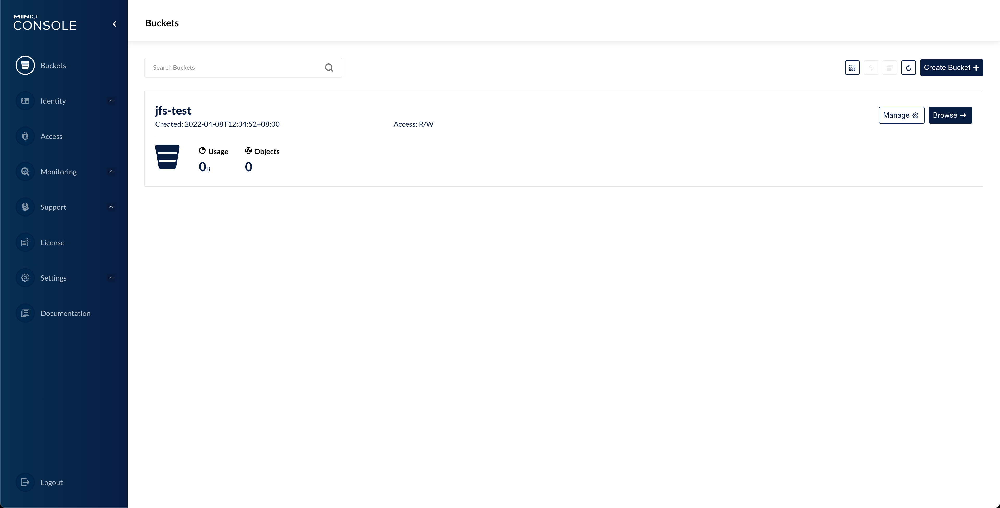

JuiceFS 从 v0.11 开始引入了 S3 网关，这是一个通过 [MinIO S3 网关](https://docs.min.io/docs/minio-gateway-for-s3.html)实现的功能。它为 JuiceFS 中的文件提供跟 S3 兼容的 RESTful API，在不方便挂载的情况下能够用 s3cmd、AWS CLI、MinIO Client（mc）等工具管理 JuiceFS 上存储的文件。另外，S3 网关还提供了一个基于网页的文件管理器，用户使用浏览器就能对 JuiceFS 上的文件进行常规的增删管理。

因为 JuiceFS 会将文件分块存储到底层的对象存储中，不能直接使用底层对象存储的接口和界面来直接访问文件，S3 网关提供了类似底层对象存储的访问能力，架构图如下：


## 先决条件

S3 网关是建立在 JuiceFS 文件系统之上的功能，如果你还没有 JuiceFS 文件系统，请先参考 [快速上手指南](../getting-started/README.md) 创建一个。

JuiceFS S3 网关是 v0.11 中引入的功能，请确保您拥有最新版本的 JuiceFS。

## 快速开始

使用 JuiceFS 的 `gateway` 子命令即可在当前主机启用 S3 网关。在开启功能之前，需要先设置 `MINIO_ROOT_USER` 和 `MINIO_ROOT_PASSWORD` 两个环境变量，即访问 S3 API 时认证身份用的 Access Key 和 Secret Key。可以简单的把它们视为 S3 网关的用户名和密码。例如：

```shell
export MINIO_ROOT_USER=admin
export MINIO_ROOT_PASSWORD=12345678
```

```shell
juicefs gateway redis://localhost:6379 localhost:9000
```

以上三条命令中，前两条命令用于设置环境变量。注意，`MINIO_ROOT_USER` 的长度至少 3 个字符， `MINIO_ROOT_PASSWORD` 的长度至少 8 个字符（Windows 用户请改用 `set` 命令设置环境变量，例如：`set MINIO_ROOT_USER=admin`）。

最后一条命令用于启用 S3 网关，`gateway` 子命令至少需要提供两个参数，第一个是存储元数据的数据库 URL，第二个是 S3 网关监听的地址和端口。你可以根据需要在 `gateway` 子命令中添加[其他选项](../reference/command_reference.md#juicefs-gateway)优化 S3 网关，比如，可以将默认的本地缓存设置为 20 GiB。

```shell
juicefs gateway --cache-size 20480 redis://localhost:6379 localhost:9000
```

在这个例子中，我们假设 JuiceFS 文件系统使用的是本地的 Redis 数据库。当 S3 网关启用时，在**当前主机**上可以使用 `http://localhost:9000` 这个地址访问到 S3 网关的管理界面。


如果你希望通过局域网或互联网上的其他主机访问 S3 网关，则需要调整监听地址，例如：

```shell
juicefs gateway redis://localhost:6379 0.0.0.0:9000
```

这样一来，S3 网关将会默认接受所有网络请求。不同的位置的 S3 客户端可以使用不同的地址访问 S3 网关，例如：

- S3 网关所在主机中的第三方客户端可以使用 `http://127.0.0.1:9000` 或 `http://localhost:9000` 进行访问；
- 与 S3 网关所在主机处于同一局域网的第三方客户端可以使用 `http://192.168.1.8:9000` 访问（假设启用 S3 网关的主机内网 IP 地址为 192.168.1.8）；
- 通过互联网访问 S3 网关可以使用 `http://110.220.110.220:9000` 访问（假设启用 S3 网关的主机公网 IP 地址为 110.220.110.220）。

## S3 网关 以守护进程的形式运行

S3 网关 可以通过以下配置以 Linux 守护进程的形式在后台运行。

```shell
cat > /lib/systemd/system/juicefs-gateway.service<<EOF
[Unit]
Description=Juicefs S3 Gateway
Requires=network.target
After=multi-user.target
StartLimitIntervalSec=0

[Service]
Type=simple
User=root
Environment="MINIO_ROOT_USER=admin"
Environment="MINIO_ROOT_PASSWORD=12345678"
ExecStart=/usr/local/bin/juicefs gateway redis://localhost:6379 localhost:9000
Restart=on-failure
RestartSec=60

[Install]
WantedBy=multi-user.target
EOF
```

设置进程开机自启动

```shell
sudo systemctl daemon-reload
sudo systemctl enable juicefs-gateway --now
sudo systemctl status juicefs-gateway
```

检阅进程的日志

```bash
sudo journalctl -xefu juicefs-gateway.service
```

## 访问 S3 网关

各类支持 S3 API 的客户端、桌面程序、Web 程序等都可以访问 JuiceFS S3 网关。使用时请注意 S3 网关监听的地址和端口。

:::tip 提示
以下示例均为使用第三方客户端访问本地主机上运行的 S3 网关。在具体场景下，请根据实际情况调整访问 S3 网关的地址。
:::

### 使用 AWS CLI

从 [https://aws.amazon.com/cli](https://aws.amazon.com/cli) 下载并安装 AWS CLI，然后进行配置：

```bash
$ aws configure
AWS Access Key ID [None]: admin
AWS Secret Access Key [None]: 12345678
Default region name [None]:
Default output format [None]:
```

程序会通过交互式的方式引导你完成新配置的添加，其中 `Access Key ID` 与 `MINIO_ROOT_USER` 相同，`Secret Access Key` 与 `MINIO_ROOT_PASSWORD` 相同，区域名称和输出格式请留空。

之后，即可使用 `aws s3` 命令访问 JuiceFS 存储，例如：

```bash
# List buckets
$ aws --endpoint-url http://localhost:9000 s3 ls

# List objects in bucket
$ aws --endpoint-url http://localhost:9000 s3 ls s3://<bucket>
```

### 使用 MinIO 客户端

首先参照 [MinIO 下载页面](https://min.io/download)安装 mc，然后添加一个新的 alias：

```bash
mc alias set juicefs http://localhost:9000 admin 12345678 --api S3v4
```

依照 mc 的命令格式，以上命令创建了一个别名为 `juicefs` 的配置。特别注意，命令中必须指定 API 版本，即 `--api "s3v4"`。

然后，你可以通过 mc 客户端自由的在本地磁盘与 JuiceFS 存储以及其他云存储之间进行文件和文件夹的复制、移动、增删等管理操作。

```shell
$ mc ls juicefs/jfs
[2021-10-20 11:59:00 CST] 130KiB avatar-2191932_1920.png
[2021-10-20 11:59:00 CST] 4.9KiB box-1297327.svg
[2021-10-20 11:59:00 CST]  21KiB cloud-4273197.svg
[2021-10-20 11:59:05 CST]  17KiB hero.svg
[2021-10-20 11:59:06 CST] 1.7MiB hugo-rocha-qFpnvZ_j9HU-unsplash.jpg
[2021-10-20 11:59:06 CST]  16KiB man-1352025.svg
[2021-10-20 11:59:06 CST] 1.3MiB man-1459246.ai
[2021-10-20 11:59:08 CST]  19KiB sign-up-accent-left.07ab168.svg
[2021-10-20 11:59:10 CST]  11MiB work-4997565.svg
```

## 在 Kubernetes 中部署 S3 网关

### 通过 kubectl 部署

首先创建 secret（以 Amazon S3 为例）：

```shell
export NAMESPACE=default
```

```shell
kubectl -n ${NAMESPACE} create secret generic juicefs-secret \
    --from-literal=name=<NAME> \
    --from-literal=metaurl=redis://[:<PASSWORD>]@<HOST>:6379[/<DB>] \
    --from-literal=storage=s3 \
    --from-literal=bucket=https://<BUCKET>.s3.<REGION>.amazonaws.com \
    --from-literal=access-key=<ACCESS_KEY> \
    --from-literal=secret-key=<SECRET_KEY>
```

其中：

- `name`：JuiceFS 文件系统名称
- `metaurl`：元数据服务的访问 URL（比如 Redis）。更多信息参考[这篇文档](../guide/how_to_set_up_metadata_engine.md)。
- `storage`：对象存储类型，比如 `s3`、`gs`、`oss`。更多信息参考[这篇文档](../guide/how_to_set_up_object_storage.md)。
- `bucket`：Bucket URL。更多信息参考[这篇文档](../guide/how_to_set_up_object_storage.md)。
- `access-key`：对象存储的 access key。更多信息参考[这篇文档](../guide/how_to_set_up_object_storage.md)。
- `secret-key`：对象存储的 secret key。更多信息参考[这篇文档](../guide/how_to_set_up_object_storage.md)。

然后下载 S3 网关[部署 YAML](https://github.com/juicedata/juicefs/blob/main/deploy/juicefs-s3-gateway.yaml) 并通过 `kubectl` 创建 `Deployment` 和 `Service` 资源。以下几点需要特别注意：

- 请将以下命令的 `${NAMESPACE}` 替换为实际部署 S3 网关的 Kubernetes 名字空间，默认为 `kube-system`。
- `Deployment` 的 `replicas` 默认为 1，请根据实际情况调整。
- 默认使用 `juicedata/juicefs-csi-driver` 最新版镜像，其中已经集成了最新版 JuiceFS 客户端，具体集成的 JuiceFS 客户端版本请查看[这里](https://github.com/juicedata/juicefs-csi-driver/releases)。
- `Deployment` 的 `initContainers` 会先尝试格式化 JuiceFS 文件系统，如果你已经提前格式化完毕，这一步不会影响现有 JuiceFS 文件系统。
- S3 网关默认监听的端口号为 9000
- S3 网关[启动选项](../reference/command_reference.md#juicefs-gateway)均为默认值，请根据实际需求调整。
- `MINIO_ROOT_USER` 环境变量的值为 Secret 中的 `access-key`，`MINIO_ROOT_PASSWORD` 环境变量的值为 Secret 中的 `secret-key`。

```shell
curl -sSL https://raw.githubusercontent.com/juicedata/juicefs/main/deploy/juicefs-s3-gateway.yaml | sed "s@kube-system@${NAMESPACE}@g" | kubectl apply -f -
```

检查是否已经部署成功：

```shell
$ kubectl -n $NAMESPACE get po -o wide -l app.kubernetes.io/name=juicefs-s3-gateway
juicefs-s3-gateway-5c7d65c77f-gj69l         1/1     Running   0          37m     10.244.2.238   kube-node-3   <none>           <none>
```

```shell
$ kubectl -n $NAMESPACE get svc -l app.kubernetes.io/name=juicefs-s3-gateway
NAME                 TYPE        CLUSTER-IP      EXTERNAL-IP   PORT(S)    AGE
juicefs-s3-gateway   ClusterIP   10.101.108.42   <none>        9000/TCP   142m
```

可以在应用 pod 中通过 `juicefs-s3-gateway.${NAMESPACE}.svc.cluster.local:9000` 域名或 `juicefs-s3-gateway` 的 pod IP 及端口号（例如 `10.244.2.238:9000`）访问 JuiceFS S3 网关。

若想通过 Ingress 访问，需要确保集群中已经部署了 Ingress Controller，参考 [Ingress Controller 部署文档](https://kubernetes.github.io/ingress-nginx/deploy)。创建 `Ingress` 资源：

```yaml
kubectl apply -f - <<EOF
apiVersion: networking.k8s.io/v1
kind: Ingress
metadata:
  name: juicefs-s3-gateway
  namespace: ${NAMESPACE}
spec:
  ingressClassName: nginx
  rules:
  - http:
      paths:
      - path: /
        pathType: Prefix
        backend:
          service:
            name: juicefs-s3-gateway
            port:
              number: 9000
EOF
```

可以通过 Ingress Controller 的 `<external IP>` 来访问 S3 网关（不需要带上 9000 端口号），如下：

```shell
kubectl get services -n ingress-nginx
```

Ingress 的各个版本之间差异较大，更多使用方式请参考 [Ingress Controller 使用文档](https://kubernetes.github.io/ingress-nginx/user-guide/basic-usage)。

### 通过 Helm 部署

1. 准备配置文件

   创建一个配置文件，例如：`values.yaml`，复制并完善下列配置信息。其中，`secret` 部分是 JuiceFS 文件系统相关的信息，你可以参照 [JuiceFS 快速上手指南](../getting-started/README.md) 了解相关内容。

   ```yaml title="values.yaml"
   secret:
     name: "<name>"
     metaurl: "<meta-url>"
     storage: "<storage-type>"
     accessKey: "<access-key>"
     secretKey: "<secret-key>"
     bucket: "<bucket>"
   ```

   若需要部署 Ingress，在 `values.yaml` 中再加上：

   ```yaml title="values.yaml"
   ingress:
     enabled: true
   ```

2. 部署

   依次执行以下三条命令，通过 Helm 部署 JuiceFS S3 网关（注意以下示例是部署到 `kube-system` 名字空间）。

   ```sh
   helm repo add juicefs-s3-gateway https://juicedata.github.io/charts/
   helm repo update
   helm install juicefs-s3-gateway juicefs-s3-gateway/juicefs-s3-gateway -n kube-system -f ./values.yaml
   ```

3. 检查部署状态

   - **检查 Pods**：部署过程会启动一个名为 `juicefs-s3-gateway` 的 `Deployment`。执行命令 `kubectl -n kube-system get po -l app.kubernetes.io/name=juicefs-s3-gateway` 查看部署的 pod：

     ```sh
     $ kubectl -n kube-system get po -l app.kubernetes.io/name=juicefs-s3-gateway
     NAME                                  READY   STATUS    RESTARTS   AGE
     juicefs-s3-gateway-5c69d574cc-t92b6   1/1     Running   0          136m
     ```

   - **检查 Service**：执行命令 `kubectl -n kube-system get svc -l app.kubernetes.io/name=juicefs-s3-gateway` 查看部署的 Service：

     ```shell
     $ kubectl -n kube-system get svc -l app.kubernetes.io/name=juicefs-s3-gateway
     NAME                 TYPE        CLUSTER-IP      EXTERNAL-IP   PORT(S)    AGE
     juicefs-s3-gateway   ClusterIP   10.101.108.42   <none>        9000/TCP   142m
     ```

## 监控

请查看[「监控」](../administration/monitoring.md)文档了解如何收集及展示 JuiceFS 监控指标

## 使用功能更完整的 S3 网关

如果需要使用 MinIO S3 网关的一些高级功能，可以拉取[该仓库的 gateway 分支](https://github.com/juicedata/minio/tree/gateway)并自行编译 MinIO。该分支是基于 [MinIO RELEASE.2022-03-05T06-32-39Z](https://github.com/minio/minio/tree/RELEASE.2022-03-05T06-32-39Z) 版本开发，并添加了 JuiceFS 网关支持，支持在使用 JuiceFS 作为后端的同时使用 MinIO 网关的完整功能，比如[多用户管理](https://docs.min.io/docs/minio-multi-user-quickstart-guide.html)。

### 编译

:::tip 提示
该分支依赖较新版本的 JuiceFS，具体的 JuiceFS 版本请查看 [`go.mod`](https://github.com/juicedata/minio/blob/gateway/go.mod) 文件。

与[手动编译 JuiceFS 客户端](../getting-started/installation.md#手动编译客户端)类似，你需要提前安装一些依赖才能正常编译 S3 网关。
:::

```shell
git clone -b gateway git@github.com:juicedata/minio.git && cd minio
```

将会生成 MinIO 二进制文件

```shell
make build
```

### 使用

该版本 MinIO 网关的使用方法与原生 MinIO 网关完全一致，原生功能的使用可以参考 MinIO 的[文档](https://docs.min.io/docs/minio-gateway-for-s3.html)，而 JuiceFS 自身的配置选项可以通过命令行传入。你可以使用 `minio gateway juicefs -h` 查看当前支持的所有选项。

与使用 JuiceFS 集成的 S3 网关类似，可以通过以下命令启动网关服务：

```shell
export MINIO_ROOT_USER=admin
export MINIO_ROOT_PASSWORD=12345678
```

```shell
./minio gateway juicefs --console-address ':59001' redis://localhost:6379
```

这里显式指定了 S3 网关控制台的端口号为 59001，如果不指定则会随机选择一个端口。根据命令行提示，在浏览器中打开 [http://127.0.0.1:59001](http://127.0.0.1:59001) 地址便可以访问控制台，如下图所示：


