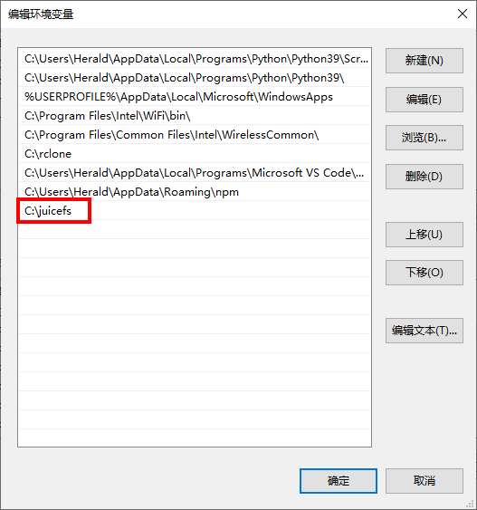

# 安装与升级

JuiceFS 有良好的跨平台能力，支持在几乎所有主流架构的各类操作系统上运行，包括且不限于 Linux、macOS、Windows、BSD 等。

JuiceFS 客户端只有一个二进制文件，你可以下载预编译的版本直接解压使用，也可以用源代码手动编译。

## 安装预编译客户端

你可以在 [GitHub](https://github.com/juicedata/juicefs/releases) 找到最新版客户端下载地址，每个版本的下载列表中都提供了面向不同 CPU 架构和操作系统的预编译版本，请注意识别选择，例如：

| 文件名                                 | 说明                                         |
| ------------------------------------   | ----------------------------                 |
| `juicefs-x.x.x-darwin-amd64.tar.gz`    | 面向 Intel 芯片的 macOS 系统                 |
| `juicefs-x.x.x-linux-amd64.tar.gz`     | 面向 x86 架构 Linux 发行版                   |
| `juicefs-x.x.x-linux-arm64.tar.gz`     | 面向 ARM 架构的 Linux 发行版                 |
| `juicefs-x.x.x-windows-amd64.tar.gz`   | 面向 x86 架构的 Windows 系统                 |
| `juicefs-hadoop-x.x.x-linux-amd64.jar` | 面向 x86 架构 Linux 发行版的 Hadoop Java SDK |

:::tip 提示
对于 M1 系列芯片的 macOS 系统，可以使用 `darwin-amd64` 版本客户端依赖 [Rosetta 2](https://support.apple.com/zh-cn/HT211861) 使用，也可以参考 [手动编译客户端](#手动编译客户端) 编译原生版本。
:::

### Linux 发行版

以 x86 架构的 Linux 系统为例，下载文件名包含 `linux-amd64` 的压缩包，在终端依次执行以下命令。

1. 获取最新的版本号

   ```shell
   JFS_LATEST_TAG=$(curl -s https://api.github.com/repos/juicedata/juicefs/releases/latest | grep 'tag_name' | cut -d '"' -f 4 | tr -d 'v')
   ```

2. 下载客户端到当前目录

   ```shell
   wget "https://github.com/juicedata/juicefs/releases/download/v${JFS_LATEST_TAG}/juicefs-${JFS_LATEST_TAG}-linux-amd64.tar.gz"
   ```

3. 解压安装包

   ```shell
   tar -zxf "juicefs-${JFS_LATEST_TAG}-linux-amd64.tar.gz"
   ```

4. 安装客户端

   ```shell
   sudo install juicefs /usr/local/bin
   ```

完成上述 4 个步骤，在终端执行 `juicefs` 命令，返回帮助信息，则说明客户端安装成功。

:::info 说明
如果终端提示 `command not found`，可能是因为 `/usr/local/bin` 不在你的系统 `PATH` 环境变量中，可以执行 `echo $PATH` 查看系统设置了哪些可执行路径，根据返回结果选择一个恰当的路径，调整并重新执行第 4 步的安装命令。
:::

### Windows 系统

在 Windows 系统使用 JuiceFS 的方法有两种：

1. [使用预编译的 Windows 客户端](#预编译的-windows-客户端)
2. [在 WSL 中使用 Linux 版客户端](#在-wsl-中使用-linux-版客户端)

#### 预编译的 Windows 客户端

JuiceFS 的 Windows 客户端也是一个独立的二进制程序，下载解压即可直接运行使用。

1. 安装依赖程序

   由于 Windows 没有原生支持 FUSE 接口，首先需要下载安装 [WinFsp](http://www.secfs.net/winfsp/) 才能实现对 FUSE 的支持。

   :::tip 提示
   **[WinFsp](https://github.com/billziss-gh/winfsp)** 是一个开源的 Windows 文件系统代理，它提供了一个 FUSE 仿真层，使得 JuiceFS 客户端可以将文件系统挂载到 Windows 系统中使用。
   :::

2. 安装客户端

   以 Windows 10 系统为例，下载文件名包含 `windows-amd64` 的压缩包，解压后得到 `juicefs.exe` 即是 JuiceFS 的客户端程序。

   为了便于使用，可以在 `C：\` 盘根目录创建一个名为 `juicefs` 的文件夹，把 `juicefs.exe` 解压到该文件夹中。然后将 `C:\juicefs` 文件夹路径添加到系统的环境变量，重启系统让设置生效以后，可直接使用使用系统自带的 `命令提示符` 或 `PowerShell` 等终端程序运行 `juicefs` 命令。

   

#### 在 WSL 中使用 Linux 版客户端

[WSL](https://docs.microsoft.com/zh-cn/windows/wsl/about) 全称 Windows Subsystem for Linux，即 Windows 的 Linux 子系统，从 Windows 10 版本 2004 以上或 Windows 11 开始支持该功能。它可以让你在 Windows 系统中运行原生的 GNU/Linux 的大多数命令行工具、实用工具和应用程序且不会产生传统虚拟机或双启动设置开销。

因为 WSL 是运行在 Windows 系统上高度完整的 Linux 系统（默认是 Ubuntu）。因此，进入 WSL 子系统终端以后，你应该完全参照在 [Linux 上安装使用 JuiceFS 客户端](#linux-发行版) 的方法进行安装和使用。

### macOS 系统

由于 macOS 默认不支持 FUSE 接口，需要先安装 [macFUSE](https://osxfuse.github.io/) 实现对 FUSE 的支持。

:::tip 提示
[macFUSE](https://github.com/osxfuse/osxfuse) 是一个开源的文件系统增强工具，它让 macOS 可以挂载第三方的文件系统，使得 JuiceFS 客户端可以将文件系统挂载到 macOS 系统中使用。
:::

#### Homebrew 安装

如果你的系统安装了 [Homebrew](https://brew.sh/) 包管理器，可以执行以下命令安装 JuiceFS 客户端：

```shell
brew tap juicedata/homebrew-tap
brew install juicefs
```

#### 预编译二进制程序

你也可以下载文件名包含 `darwin-amd64` 的二进制程序，解压后使用 `install` 命令将程序安装到系统的任意可执行路径，例如：

```shell
sudo install juicefs /usr/local/bin
```

### Docker 容器

对于要在 Docker 容器中使用 JuiceFS 的情况，这里提供一份构建 JuiceFS 客户端镜像的 `Dockerfile`，可以以此为基础单独构建 JuiceFS 客户端镜像或与其他应用打包在一起使用。

```dockerfile
FROM ubuntu:20.04

RUN apt update && apt install -y curl fuse && \
    apt-get autoremove && \
    apt-get clean && \
    rm -rf \
    /tmp/* \
    /var/lib/apt/lists/* \
    /var/tmp/*

RUN set -x && \
    mkdir /juicefs && \
    cd /juicefs && \
    JFS_LATEST_TAG=$(curl -s https://api.github.com/repos/juicedata/juicefs/releases/latest | grep 'tag_name' | cut -d '"' -f 4 | tr -d 'v') && \
    curl -s -L "https://github.com/juicedata/juicefs/releases/download/v${JFS_LATEST_TAG}/juicefs-${JFS_LATEST_TAG}-linux-amd64.tar.gz" \
    | tar -zx && \
    install juicefs /usr/bin && \
    cd .. && \
    rm -rf /juicefs

CMD [ "juicefs" ]
```

## 手动编译客户端

如果预编译的客户端中没有适用于你的版本，比如 FreeBSD 或 M1 芯片的 macOS，这时可以采用手动编译的方式编译适合你的 JuiceFS 客户端。

另外，手动编译客户端可以让你优先体验到 JuiceFS 开发中的各种新功能，但这需要你具备一定的软件编译相关的基础知识。

### 前置条件

这里的编译操作同时适用于各种 CPU 架构的 Linux、macOS 和 BSD 系统。

JuiceFS 客户端使用 Go 语言开发，编译依赖以下工具：

- [Go](https://golang.org) 1.16+
- GCC 5.4+

:::tip 提示
对于中国地区用户，为了加快获取 Go 模块的速度，建议通过 `GOPROXY` 环境变量设置国内的镜像服务器。例如：[Goproxy China](https://github.com/goproxy/goproxy.cn)。
:::

1. 克隆源码

   ```shell
   git clone https://github.com/juicedata/juicefs.git
   ```

2. 进入源代码目录

   ```shell
   cd juicefs
   ```

3. 切换分支

   源代码默认使用 `main` 分支，你可以切换到任何正式发布的版本，比如切换到 `v0.17.4`：

   ```shell
   git checkout v0.17.4
   ```

   :::caution 注意
   开发分支经常涉及较大的变化，请不要将「开发分支」编译的客户端用于生产环境。
   :::

4. 执行编译

   ```shell
   make
   ```

   编译好的 `juicefs` 二进制程序位于当前目录。

## 客户端升级

JuiceFS 客户端只有一个二进制程序，升级新版只需用新版程序替换旧版程序即可。

- **使用预编译客户端**：可以参照本文档中相应系统的安装方法，下载最新的客户端，覆盖旧版客户端即可。
- **手动编译客户端**：可以拉取最新的源代码重新编译，覆盖旧版客户端即可。

:::caution 注意
对于使用旧版 JuiceFS 客户端已经挂载好的文件系统，需要先[卸载文件系统](for_distributed.md#6-卸载文件系统)，然后用新版 JuiceFS 客户端重新挂载。
:::

## 卸载客户端

JuiceFS 客户端只有一个二进制文件，只需找到程序所在位置删除即可。例如，参照本文档 Linux 系统安装的客户端，执行以下命令卸载客户端：

```shell
sudo rm /usr/local/bin/juicefs
```

你还可以通过 `which` 命令查看程序所在位置：

```shell
which juicefs
```

命令返回的路径即 JuiceFS 客户端在你系统上的安装位置。其他操作系统卸载方法依此类推。
