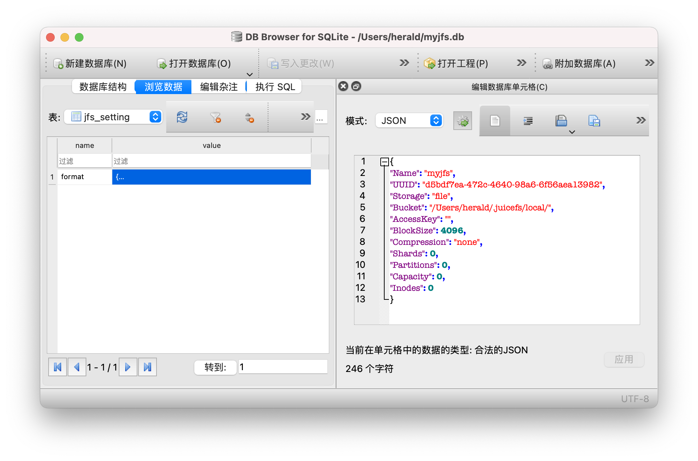
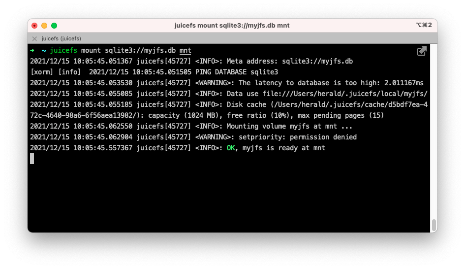

# 单机模式

JuiceFS 文件系统由[「对象存储」](../reference/how_to_set_up_object_storage.md)和[「数据库」](../reference/how_to_set_up_metadata_engine.md)共同驱动。除了对象存储，还支持使用本地磁盘、WebDAV 和 HDFS 等作为底层存储。因此，可以使用本地磁盘和 SQLite 数据库快速创建一个单机文件系统用以了解和体验 JuiceFS。

## 安装客户端

对于 Linux 发行版和 macOS 系统用户，可以使用一键安装脚本快速安装 JuiceFS 客户端：

```shell
curl -sSL https://d.juicefs.com/install | sh -
```

其他操作系统及安装方式请查阅[「安装」](installation.md)。

不论你使用什么操作系统，当在终端输入并执行 `juicefs` 并返回了程序的帮助信息，就说明你成功安装了 JuiceFS 客户端。

## 创建文件系统 {#juicefs-format}

### 基本概念

创建文件系统使用客户端提供的 [`format`](../reference/command_reference.mdx#format) 命令，一般格式为：

```shell
juicefs format [command options] META-URL NAME
```

可见，格式化文件系统需要提供 3 种信息：

- **[command options]**：设定文件系统的存储介质，留空则**默认使用本地磁盘**作为存储介质，路径为 `"$HOME/.juicefs/local"`(darwin/macOS)，`"/var/jfs"`(Linux) 或 `"C:/jfs/local"`(Windows)；
- **META-URL**：用来设置元数据存储，即数据库相关的信息，通常是数据库的 URL 或文件路径；
- **NAME**：是文件系统的名称。

:::tip 提示
JuiceFS 支持丰富的存储介质和元数据存储引擎，查看 [JuiceFS 支持的存储介质](../reference/how_to_set_up_object_storage.md) 和 [JuiceFS 支持的元数据存储引擎](../reference/how_to_set_up_metadata_engine.md)。
:::

### 上手实践

以 Linux 系统为例，以下命令创建了一个名为 `myjfs` 的文件系统。

```shell
juicefs format sqlite3://myjfs.db myjfs
```

创建完成将返回类似下面的输出：

```shell {1,4}
2021/12/14 18:26:37.666618 juicefs[40362] <INFO>: Meta address: sqlite3://myjfs.db
[xorm] [info]  2021/12/14 18:26:37.667504 PING DATABASE sqlite3
2021/12/14 18:26:37.674147 juicefs[40362] <WARNING>: The latency to database is too high: 7.257333ms
2021/12/14 18:26:37.675713 juicefs[40362] <INFO>: Data use file:///Users/herald/.juicefs/local/myjfs/
2021/12/14 18:26:37.689683 juicefs[40362] <INFO>: Volume is formatted as {Name:myjfs UUID:d5bdf7ea-472c-4640-98a6-6f56aea13982 Storage:file Bucket:/Users/herald/.juicefs/local/ AccessKey: SecretKey: BlockSize:4096 Compression:none Shards:0 Partitions:0 Capacity:0 Inodes:0 EncryptKey:}
```

从返回的信息中可以看到，该文件系统使用 SQLite 作为元数据存储引擎，数据库文件位于当前目录，文件名为 `myjfs.db`，保存了 `myjfs` 文件系统的所有信息。它构建了完善的表结构，将用作所有数据的元信息的存储。



由于没有指定任何存储相关的选项，客户端默认使用本地磁盘作为存储介质，根据返回的信息， `myjfs` 的存储路径为 `file:///Users/herald/.juicefs/local/myjfs/`，即当前用户家目录下的 `.juicefs/local/myjfs/`。

## 挂载文件系统

### 基本概念

挂载文件系统使用客户端提供的 [`mount`](../reference/command_reference.mdx#mount) 命令，一般格式为：

```shell
juicefs mount [command options] META-URL MOUNTPOINT
```

与创建文件系统的命令类似，挂载文件系统需要提供以下信息：

- `[command options]`：用来指定文件系统相关的选项，例如：`-d` 可以实现后台挂载；
- `META-URL`：用来设置元数据存储。即数据库相关的信息，通常是数据库的 URL 或文件路径；
- `MOUNTPOINT`：指定文件系统的挂载点。

:::tip 提示
Windows 系统的挂载点（`MOUNTPOINT`）应该使用尚未占用的盘符，比如：`Z:`、`Y:`。
:::

### 上手实践

:::note 注意
由于 SQLite 是单文件数据库，挂载时要注意数据库文件的的路径，JuiceFS 同时支持相对路径和绝对路径。
:::

以下命令将 `myjfs` 文件系统挂载到 `~/jfs` 文件夹：

```shell
juicefs mount sqlite3://myjfs.db ~/jfs
```



默认情况下，客户端会在前台挂载文件系统。就像你在上图中看到的那样，程序会一直运行在当前终端进程中，使用 <kbd>Ctrl</kbd> + <kbd>C</kbd> 组合键或关闭终端窗口，文件系统会被卸载。

为了让文件系统可以在后台保持挂载，你可以在挂载时指定 `-d` 或 `--background` 选项，即让客户端在守护进程中挂载文件系统：

```shell
juicefs mount sqlite3://myjfs.db ~/jfs -d
```

接下来，任何存入挂载点 `~/jfs` 的文件，都会按照 [JuiceFS 的文件存储格式](../introduction/architecture.md#how-juicefs-store-files)被拆分成特定的「数据块」并存入 `$HOME/.juicefs/local/myjfs` 目录中，相对应的「元数据」会全部存储在 `myjfs.db` 数据库中。

最后执行以下命令可以将挂载点 `~/jfs` 卸载：

```shell
juicefs umount ~/jfs
```

## 更进一步

前面介绍的内容通常只适用于快速在本地体验和了解，帮助你对 JuiceFS 的工作方式建立基本的认识。我们可以在前面内容的基础上更进一步，仍然使用 SQLite 存储元数据，把本地存储换成「对象存储」，做一个更有实用价值的方案。

### 对象存储

对象存储是一种基于 HTTP 协议的，提供简单访问 API 的网络存储服务。它的结构扁平，易于扩展，价格相对低廉，非常适合存储海量的非结构化数据。几乎所有主流的云计算平台都有提供对象存储服务，如亚马逊 S3、阿里云 OSS、Backblaze B2 等。

JuiceFS 支持几乎所有的对象存储服务，查看「[JuiceFS 支持的存储介质](../reference/how_to_set_up_object_storage.md)」。

一般来说，创建对象存储通常只需要 2 个环节：

1. 创建 **Bucket** 存储桶，拿到 Endpoint 地址；
2. 创建 **Access Key ID** 和 **Access Key Secret**，即对象存储 API 的访问密钥。

以阿里云 OSS 为例，创建好的资源大概像下面这样：

- **Bucket Endpoint**：`https://myjfs.oss-cn-shanghai.aliyuncs.com`
- **Access Key ID**：`ABCDEFGHIJKLMNopqXYZ`
- **Access Key Secret**：`ZYXwvutsrqpoNMLkJiHgfeDCBA`

:::note 注意
创建对象存储的过程各个平台会略有差别，建议查看云平台的帮助手册操作。另外，有些平台可能会针对内外网提供不同的 Endpoint 地址，由于本文要从本地访问对象存储，因此请选择使用面向外网访问的地址。
:::

### 上手实践

接下来使用 SQLite 和阿里云 OSS 对象存储创建一个 JuiceFS 文件系统：

:::note 注意
如果 `myjfs.db` 文件已经存在，请先删除它再执行以下命令。
:::

```shell
# 使用你自己所使用的对象存储信息替换下方相关参数
juicefs format --storage oss \
    --bucket https://myjfs.oss-cn-shanghai.aliyuncs.com \
    --access-key ABCDEFGHIJKLMNopqXYZ \
    --secret-key ZYXwvutsrqpoNMLkJiHgfeDCBA \
    sqlite3://myjfs.db myjfs
```

在上述命令中，数据库和文件系统名称保持不变，增加了对象存储相关的信息：

- `--storage`：设置存储类型，比如 `oss`、`s3` 等；
- `--bucket`：设置对象存储的 Endpoint 地址；
- `--access-key`：设置对象存储 API 访问密钥 Access Key ID；
- `--secret-key`：设置对象存储 API 访问密钥 Access Key Secret。

创建完成即可进行挂载：

```shell
juicefs mount sqlite3://myjfs.db ~/jfs
```

挂载命令与使用本地存储时完全一样，这是因为创建文件系统时，对象存储相关的信息已经写入了 `myjfs.db` 数据库，因此客户端不需要额外提供对象存储认证信息，也没有本地配置文件（作为对比，JuiceFS 云服务用 [`juicefs auth`](https://juicefs.com/docs/zh/cloud/reference/commands_reference/#auth) 命令进行认证、获取配置文件）。

相比使用本地磁盘，SQLite 和对象存储的组合实用价值更高。从应用的角度看，这种形式等同于将容量几乎无限的对象存储接入到了本地计算机，让你可以像使用本地磁盘那样使用云存储。

进一步的，该文件系统的所有数据都存储在云端的对象存储，因此可以把 `myjfs.db` 数据库复制到其他安装了 JuiceFS 客户端的计算机上进行挂载和读写。也就是说，任何一台计算机只要能够读取到存储了元数据的数据库，那么它就能够挂载读写该文件系统。

很显然，SQLite 这种单文件数据库很难实现被多台计算机同时访问。如果把 SQLite 改为 Redis、PostgreSQL、MySQL 等能够通过网络被多台计算机同时读写访问的数据库，那么就可以实现 JuiceFS 文件系统的分布式挂载读写。
