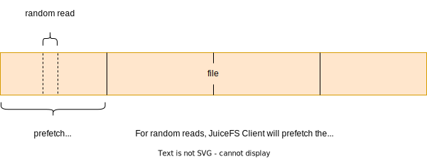
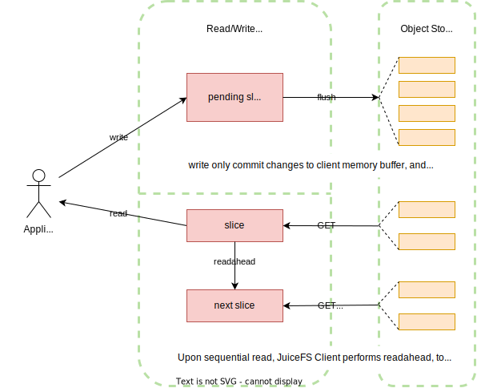
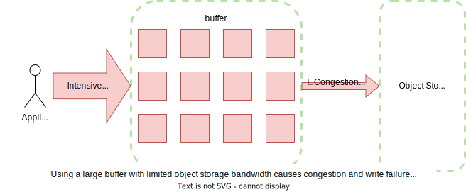
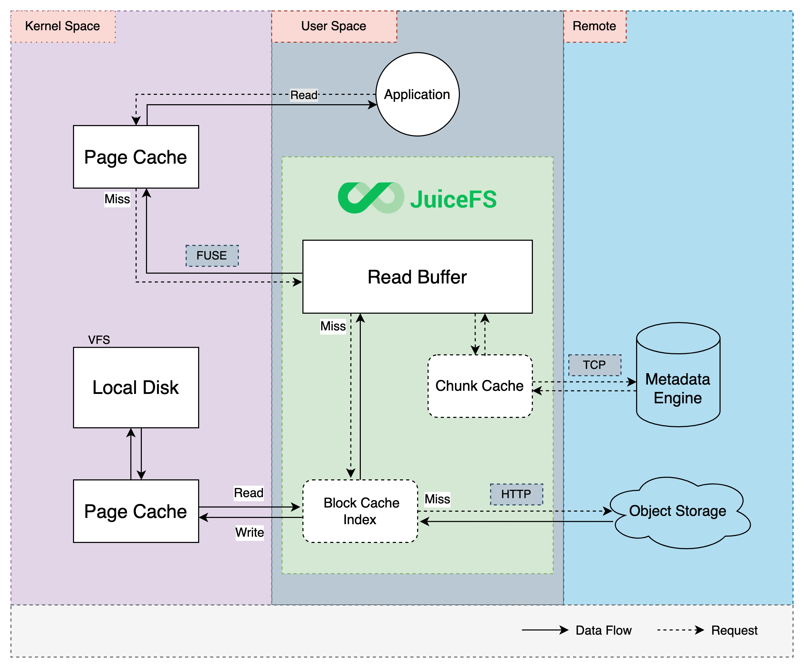

对于一个由对象存储和数据库组合驱动的文件系统，缓存是本地客户端与远端服务之间高效交互的重要纽带。读写的数据可以提前或者异步载入缓存，再由客户端在后台与远端服务交互执行异步上传或预取数据。相比直接与远端服务交互，采用缓存技术可以大大降低存储操作的延时并提高数据吞吐量。

JuiceFS 提供包括元数据缓存、数据读写缓存等多种缓存机制。

:::tip 我的场景真的需要缓存吗？
数据缓存可以有效地提高随机读的性能，对于像 Elasticsearch、ClickHouse 等对随机读性能要求更高的应用，建议将缓存路径设置在速度更快的存储介质上并分配更大的缓存空间。

然而缓存能提升性能的前提是，你的应用需要反复读取同一批文件。如果你确定你的应用对数据是「读取一次，然后再也不需要」的访问模式（比如大数据的数据清洗常常就是这样），可以关闭缓存功能，省去缓存不断建立，又反复淘汰的开销。
:::

## 数据一致性 {#consistency}

分布式系统，往往需要在缓存和一致性之间进行取舍。JuiceFS 由于其元数据分离架构，需要从元数据、文件数据（对象存储）、文件数据本地缓存三方面来思考一致性问题：

对于[元数据缓存](#metadata-cache)，JuiceFS 默认的挂载设置满足「关闭再打开（close-to-open）」一致性，也就是说一个客户端修改并关闭文件之后，其他客户端重新打开这个文件都会看到最新的修改。与此同时，默认的挂载参数设置了 1 秒的内核元数据缓存，满足了一般场景的需要。但如果你的应用需要更激进的缓存设置以提升性能，可以阅读下方章节，对元数据缓存进行针对性的调优。特别地，发起修改的客户端（挂载点）能享受到更强的一致性，阅读[一致性例外](#consistency-exceptions)详细了解。

对于对象存储，JuiceFS 将文件分成一个个数据块（默认 4MiB），赋予唯一 ID 并上传至对象存储服务。文件的任何修改操作都将生成新的数据块，原有块保持不变，所以不用担心数据缓存的一致性问题，因为一旦文件被修改过了，JuiceFS 会从对象存储读取新的数据块。而老的失效数据块，也会随着[回收站](../security/trash.md)或碎片合并机制被删除，避免对象存储泄露。

[本地数据缓存](#client-read-cache)缓存也是以对象存储的数据块做为最小单元。一旦文件数据被下载到缓存盘，一致性就和缓存盘可靠性相关，如果磁盘数据发生了篡改，客户端也会读取到错误的数据。对于这种担忧，可以配置合适的 [`--verify-cache-checksum`](../reference/command_reference.mdx#mount-data-cache-options) 策略，确保缓存盘数据完整性。

## 元数据缓存 {#metadata-cache}

作为用户态文件系统，JuiceFS 元数据缓存既通过 FUSE API，以内核元数据缓存的形式进行管理，同时也直接在客户端内存中维护。

### 内核元数据缓存 {#kernel-metadata-cache}

JuiceFS 客户端可以控制这些内核元数据缓存：文件属性（attribute，包含文件名、大小、权限、修改时间等信息）、文件项（entry 和 direntry，用来区分文件和目录类型的文件），在挂载时，可以使用下方参数，通过 FUSE 控制这些元数据的缓存时间：

```shell
# 文件属性缓存时间（秒），默认为 1，提升 getattr 性能
--attr-cache=1

# 文件类型的缓存时间（秒），默认为 1，提升文件 lookup 性能
--entry-cache=1

# 目录类型文件的缓存时间（秒），默认为 1，提升目录的 lookup 性能
--dir-entry-cache=1
```

让以上元数据默认在内核中缓存 1 秒，能显著提高 `lookup` 和 `getattr` 的性能。

需要注意，`entry` 缓存是随着文件访问逐渐建立起来的，不是一个完整列表，因此不能被 `readdir` 调用或者 `ls` 命令使用，而只对 `lookup` 调用有加速效果。这里的 `dir-entry` 含义也不等同于[「目录项」](https://www.kernel.org/doc/html/latest/filesystems/ext4/directory.html)的概念，他并不用来描述「一个目录下包含哪些文件」，而是和 `entry` 一样，都是文件，只不过对文件是否目录类型做了区分。

在实际场景中，也很少需要对 `--entry-cache` 和 `--dir-entry-cache` 进行区分设置，如果确实要精细化调优，在目录极少变动、而文件频繁变动的场景，可以令 `--dir-entry-cache` 大于 `--entry-cache`。

### 客户端内存元数据缓存 {#client-memory-metadata-cache}

JuiceFS 客户端在 `open` 操作即打开一个文件时，其文件属性会被自动缓存在客户端内存中，这里的属性缓存，不仅包含内核元数据中的文件属性比如文件大小、修改时间信息，还包含 JuiceFS 特有的属性，如[文件和 chunk、slice 的对应关系](../introduction/architecture.md#how-juicefs-store-files)。

为保证「关闭再打开（close-to-open）」一致性，`open` 操作默认需要直接访问元数据引擎，不会利用缓存。也就是说，客户端 A 的修改在客户端 B 不一定能立即看到。但是，一旦这个文件在 A 写入完成并关闭，之后在任何一个客户端重新打开该文件都可以保证能访问到最新写入的数据，不论是否在同一个节点。文件的属性缓存也不一定要通过 `open` 操作建立，比如 `tail -f` 会不断查询文件属性，在这种情况下无需重新打开文件，也能获得最新文件变动。

如果要利用上客户端内存的元数据缓存，需要设置 [`--open-cache`](../reference/command_reference.mdx#mount-metadata-cache-options)，指定缓存的有效时长。在缓存有效期间执行的 `getattr` 和 `open` 操作会从内存缓存中立即返回 slice 信息。有了这些信息，就能省去每次打开文件都重新访问元数据服务的开销。

使用 `--open-cache` 选项设置了缓存时间以后，文件系统就不再满足 close-to-open 一致性了，不过与内核元数据类似，发起修改的客户端同样能享受到客户端内存元数据缓存主动失效，其他客户端就只能等待缓存自然过期。因此为了保证文件系统语义，`--open-cache` 默认关闭。如果文件很少发生修改，或者只读场景下（例如 AI 模型训练），则推荐根据情况设置 `--open-cache`，进一步提高读性能。

作为对比，JuiceFS 商业版提供更丰富的客户端内存的元数据缓存功能，并且支持主动失效，阅读[商业版文档](https://juicefs.com/docs/zh/cloud/guide/cache/#client-memory-metadata-cache)以了解。

### 一致性例外 {#consistency-exceptions}

当文件发生变动时，发起修改的挂载点能够享受到更强的一致性，具体而言：

* 发起修改的挂载点，自身的内核元数据缓存能够主动失效。但对于多个挂载点访问、修改同一文件的情况，只有发起修改的客户端能享受到内核元数据缓存主动失效，其他客户端就只能等待缓存自然过期。
* 调用 `write` 成功后，挂载点自身立刻就能看到文件长度的变化（比如用 `ls -al` 查看文件大小，可能会注意到文件不断变大）——但这并不意味着修改已经成功提交，在 `flush` 成功前，是不会将这些改动同步到对象存储的，其他挂载点也看不到文件的变动。调用 `fsync, fdatasync, close` 都能触发 `flush`，让修改得以持久化、对其他客户端可见。
* 作为上一点的极端情况，如果调用 `write` 写入，并在当前挂载点观察到文件长度不断增长，但最后的 `flush` 因为某种原因失败了，比方说到达了文件系统配额上限，文件长度会立刻发生回退，比如从 10M 变为 0。这是一个容易引人误会的情况——并不是 JuiceFS 清空了你的数据，而是写入自始至终就没有成功，只是由于发起修改的挂载点能够提前预览文件长度的变化，让人误以为写入已经成功提交。
* 发起修改的挂载点，能够监听对应的文件变动（比如使用 [`fswatch`](https://emcrisostomo.github.io/fswatch/) 或者 [`Watchdog`](https://python-watchdog.readthedocs.io/en/stable)）。但范畴也仅限于该挂载点发起修改的文件，也就是说 A 修改的文件，无法在 B 挂载点进行监听。
* 目前而言，由于 FUSE 尚不支持 inotify API，所以如果你希望监听 JuiceFS 特定目录下的文件变化，请使用轮询的方式（比如 [`PollingObserver`](https://python-watchdog.readthedocs.io/en/stable/_modules/watchdog/observers/polling.html#PollingObserver)）。

## 读写缓冲区 {#buffer-size}

读写缓冲区是分配给 JuiceFS 客户端进程的一块内存，通过 [`--buffer-size`](../reference/command_reference.mdx#mount-data-cache-options) 控制着大小，默认 300（单位 MiB）。读和写产生的数据，都会途经这个缓冲区。所以缓冲区的作用非常重要，在大规模场景下遇到性能不足时，提升缓冲区大小也是常见的优化方式。

### 预读和预取 {#readahead-prefetch}

:::tip
为了准确描述 JuiceFS 客户端的工作机制，文档中会用「预读」和「预取」来特指客户端的两种不同提前下载数据、优化读性能的行为。
:::

顺序读文件时，JuiceFS 客户端会进行预读（readahead），也就是提前将文件后续的内容下载下来。事实上同样的行为也早已存在于[内核](https://www.halolinux.us/kernel-architecture/page-cache-readahead.html)：读取文件时，内核也会根据具体的读行为和预读窗口算法，来提前将文件读取到内核页缓存。考虑到 JuiceFS 是个网络文件系统，内核的预读窗口对他来说太小，无法有效提升顺序读的性能，因此在内核的预读之上，JuiceFS 客户端也会发起自己的预读，根据更激进的算法来“猜测”应用接下来要读取的数据范围，然后提前将对象存储对应的数据块下载下来。


由于 readahead 只能优化顺序读场景，因此在 JuiceFS 客户端还存在着另一种相似的机制，称作预取（prefetch）：随机读取文件某个块（Block）的一小段，客户端会异步将整个对象存储块下载下来。



预取的设计是基于「假如文件的某一小段被应用读取，那么文件附近的区域也很可能会被读取」的假设，对于不同的应用场景，这样的假设未必成立——如果应用对大文件进行偏移极大的、稀疏的随机读，那么不难想象，prefetch 会带来明显的读放大。因此如果你已经对应用场景的读取模式有深入了解，确认并不需要 prefetch，可以通过 [`--prefetch=0`](../reference/command_reference.mdx#mount-data-cache-options) 禁用该行为。

预读和预取分别优化了顺序读、随机读性能，也会带来一定程度的读放大，阅读[「读放大」](../administration/troubleshooting.md#read-amplification)了解更多信息。

### 写入 {#buffer-write}

调用 `write` 成功，并不代表数据被持久化，持久化是 `flush` 的工作。这一点不论对于本地文件系统，还是 JuiceFS 文件系统，都是一样的。在 JuiceFS 中，`write` 会将数据写入缓冲区，写入完毕以后，你甚至会注意到，当前挂载点已经看到文件长度有所变化，不要误会，这并不代表写入已经持久化（这点也在[一致性例外](#consistency-exceptions)话题上有更详细介绍）。总而言之，在 `flush` 来临之前，改动只存在于客户端缓冲区。应用可以显式调用 `flush`，但就算不这样做，当写入超过块大小（默认 4M），或者在缓冲区停留超过一定时间，都会触发自动 `flush`。

结合上方已经介绍过的预读，缓冲区的总体作用可以一张图表示：



缓冲区是读写共用的，显然「写」具有更高的优先级，这隐含着「写会影响读」的可能性。举例说明，如果对象存储的上传速度不足以支撑写入负载，会发生缓冲区拥堵：



如上图所示，写入负载过大，在缓冲区中积攒了太多待写入的 Slice，侵占了缓冲区用于预读的空间，因此读文件会变慢。不仅如此，由于对象存储上传速度不足，写也可能会因为 `flush` 超时而最终失败。

### 观测和调优 {#buffer-observation}

上方小节介绍了缓冲区对读、写都有关键作用，因此在面对高并发读写场景的时候，对 `--buffer-size` 进行相应的扩容，能有效提升性能。但一味地扩大缓冲区大小，也可能产生其他的问题，比如 `--buffer-size` 过大，但对象存储上传速度不足，导致上方小节中介绍的缓冲区拥堵的情况。因此，缓冲区的大小需要结合其他性能参数一起科学地设置。

在调整缓冲区大小前，我们推荐使用 [`juicefs stats`](../administration/fault_diagnosis_and_analysis.md#stats) 来观察当前的缓冲区用量大小，这个命令能直观反映出当前的读写性能问题。

如果希望增加顺序读速度，可以增加 `--buffer-size`，来放大预读窗口，窗口内尚未下载到本地的数据块，会并发地异步下载。同时注意，单个文件的预读不会把整个缓冲区用完，限制为 1/4 到 1/2。因此如果在优化单个大文件的顺序读时发现 `juicefs stats` 中 `buf` 用量已经接近一半，说明该文件的预读额度已满，此时虽然缓冲区还有空闲，但也需要继续增加 `--buffer-size` 才能进一步提升单个大文件的预读性能。

如果你希望增加写入速度，通过调整 [`--max-uploads`](../reference/command_reference.mdx#mount-data-storage-options) 增大了上传并发度，但并没有观察到上行带宽用量有明显增加，那么此时可能就需要相应地调大 `--buffer-size`，让并发线程更容易申请到内存来工作。这个排查原理反之亦然：如果增大 `--buffer-size` 却没有观察到上行带宽占用提升，也可以考虑增大 `--max-uploads` 来提升上传并发度。

可想而知，`--buffer-size` 也控制着每次 `flush` 操作的上传数据量大小，因此如果客户端处在一个低带宽的网络环境下，可能反而需要降低 `--buffer-size` 来避免 `flush` 超时。关于低带宽场景排查请详见[「与对象存储通信不畅」](../administration/troubleshooting.md#io-error-object-storage)。

## 数据缓存 {#data-cache}

JuiceFS 对数据也提供多种缓存机制来提高性能，包括内核中的页缓存和客户端所在机器的本地缓存，以及客户端自身的内存读写缓冲区。读请求会依次尝试内核分页缓存、JuiceFS 进程的预读缓冲区、本地磁盘缓存，当缓存中没找到对应数据时才会从对象存储读取，并且会异步写入各级缓存保证下一次访问的性能。



### 内核页缓存 {#kernel-data-cache}

对于已经读过的文件，内核会为其建立页缓存（Page Cache），下次再打开的时候，如果文件没有被更新，就可以直接从内核页缓存读取，获得最好的性能。

JuiceFS 客户端会跟踪所有最近被打开的文件，要重复打开相同文件时，它会根据该文件是否被修改决定是否可以使用内核页数据，如果文件被修改过，则对应的页缓存也将在再次打开时失效，这样保证了客户端能够读到最新的数据。

当重复读 JuiceFS 中的同一个文件时，速度会非常快，延时可低至微秒，吞吐量可以到每秒几 GiB。

### 内核回写模式 {#fuse-writeback-cache}

从 Linux 内核 3.15 开始，FUSE 支持[内核回写（writeback-cache）](https://www.kernel.org/doc/Documentation/filesystems/fuse-io.txt)模式，内核会把高频随机小 IO（例如 10-100 字节）的写请求合并起来，显著提升随机写入的性能。但其副作用是会将顺序写变为随机写，严重降低顺序写的性能。开启前请考虑使用场景是否匹配。

在挂载命令通过 [`-o writeback_cache`](../reference/fuse_mount_options.md) 选项来开启内核回写模式。注意，内核回写与[「客户端写缓存」](#client-write-cache)并不一样，前者是内核中的实现，后者则发生在 JuiceFS 客户端，二者适用场景也不一样，详读对应章节以了解。

### 客户端读缓存 {#client-read-cache}

客户端会根据应用读数据的模式，自动做预读和缓存操作以提高顺序读的性能。数据会缓存到本地文件系统中，可以是基于硬盘、SSD 或者内存的任意本地文件系统。

JuiceFS 客户端会把从对象存储下载的数据，以及新上传的小于 1 个 block 大小的数据写入到缓存目录中，不做压缩和加密。如果希望保证应用程序首次访问数据的时候就能获得已缓存的性能，可以使用 [`juicefs warmup`](../reference/command_reference.mdx#warmup) 命令来对缓存数据进行预热。

在未开启 `--write-back` 时，如果缓存目录所在的文件系统无法正常工作时 JuiceFS 客户端能立刻返回错误，剔除缓存盘并降级成直接访问对象存储。但在开启 `--writeback` 的情况下，如果缓存目录所在的文件系统异常时体现为读操作卡死（如某些内核态的网络文件系统），那么 JuiceFS 也会随之一起卡住，这就要求你对缓存目录底层的文件系统行为进行调优，做到快速失败。

以下是缓存配置的关键参数（完整参数列表见 [`juicefs mount`](../reference/command_reference.mdx#mount)）：

* `--prefetch`

  并发预取 N 个块（默认 1）。所谓预取（prefetch），就是随机读取文件某个块（block）的一小段，客户端会异步将整个对象存储块下载下来。预取往往能改善随机读性能，但如果你的场景的文件访问模式无法利用到预取数据（比如 offset 跨度极大的大文件随机访问），预取会带来比较明显的读放大，可以考虑设为 0 以禁用预取特性。

  JuiceFS 还内置着另一种类似的预读机制：在顺序读时，会提前下载临近的对象存储块，这在 JuiceFS 内称为 readahead 机制，能有效提高顺序读性能。Readahead 的并发度受[「读写缓冲区」](#buffer-size)的大小影响，读写缓冲区越大并发度越高。

* `--cache-dir`

  缓存目录，默认为 `/var/jfsCache` 或 `$HOME/.juicefs/cache`。请阅读[「缓存位置」](#cache-dir)了解更多信息。

  如果急需释放磁盘空间，你可以手动清理缓存目录下的文件，缓存路径为 `<cache-dir>/<UUID>/raw/`。

* `--cache-size` 与 `--free-space-ratio`

  缓存空间大小（单位 MiB，默认 102400）与缓存盘的最少剩余空间占比（默认 0.1）。这两个参数任意一个达到阈值，均会自动触发缓存淘汰，使用的是类似于 LRU 的策略，即尽量清理较早且较少使用的缓存。

  实际缓存数据占用空间大小可能会略微超过设置值，这是因为对同样一批缓存数据，很难精确计算它们在不同的本地文件系统上所占用的存储空间，JuiceFS 累加所有被缓存对象大小时会按照 4KiB 的最小值来计算，因此与 `du` 得到的数值往往不一致。

* `--cache-partial-only`

  只缓存小文件和随机读的部分，适合对象存储的吞吐比缓存盘还高的情况。默认为 false。

  读一般有两种模式，连续读和随机读。对于连续读，一般需要较高的吞吐。对于随机读，一般需要较低的时延。当本地磁盘的吞吐反而比不上对象存储时，可以考虑启用 `--cache-partial-only`，这样一来，连续读虽然会将一整个对象块读取下来，但并不会被缓存。而随机读（例如读 Parquet 或者 ORC 文件的 footer）所读取的字节数比较小，不会读取整个对象块，此类读取就会被缓存。充分地利用了本地磁盘低时延和网络高吞吐的优势。

### 客户端写缓存 {#client-write-cache}

开启客户端写缓存能提升特定场景下的大量小文件写入性能，请详读本节了解。

客户端写缓存默认关闭，写入的数据会首先进入 JuiceFS 客户端的内存[读写缓冲区](#buffer-size)，当一个 Chunk 被写满，或者应用强制写入（调用 `close()` 或者 `fsync()`）时，才会触发数据上传对象存储。为了确保数据安全性，客户端会等数据上传完成，才提交到元数据服务。

由于默认的写入流程是「先上传，再提交」，可想而知，大量小文件写入时，这样的流程将影响写入性能。启用客户端写缓存以后，写入流程将改为「先提交，再异步上传」，写文件不会等待数据上传到对象存储，而是写入到本地缓存目录并提交到元数据服务后就立即返回，本地缓存目录中的文件数据会在后台异步上传至对象存储。

如果你的场景需要写入大量临时文件，不需要持久化和分布式访问，也可以用 [`--upload-delay`](../reference/command_reference.mdx#mount-data-cache-options) 参数来设置延缓数据上传到对象存储，如果在等待的时间内数据被应用删除，则无需再上传到对象存储，既提升了性能也节省了成本。相较于本地硬盘而言，JuiceFS 提供了后端保障，在缓存目录容量不足时依然会自动将数据上传，确保在应用侧不会因此而感知到错误。

挂载时加入 `--writeback` 参数，便能开启客户端写缓存，但在该模式下请注意：

* 本地缓存本身的可靠性与缓存盘的可靠性直接相关，如果在上传完成前本地数据遭受损害，意味着数据丢失。因此对数据安全性要求越高，越应谨慎使用。
* 待上传的文件默认存储在 `/var/jfsCache/<UUID>/rawstaging/`，只要该目录不为空，就表示还有待上传的文件。务必注意不要删除该目录下的文件，否则将造成数据丢失。
* 写缓存大小由 [`--free-space-ratio`](#client-read-cache) 控制。默认情况下，如果未开启写缓存，JuiceFS 客户端最多使用缓存目录 90% 的磁盘空间（计算规则是 `(1 - <free-space-ratio>) * 100`）。开启写缓存后会超额使用一定比例的磁盘空间，计算规则是 `(1 - (<free-space-ratio> / 2)) * 100`，即默认情况下最多会使用缓存目录 95% 的磁盘空间。
* 写缓存和读缓存共享缓存盘空间，因此会互相影响。例如写缓存占用过多磁盘空间，那么将导致读缓存的大小受到限制，反之亦然。
* 如果本地盘写性能太差，带宽甚至比不上对象存储，那么 `--writeback` 会带来更差的写性能。
* 如果缓存目录的文件系统出错，客户端则降级为同步写入对象存储，情况类似[客户端读缓存](#client-read-cache)。
* 如果节点到对象存储的上行带宽不足（网速太差），本地写缓存迟迟无法上传完毕，此时如果在其他节点访问这些文件，则会出现读错误。低带宽场景的排查请详见[「与对象存储通信不畅」](../administration/troubleshooting.md#io-error-object-storage)。

也正由于写缓存的使用注意事项较多，使用不当极易出问题，我们推荐仅在大量写入小文件时临时开启，比如：

* 解压包含大量小文件的压缩文件
* 软件编译
* 大数据任务的临时存储场景，比如 Spark shuffle

启用 `--writeback` 模式后，除了直接查看 `/var/jfsCache/<UUID>/rawstaging/` 目录，还可以通过以下命令确定文件上传进度：

```shell
# 假设挂载点为 /jfs
$ cd /jfs
$ cat .stats | grep "staging"
juicefs_staging_block_bytes 1621127168  # 待上传的数据块大小
juicefs_staging_block_delay_seconds 46116860185.95535
juicefs_staging_blocks 394  # 待上传的数据块数量
```

### 缓存位置 {#cache-dir}

取决于操作系统，JuiceFS 的默认缓存路径如下：

- **Linux**：`/var/jfsCache`
- **macOS**：`$HOME/.juicefs/cache`
- **Windows**：`%USERPROFILE%\.juicefs\cache`

对于 Linux 系统，要注意默认缓存路径要求管理员权限，普通用户需要有权使用 `sudo` 才能设置成功，例如：

```shell
sudo juicefs mount redis://127.0.0.1:6379/1 /mnt/myjfs
```

另外，可以在挂载文件系统时通过 `--cache-dir` 选项设置在当前系统可以访问的任何存储路径上。对于没有访问 `/var` 目录权限的普通用户，可以把缓存设置在用户的 `HOME` 目录中，例如：

```shell
juicefs mount --cache-dir ~/jfscache redis://127.0.0.1:6379/1 /mnt/myjfs
```

:::tip 提示
建议缓存目录尽量使用独立的高性能盘，不要用系统盘，也不要和其它应用共用。共用不仅会相互影响性能，还可能导致其它应用出错（例如磁盘剩余空间不足）。如果无法避免必须共用那一定要预估好其它应用所需的磁盘容量，限制缓存空间大小（`--cache-size`），避免 JuiceFS 的读缓存或者写缓存占用过多空间。
:::

#### 内存盘

如果对文件的读性能有更高要求，可以把缓存设置在内存盘上。对于 Linux 系统，通过 `df` 命令查看 `tmpfs` 类型的文件系统：

```shell
$ df -Th | grep tmpfs
文件系统         类型      容量   已用  可用   已用% 挂载点
tmpfs          tmpfs     362M  2.0M  360M    1% /run
tmpfs          tmpfs     3.8G     0  3.8G    0% /dev/shm
tmpfs          tmpfs     5.0M  4.0K  5.0M    1% /run/lock
```

其中 `/dev/shm` 是典型的内存盘，可以作为 JuiceFS 的缓存路径使用，它的容量一般是内存的一半，可以根据需要手动调整容量，例如，将缓存盘的容量调整为 32GB：

```shell
sudo mount -o size=32000M -o remount /dev/shm
```

然后使用该路径作为缓存，挂载文件系统：

```shell
juicefs mount --cache-dir /dev/shm/jfscache redis://127.0.0.1:6379/1 /mnt/myjfs
```

除此之外，还可以将 `--cache-dir` 选项设置为 `memory` 来直接使用进程内存作为缓存，与 `/dev/shm` 相比，好处是简单不依赖外部设备，但相应地也无法持久化，一般在测试评估的时候使用。

#### 共享目录

SMB、NFS 等共享目录也可以用作 JuiceFS 的缓存，对于局域网有多个设备挂载了相同 JuiceFS 文件系统的情况，将局域网中的共享目录作为缓存路径，可以有效缓解多个设备重复预热缓存的带宽压力。

以 SMB/CIFS 共享为例，使用 `cifs-utils` 包提供的工具挂载局域网中的共享目录：

```shell
sudo mount.cifs //192.168.1.18/public /mnt/jfscache
```

将共享目录作为 JuiceFS 缓存：

```shell
sudo juicefs mount --cache-dir /mnt/jfscache redis://127.0.0.1:6379/1 /mnt/myjfs
```

#### 多缓存目录

JuiceFS 支持同时设置多个缓存目录，从而解决缓存空间不足的问题，使用 `:`（Linux、macOS）或 `;`（Windows）字符分隔多个路径，例如：

```shell
sudo juicefs mount --cache-dir ~/jfscache:/mnt/jfscache:/dev/shm/jfscache redis://127.0.0.1:6379/1 /mnt/myjfs
```

当设置了多个缓存目录，或者使用多块设备作为缓存盘，`--cache-size` 选项表示所有缓存目录中的数据总大小。客户端会采用哈希策略向各个缓存路径中均匀地写入数据，无法对多块容量或性能不同的缓存盘进行特殊调优。

因此建议不同缓存目录／缓存盘的可用空间保持一致，否则可能造成不能充分利用某个缓存目录空间的情况。例如 `--cache-dir` 为 `/data1:/data2`，其中 `/data1` 的可用空间为 1GiB，`/data2` 的可用空间为 2GiB，`--cache-size` 为 3GiB，`--free-space-ratio` 为 0.1。因为缓存的写入策略是均匀写入，所以分配给每个缓存目录的最大空间是 `3GiB / 2 = 1.5GiB`，会造成 `/data2` 目录的缓存空间最大为 1.5GiB，而不是 `2GiB * 0.9 = 1.8GiB`。
