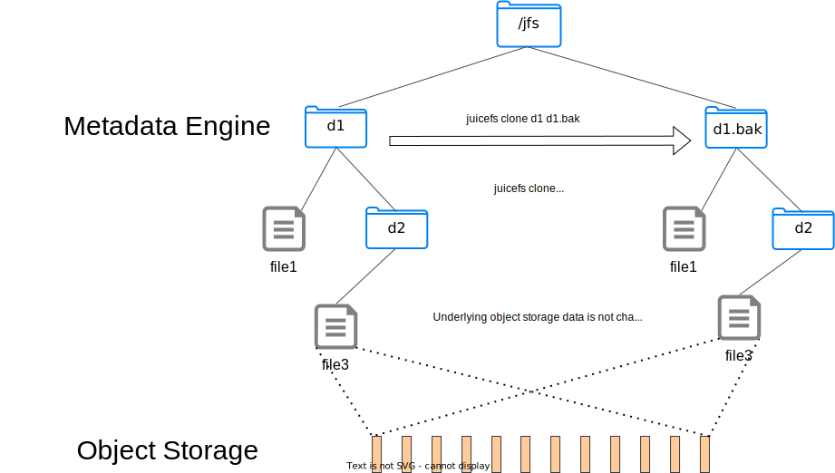

对指定数据进行克隆，创建克隆时不会实际拷贝对象存储数据，而是仅拷贝元数据，因此不论对多大的文件或目录进行克隆，都非常快。对于 JuiceFS，这个命令是 `cp` 更好的替代，甚至对于 Linux 客户端来说，如果所使用的内核支持 [`copy_file_range`](https://man7.org/linux/man-pages/man2/copy_file_range.2.html)，那么调用 `cp` 时，实际发生的也是同样的元数据拷贝，调用将会格外迅速。



克隆结果是纯粹的元数据拷贝，实际引用的对象存储块和源文件相同，因此在各方面都和源文件一样，可以正常读写。有任何一方文件数据被实际修改时，对应的数据块变更会以写入时复制（Copy-on-Write）的方式，写入到新的数据块，而其他未经修改的文件区域，由于对象存储数据块仍然相同，所以引用关系依然保持不变。

需要注意的是，**克隆产生的元数据，也同样占用文件系统存储空间，以及元数据引擎的存储空间**，因此对庞大的目录进行克隆操作时请格外谨慎。

```shell
juicefs clone SRC DST

# 克隆文件
juicefs clone /mnt/jfs/file1 /mnt/jfs/file2

# 克隆目录
juicefs clone /mnt/jfs/dir1 /mnt/jfs/dir2
```

## 一致性 {#consistency}

在事务一致性方面，克隆的行为如下：

- 在 `clone` 命令完成前，目标文件不可见。
- 对于文件：`clone` 命令确保原子性，即克隆后的文件始终处于正确和一致的状态。
- 对于目录：`clone` 命令对目录的原子性没有保证。在克隆过程中，如果源目录发生变化，则目标目录与源目录可能不一致。
- 同时往同一个位置创建克隆时，只会有一个成功，失败请求的会清理掉临时创建的目录树。

克隆操作是在挂载进程中进行，如果克隆命令意外退出，克隆操作可能完成或者被中断。失败或者被中断的克隆操作，`mount` 进程会尝试清理已创建好的子树，如果清理子树也失败（元数据不可用或者`mount`进程意外退出），则会导致元数据泄露和可能的对象存储泄露。此时如果源对象被删除了，则会导致其对象存储上的数据不会被释放（因为被未挂载的的子树所引用），直到使用 [`juicefs gc --delete`](../reference/command_reference.mdx#gc) 命令清理。
