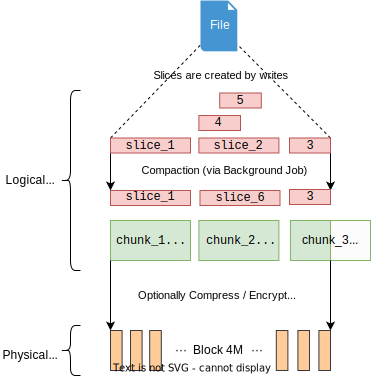

JuiceFS 文件系统由三个部分组成：JuiceFS客户端（Client）、数据存储（Data Storage）和元数据引擎（Metadata Engine）。

**JuiceFS 客户端（Client）**：所有文件读写，碎片合并、回收站文件过期删除等后台任务，均在客户端中发生。客户端需要同时与对象存储和元数据引擎打交道。客户端支持多种接入方式：

- 通过 **FUSE**，JuiceFS 文件系统能够以 POSIX 兼容的方式挂载到服务器，将海量云端存储直接当做本地存储来使用。
- 通过 **Hadoop Java SDK**，JuiceFS 文件系统能够直接替代 HDFS，为 Hadoop 提供低成本的海量存储。
- 通过 **Kubernetes CSI 驱动**，JuiceFS 文件系统能够直接为 Kubernetes 提供海量存储。
- 通过 **S3 网关**，使用 S3 作为存储层的应用可直接接入，同时可使用 AWS CLI、s3cmd、MinIO client 等工具访问 JuiceFS 文件系统。
- 通过 **WebDAV 服务**，以 HTTP 协议，以类似 RESTful API 的方式接入 JuiceFS 并直接操作其中的文件。

**数据存储（Data Storage）**：文件将会被切分上传至对象存储服务。JuiceFS 支持几乎所有的公有云对象存储，同时也支持 OpenStack Swift、Ceph、MinIO 等私有化的对象存储。

**元数据引擎（Metadata Engine）**：用于存储文件元数据（metadata），包含以下内容：

- 常规文件系统的元数据：文件名、文件大小、权限信息、创建修改时间、目录结构、文件属性、符号链接、文件锁等。
- JuiceFS 独有的元数据：文件的 chunk 及 slice 映射关系、客户端 session 等。

JuiceFS 采用多引擎设计，目前已支持 Redis、TiKV、MySQL/MariaDB、PostgreSQL、SQLite 等作为元数据服务引擎，也将陆续实现更多元数据存储引擎。欢迎[提交 Issue](https://github.com/juicedata/juicefs/issues) 反馈你的需求。

## 数据存储：JuiceFS 如何存储文件 {#how-juicefs-store-files}

与传统文件系统只能使用本地磁盘存储数据和对应的元数据的模式不同，JuiceFS 会将数据格式化以后存储在对象存储，同时会将文件的元数据存储在元数据引擎。在 JuiceFS 中，Chunk、Slice、Block 是三个重要的概念：

文件首先被切分为一或多个 64M 的「Chunk」，方便根据 offset 来定位，让 JuiceFS 面对大文件也有优秀的性能。只要文件总长度没有变化，不论经历多少修改写入，文件的 Chunk 切分都是固定的。Chunk 的存在是为了优化查找定位，实际的文件写入则在「Slice」上进行。

「Slice」是 JuiceFS 中负责处理写入的数据结构，最长不超 64M。一个 Slice 代表一次连续写入，隶属于某个 Chunk，并且不能跨越 Chunk 边界。应用的顺序写通常会在一个 Chunk 中只有一个 Slice，而随机写或者缓慢的追加写则会在一个 Chunk 中产生多个 Slice。这多个 Slice 可以是连续的，也可以重叠，或者中间有间隔。调用 `flush` 则会将这些 Slice 持久化。`flush` 可以被用户显式调用，就算不调用，JuiceFS 客户端也会自动在恰当的时机进行 `flush`，防止缓冲区被写满。

如果一个文件在各个区域被反复修改，那么就会产生大量重叠的 Slice，这也是为什么在 Chunk 与 Slice 的引用关系中，[标记了各个 Slice 的有效数据偏移范围](../development/internals.md#sliceref)。文件被读取的时候，按照下方架构图中的堆叠 Slice 模型，不难想象，读取文件需要查找「当前读取范围内最新写入的 Slices」，那么显而易见，堆叠的大量 Slice 将会显著影响读性能，因此 JuiceFS 会在后台任务运行碎片合并，将这一系列 Slice 合并为一。

上边介绍的 Chunk、Slice，其实都是逻辑数据结构，实际持久化到对象存储时，为了能够尽快写入，会对 Slice 进行进一步拆分成一个个「Block」（默认最大 4M），多线程并发写入以提升写性能。因此 Block 也是对象存储和磁盘缓存的最小存储单元。

因此，你会发现在对象存储平台的文件浏览器中找不到存入 JuiceFS 的源文件，存储桶中只有一个 `chunks` 目录和一堆数字编号的目录和文件，不必惊慌，这正是经过 JuiceFS 拆分存储的数据块。与此同时，文件与 Chunk、Slice、Block 的对应关系等元数据信息存储在元数据引擎中。正是这样的分离设计，让 JuiceFS 文件系统得以高性能运作。

JuiceFS 的存储设计，还有着以下技术特点：

* 对于任意大小的文件，JuiceFS 都不进行合并存储，这也是为了性能考虑，避免读放大。
* 提供强一致性保证，但也可以根据场景需要与缓存功能一起调优，比如通过设置出更激进的元数据缓存，牺牲一部分一致性，换取更好的性能。详见[「元数据缓存」](../guide/cache_management.md#metadata-cache)。
* 支持并默认开启[「回收站」](../security/trash.md)功能，删除文件后保留一段时间才彻底清理，最大程度避免误删文件导致事故。
