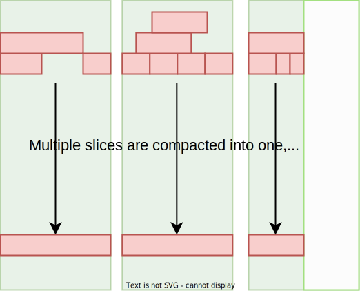

JuiceFS 文件系统由三个部分组成：

**JuiceFS 客户端（Client）**：所有文件读写，以及碎片合并、回收站文件过期删除等后台任务，均在客户端中发生。客户端需要同时与对象存储和元数据引擎打交道。客户端支持多种接入方式：

- 通过 **FUSE**，JuiceFS 文件系统能够以 POSIX 兼容的方式挂载到服务器，将海量云端存储直接当做本地存储来使用。
- 通过 **Hadoop Java SDK**，JuiceFS 文件系统能够直接替代 HDFS，为 Hadoop 提供低成本的海量存储。
- 通过 **Kubernetes CSI 驱动**，JuiceFS 文件系统能够直接为 Kubernetes 提供海量存储。
- 通过 **S3 网关**，使用 S3 作为存储层的应用可直接接入，同时可使用 AWS CLI、s3cmd、MinIO client 等工具访问 JuiceFS 文件系统。
- 通过 **WebDAV 服务**，以 HTTP 协议，以类似 RESTful API 的方式接入 JuiceFS 并直接操作其中的文件。

**数据存储（Data Storage）**：文件将会被切分上传至对象存储服务。JuiceFS 支持几乎所有的公有云对象存储，同时也支持 OpenStack Swift、Ceph、MinIO 等私有化的对象存储。

**元数据引擎（Metadata Engine）**：用于存储文件元数据（metadata），包含以下内容：

- 常规文件系统的元数据：文件名、文件大小、权限信息、创建修改时间、目录结构、文件属性、符号链接、文件锁等。
- 文件数据的索引：文件的数据分配和引用计数、客户端会话等。

JuiceFS 采用多引擎设计，目前已支持 Redis、TiKV、MySQL/MariaDB、PostgreSQL、SQLite 等作为元数据服务引擎，也将陆续实现更多元数据存储引擎。欢迎[提交 Issue](https://github.com/juicedata/juicefs/issues) 反馈你的需求。

## JuiceFS 如何存储文件 {#how-juicefs-store-files}

与传统文件系统只能使用本地磁盘存储数据和对应的元数据的模式不同，JuiceFS 会将数据格式化以后存储在对象存储，同时会将文件的元数据存储在元数据引擎。在 JuiceFS 中，Chunk、Slice、Block 是三个重要的概念：

文件首先被逻辑切分为一或多个 64M 的「Chunk」，方便根据 offset 来定位，让 JuiceFS 面对大文件也有优秀的性能。只要文件总长度没有变化，不论经历多少修改写入，文件的 Chunk 切分都是固定的。

Chunk 的存在是为了优化查找定位，实际的文件写入则在「Slice」上进行。在 JuiceFS 中，一个 Slice 代表一次连续写入，隶属于某个 Chunk，并且不能跨越 Chunk 边界，因此 Slice 长度也不会超 64M。

举例说明，如果一个文件是由一次连贯的顺序写生成，那么每个 Chunk 中只将会仅包含一个 Slice。上方的示意图就属于这种情况：顺序写入一个 160M 文件，最终会产生 3 个 Chunk，而每个 Chunk 仅包含一个 Slice。

文件写入会产生 Slice，而调用 `flush` 则会将这些 Slice 持久化。`flush` 可以被用户显式调用，就算不调用，JuiceFS 客户端也会自动在恰当的时机进行 `flush`，防止缓冲区被写满。持久化到对象存储时，为了能够尽快写入，会对 Slice 进行进一步拆分成一个个「Block」（默认最大 4M），多线程并发写入以提升写性能。上边介绍的 Chunk、Slice，其实都是逻辑数据结构，Block 则是物理存储形式，是对象存储和磁盘缓存的最小存储单元。

因此，你会发现在对象存储平台的文件浏览器中找不到存入 JuiceFS 的源文件，存储桶中只有一个 `chunks` 目录和一堆数字编号的目录和文件，不必惊慌，这正是经过 JuiceFS 拆分存储的数据块。与此同时，文件与 Chunk、Slice、Block 的对应关系等元数据信息存储在元数据引擎中。正是这样的分离设计，让 JuiceFS 文件系统得以高性能运作。

回到逻辑数据结构的话题，如果这个文件并不是由连贯的顺序写生成，而是多次追加写，每次追加均调用 `flush` 触发写入上传，就会产生多个 Slice。如果每次追加写入的数据量不足 4M，那么对应的 Block 也会小于 4M，对于任意大小的文件，JuiceFS 都不进行合并存储，这也是为了性能考虑，避免读放大。

取决于写入模式，Slice 的排列模式可以是多种多样的：如果文件在相同区域被反复修改，Slice 之间会发生重叠。如果在互不相交的区域进行写入，Slice 中间会有间隔。不论 Slice 的排列有多复杂，当读文件发生时，对于每一处文件位置，都会读到该位置最新写入的 Slice，用下图可以更加直观地理解：Slice 虽然会相互堆叠，但读文件一定是“从上往下看”，因此一定会读到该文件的最新状态。

正是由于 Slice 会相互覆盖，JuiceFS 在 Chunk 与 Slice 的引用关系中，[标记了各个 Slice 的有效数据偏移范围](../development/internals.md#sliceref)，来告诉文件系统，每一个 Slice 中的哪些部分是有效的数据。

但也不难想象，读取文件需要查找「当前读取范围内最新写入的 Slice」，在上图所示的大量堆叠 Slice 的情况下，这样的反复查找将会显著影响读性能，因此 JuiceFS 会在后台任务运行碎片合并，将这一系列 Slice 合并为一。

