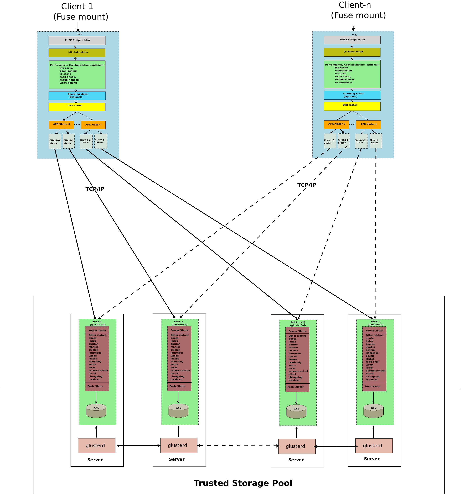
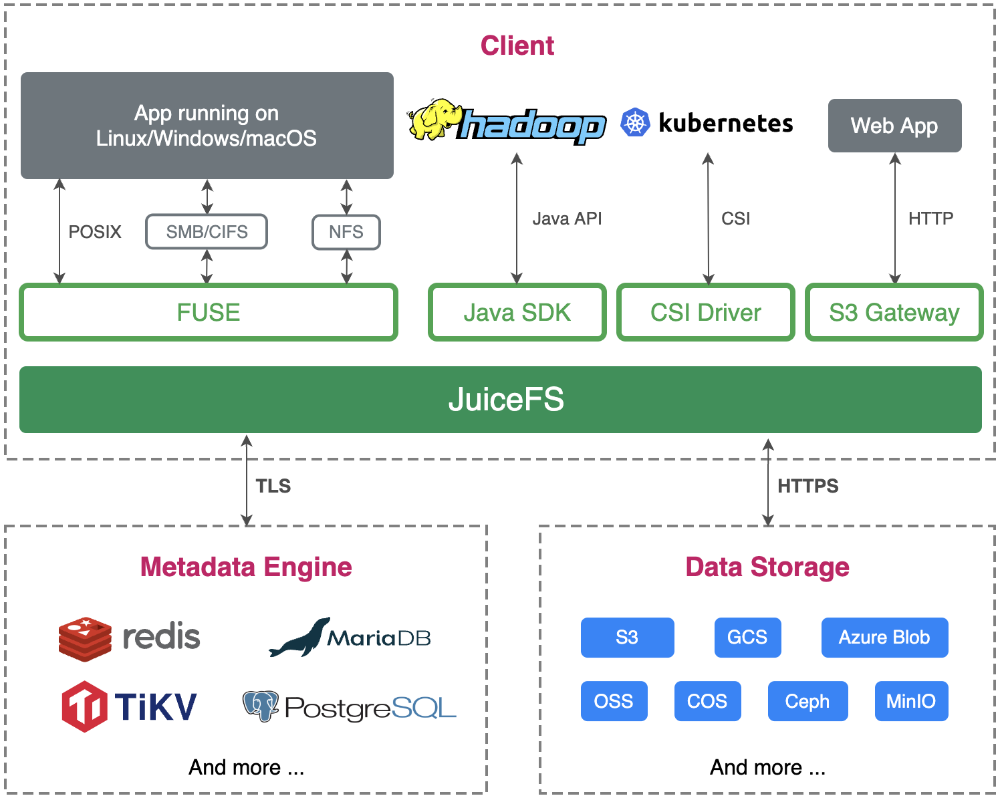

[GlusterFS](https://github.com/gluster/glusterfs) 是一款开源的软件定义分布式存储解决方案，能够在单个集群中支持高达 PiB 级别的数据存储。

JuiceFS 是一款专为云端设计的开源、高性能分布式文件系统，以较低的成本提供了大规模、弹性和高性能的存储能力。

本文先通过一份表格简要对比 JuiceFS 和 GlusterFS 的主要特点，然后进行详细探讨。你可以通过下表速查二者的关键特性对比，然后在本文中选取感兴趣的话题详细阅读。

## JuiceFS 和 GlusterFS 对比一览 {#a-quick-summary-of-glusterfs-vs-juicefs}

下表快速概述了 GlusterFS 和 JuiceFS 之间的差异：

| 对比项 | GlusterFS | JuiceFS |
| :--- | :--- | :--- |
| 元数据 | 纯分布式 | 独立数据库服务 |
| 数据存储 | 自主管理 | 依赖对象存储服务 |
| 大文件拆分 | 不拆分 | 拆分 |
| 冗余保护 | 副本、纠删码 | 依赖对象存储服务 |
| 数据压缩 | 部分支持 | 支持 |
| 数据加密 | 部分支持 | 支持 |
| POSIX 兼容性 | 完整 | 完整 |
| NFS 协议 | 不直接支持 | 不直接支持 |
| CIFS 协议 | 不直接支持 | 不直接支持 |
| S3 协议 | 支持（久未更新） | 支持 |
| HDFS 兼容性 | 支持（久未更新） | 支持 |
| CSI 驱动 | 支持 | 支持 |
| POSIX ACLs | 支持 | 支持 |
| 跨域复制 | 支持 | 依赖外部服务 |
| 目录配额 | 支持 | 支持 |
| 快照 | 支持 | 不支持（但支持克隆） |
| 回收站 | 支持 | 支持 |
| 主要维护者 | Red Hat, Inc | Juicedata, Inc |
| 开发语言 | C | Go |
| 开源协议 | GPLv2 and LGPLv3+ | Apache License 2.0 |

## 系统架构对比 {#system-architecture-comparison}

### GlusterFS 的架构 {#glusterfs-architectire}

GlusterFS 采用的是全分布式的架构，没有中心化节点。GlusterFS 集群主要由服务端和客户端两大部分组成。其中服务端负责管理和存储数据，通常被称为可信存储池（Trusted Storage Pool）。这个存储池由一系列对等的 Server 节点组成，一般会运行两类进程：

* glusterd：每个节点一个，负责配置管理和分发等。
* glusterfsd：每个 [Brick](https://docs.gluster.org/en/latest/glossary/#Brick) 一个，负责处理数据请求和对接底层文件系统。

每个 Brick 上的所有文件可以看成是 GlusterFS 的一个子集，就文件内容而言，通过 Brick 直接访问和通过 GlusterFS 客户端访问看到的结果通常是一致的。因此，在 GlusterFS 异常情况下，用户通过整合多个 Bricks 内容就能一定程度上恢复出原有数据。另外在部署时，为了确保某台机器故障时，整个文件系统的访问不受影响，通常会对数据做冗余保护。在 GlusterFS 中，多个 Bricks 会组成一个冗余组，互相之间通过副本或纠删码的方式实现数据保护。当某个节点故障时，只能在冗余组内做恢复，恢复的时间会比较长。在 GlusterFS 集群扩容时，需要以冗余组为单位整体扩容。

客户端是挂载了 GlusterFS 的节点，负责对应用程序展示统一的命名空间。其架构图如下（出自 [Gluster 架构](https://docs.gluster.org/en/latest/Quick-Start-Guide/Architecture)）：

### JuiceFS 的架构 {#juicefs-architecture}

JuiceFS 采用「数据」与「元数据」分离存储的架构，文件数据本身会被切分保存在对象存储（如 Amazon S3）当中，而元数据则是会被保存在用户自行选择的数据库里（如 Redis、MySQL）。通过共享同一个份数据库与对象存储，JuiceFS 实现了一个强一致性保证的分布式文件系统，同时还具有「POSIX 完全兼容」、「高性能」等诸多特性。更详细的介绍参见[文档](../architecture.md)。

## 元数据管理对比 {#metadata-management-comparison}

### GlusterFS {#glusterfs}

GlusterFS 元数据是纯分布式的，没有集中的元数据服务。客户端通过对文件名哈希确定其所属的 Brick；当请求需要跨多个 Bricks 访问（如 mv，ls 等）时，由客户端负责协调。这种设计架构上比较简单，但当系统规模扩大时，往往会带来性能瓶颈。比如，ls 一个大目录时可能会需要访问多个 Bricks 来获得完整的结果，其中任何一个的卡顿都会导致整个请求变慢。另外，跨 Bricks 修改操作在途中遇到故障时，元数据一致性也比较难保证。在严重故障时，还可能出现脑裂，需要[手动恢复](https://docs.gluster.org/en/latest/Troubleshooting/resolving-splitbrain)数据到统一版本。

### JuiceFS {#juicefs}

JuiceFS 的元数据存储在一个独立的数据库（称为元数据引擎）中，客户端会将文件元数据操作转换成此数据库的一个事务，借助数据库的事务能力来保证操作的原子性。这种设计使得 JuiceFS 的实现变得简单，但对元数据引擎提出了较高的要求。目前 JuiceFS 支持三大类 10 种事务型数据库，具体可参见[元数据引擎文档](../../reference/how_to_set_up_metadata_engine.md)。

## 数据管理对比 {#data-management-comparison}

GlusterFS 通过整合多个服务端节点的 Bricks（一般构建在本地文件系统之上，如 XFS）来存储数据。因此，它本身提供了一定的数据管理功能，如分布管理、冗余保护、故障切换、静默错误检测等。

JuiceFS 则不直接使用硬盘，而是通过对接各种对象存储来管理数据，大部分特性都依赖于对象存储自身的实现。

### 大文件拆分 {#large-file-splitting}

在分布式系统中，将大文件拆分成多个小块散列存储在不同节点中是一种常见的优化手段。这往往能让应用在访问此文件时有更高的并发度和整体带宽。

* GlusterFS：不拆分（曾有过 Striped Volume 会拆分大文件，现已不再支持）。
* JuiceFS：文件先按大小拆成 64 MiB 的 Chunks，每个 Chunk 再根据写入模式进一步拆成默认 4 MiB 的 Blocks；具体可参见[架构文档](../architecture.md#how-juicefs-store-files)。

### 冗余保护 {#redundancy-protection}

GlusterFS 支持副本（Replicated Volume）和纠删码（Dispersed Volume）两种类型。

JuiceFS 依赖于使用的对象存储。

### 数据压缩 {#data-compression}

GlusterFS：

* 仅支持传输层压缩，文件由客户端执行压缩，传输到服务端后再由 Brick 负责解压缩。
* 不直接实现存储层压缩，而是依赖于 Brick 使用的底层文件系统，如 [ZFS](https://docs.gluster.org/en/latest/Administrator-Guide/Gluster-On-ZFS)。

JuiceFS 同时支持传输层压缩和存储层压缩，数据的压缩和解压缩都在客户端执行。

### 数据加密 {#data-encryption}

GlusterFS：

* 仅支持[传输层加密](https://docs.gluster.org/en/latest/Administrator-Guide/SSL)，依赖于 SSL/TLS。
* 曾支持过[存储层加密](https://github.com/gluster/glusterfs-specs/blob/master/done/GlusterFS%203.5/Disk%20Encryption.md)，但现已不再支持。

JuiceFS 同时支持[传输层加密和存储层加密](../../security/encryption.md)，数据的加密和解密都在客户端进行。

## 访问协议 {#access-protocols}

### POSIX 兼容性 {#posix-compatibility}

[GlusterFS](https://docs.gluster.org/en/latest/glossary) 和 [JuiceFS](../../reference/posix_compatibility.md) 都提供 POSIX 兼容性。

### NFS 协议 {#nfs-protocol}

GlusterFS 曾有内嵌服务来支持 NFSv3，但现已[不再推荐使用](https://github.com/gluster/glusterfs-specs/blob/master/done/GlusterFS%203.8/gluster-nfs-off.md)，而是建议用 NFS server 将挂载点导出。

JuiceFS 不直接支持，需要挂载后[通过其他 NFS server 导出](../../deployment/nfs.md)。

### CIFS 协议 {#cifs-protocol}

GlusterFS 内嵌支持 Windows，Linux Samba client 和 macOS 的 CLI 访问，不支持 macOS Finder。然而，文档中建议用[通过 Samba 将挂载点导出](https://docs.gluster.org/en/latest/Administrator-Guide/Setting-Up-Clients/#testing-mounted-volumes)的方式使用。

JuiceFS 不直接支持，需要挂载后[通过 Samba 导出](../../deployment/samba.md)。

### S3 协议 {#s3-protocol}

GlusterFS 通过 [`gluster-swift`](https://github.com/gluster/gluster-swift) 项目支持，但其最近更新停留在 2017 年 11 月。

JuiceFS 通过 [S3 网关](../../guide/gateway.md)支持。

### HDFS 兼容性 {#hdfs-compatibility}

GlusterFS 通过 [`glusterfs-hadoop`](https://github.com/gluster/glusterfs-hadoop) 项目支持，但其最近更新停留在 2015 年 5 月。

JuiceFS 完整[兼容 HDFS API](../../deployment/hadoop_java_sdk.md)。

### CSI 驱动 {#csi-driver}

GlusterFS 曾[支持过](https://github.com/gluster/gluster-csi-driver)，但最近版本发布于 2018 年 11 月，且仓库已被标记 DEPRECATED。

JuiceFS 支持，具体可参见 [JuiceFS CSI 驱动文档](https://juicefs.com/docs/zh/csi/introduction)。

## 扩展功能 {#extended-features}

### POSIX ACLs {#posix-acls}

Linux 下对文件的访问权限控制一般有三类实体，即文件拥有者（owner）、拥有组（group）和其他（other）。当我们有更复杂的需求，比如要给本属于 other 的某个特定用户单独赋予权限时，这套机制就做不到了。POSIX Access Control Lists (ACLs) 提供增强的权限管理功能，可用来为任意用户/用户组指定权限。

GlusterFS [支持](https://docs.gluster.org/en/main/Administrator-Guide/Access-Control-Lists)，且支持 access ACLs 和 default ACLs。

JuiceFS 从 v1.2 版本开始支持 [POSIX ACLs](../../security/posix_acl.md) 特性。

### 跨域复制 {#cross-cluster-replication}

跨域复制是指在两套独立的集群间进行数据复制，一般被用来实现异地灾备。

GlusterFS [支持单向的异步增量复制](https://docs.gluster.org/en/main/Administrator-Guide/Geo-Replication)，但需要两边是同版本的 Gluster 集群。

JuiceFS 依赖元数据引擎和对象存储自身的复制能力，可以做单向复制。

### 目录配额 {#directory-quotas}

[GlusterFS](https://docs.gluster.org/en/main/Administrator-Guide/Directory-Quota) 和 [JuiceFS](../../guide/quota.md#directory-quota) 都支持目录配额，包括容量和/或文件数限制。

### 快照 {#snapshots}

GlusterFS 仅[支持存储卷级别的快照](https://docs.gluster.org/en/main/Administrator-Guide/Managing-Snapshots)，而且需要所有 Bricks 部署在 LVM 精简卷（Thinly-Provisioned LVM）上。

JuiceFS 不支持快照，但支持[目录级别的克隆](../../guide/clone.md)。

### 回收站 {#trash}

GlusterFS [支持](https://docs.gluster.org/en/main/Administrator-Guide/Trash)，且默认关闭。

JuiceFS [支持](../../security/trash.md)，且默认打开。
