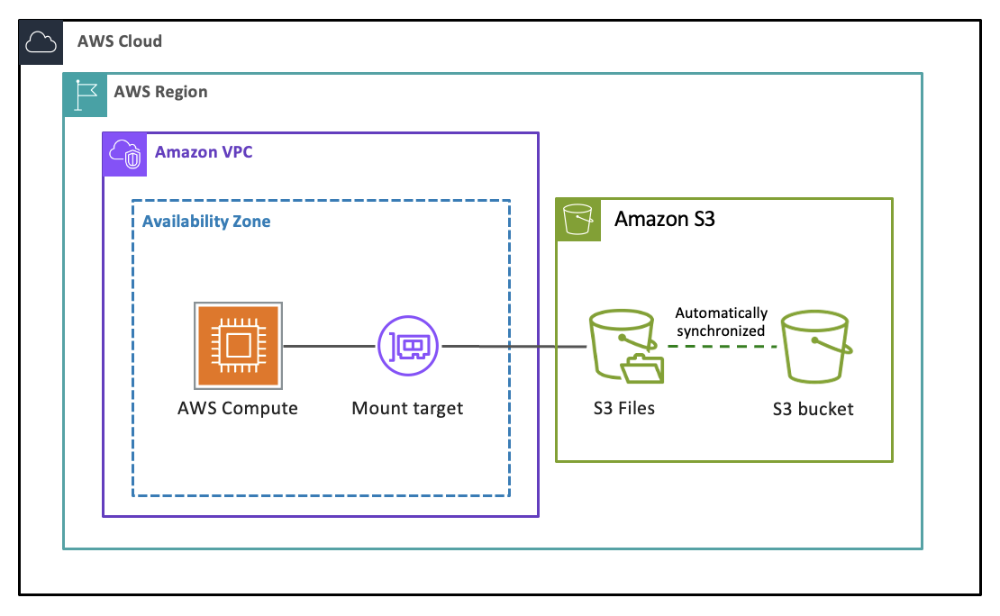

# JuiceFS 对比 S3 Files

AWS 于 2026 年 4 月推出了 [Amazon S3 Files](https://docs.aws.amazon.com/zh_cn/AmazonS3/latest/userguide/s3-files.html)。它允许用户以较少甚至零数据迁移的工作量，将 S3 存储桶挂载为高性能共享文件系统。S3 Files 兼容 NFS v4.2 和 v4.1 协议，可挂载到 EC2 实例、容器环境（如 AWS EKS）乃至 Lambda 函数上。它提供了文件系统访问语义，包括读写后数据一致性、文件锁和 POSIX 权限。

虽然 S3 Files 和 JuiceFS 都能通过 POSIX 接口提供对对象存储的文件系统访问，但两者在架构理念、性能特性、多云能力和成本结构上存在显著差异。

## 产品定位

**Amazon S3 Files** 是 AWS 的原生方案，让用户无需修改代码即可将现有 S3 存储桶作为文件系统访问。它面向深度使用 AWS 生态、希望以最小迁移成本获得轻量共享文件访问的用户群体。它最适合交互式工作负载、Agentic AI 以及零数据迁移是核心诉求的场景。

**JuiceFS** 是一款云原生分布式文件系统，专为跨多云的 AI/ML 训练、高性能计算和大数据分析等场景设计。通过「数据与元数据分离」的架构设计，JuiceFS 能够满足大规模、性能敏感型任务对 POSIX 兼容性、强一致性以及混合多云运行的要求。

## 系统架构

**Amazon S3 Files** 使用 [Amazon EFS (Elastic File System)](https://docs.aws.amazon.com/zh_cn/efs/latest/ug/whatisefs.html) 作为全托管的、高性能存储层，负责处理元数据和低延迟数据访问。S3 Files 在文件与 S3 对象之间保持直接的映射关系。该服务会自动将文件系统视图的变更同步到 S3，且始终以 S3 作为数据最终来源。

<!-- markdownlint-disable enhanced-proper-names -->

<!-- markdownlint-enable enhanced-proper-names -->

关键架构特点：

- S3 Files 使用 EFS 作为缓存和元数据层。
- 不会将文件拆分为块，保持文件与对象之间的一对一映射。
- 在数据导入阶段，只有小于阈值（可配置，默认为 128 KiB）的文件才会被放入 EFS 高性能层。
- 大文件通过 S3 直接读取。
- 存在最长约 60 秒的聚合窗口，之后写入才会被异步写回 S3。

**JuiceFS** 采用「数据与元数据分离」的架构设计。文件在上传到对象存储前被拆分为数据块（默认 4 MiB），对应的元数据则存储在独立的元数据引擎中。

关键架构特点：

- JuiceFS 支持可插拔的元数据引擎（Redis、TiKV、MySQL、PostgreSQL 等）。
- JuiceFS 使用数据分块存储文件，从而能够高效处理部分更新、追加写入以及高吞吐操作。请查阅[技术架构](../../introduction/architecture.md)了解更多信息。
- 不依赖 EFS 或任何中间存储层，但 JuiceFS 提供了灵活的缓存机制来降低延迟、提升性能。
- 支持多云和混合云，兼容[所有主流对象存储](../../reference/how_to_set_up_object_storage.md)作为后端。

### 数据路径与延迟

**S3 Files**：所有元数据操作和小文件数据访问都经由 EFS 高性能层；而大文件读取则直接访问 S3。这种混合路径导致读取延迟因文件大小和访问模式的不同而有较大差异。对于大文件的部分更新和重命名操作（详见下文），写放大问题会变得非常严重。

**JuiceFS**：元数据操作与专门的元数据引擎交互（配合可配置的元数据缓存），能够提供独立于对象存储延迟的快速响应。数据读写则利用本地缓存和基于数据块的分布式能力。JuiceFS 客户端可以智能地缓存元数据和文件数据块，减少对元数据引擎和对象存储的往返请求。

### 写入效率

**S3 Files**：由于文件与对象之间是一对一映射，当对大文件执行随机写入或追加写入时，S3 Files 必须重写或生成整个对象的新版本。例如，向一个 100 GB 的文件追加 100 KB 数据，会引起显著的写放大和存储成本。类似地，对包含数百万个对象的目录进行重命名，需要将每个对象重新写入新的位置（使用新的对象键）并删除原对象，这会极大增加操作耗时和 S3 请求成本。

**JuiceFS**：因为文件被拆分为数据块，对大文件进行重写或追加写入只会影响相关的少数数据块。无论文件多大，这种方式都能大幅减少时间和带宽浪费。而目录重命名是纯元数据操作，即使对包含数百万文件的目录也同样高效。

### 缓存

**S3 Files** 使用 EFS 作为高性能存储和缓存层，缓存行为完全由 AWS 管理。S3 Files 会自动从 EFS 层删除那些已同步到 S3、且在可配置时间段（默认 30 天）内未被访问的数据。用户无法直接控制缓存容量，而是通过设置文件大小阈值来控制哪些文件被提升到 EFS 层。这在满足工作负载对文件访问延迟的要求与随之产生的持续 EFS 读写和存储成本之间形成了一种权衡。另外，用户如果直接修改或覆盖 S3 中的底层对象，将导致最终一致性，而 S3 桶中的版本始终具有更高优先级。

**JuiceFS** 在本地 SSD 或内存中实现客户端缓存。它预设了默认的磁盘缓存上限（100 GiB），用户可以根据需要自由调整。当缓存用量达到上限，JuiceFS 会采用类似 LRU 的算法自动进行清理，确保后续的读写操作始终有缓存可用。请查阅[缓存](../../guide/cache.md)了解更多信息。

### 多云支持

S3 Files 能与现有 S3 存储桶无缝集成，对于已经深度使用 AWS 作为基础设施的团队来说是一个不错的选择。不过，S3 Files 是单云解决方案。如果您需要在 AWS、Azure、GCP 或私有云之间迁移工作负载，JuiceFS 能够提供统一的文件系统接口，并适配所有主流对象存储。更多功能对比详情请见下表。

## 功能对比

| 特性           | S3 Files                    | JuiceFS 社区版                                      | JuiceFS 企业版                               |
| -------------- | --------------------------- | --------------------------------------------------- | -------------------------------------------- |
| 客户端         | POSIX（FUSE）+ S3 直接读取  | POSIX（FUSE）、Java SDK、Python SDK、S3 网关        | POSIX（FUSE）、Java SDK、Python SDK、S3 网关 |
| 元数据存储     | EFS                         | 独立数据库服务（Redis、TiKV、MySQL、PostgreSQL 等） | 自研高性能分布式元数据引擎（可横向扩展）     |
| 元数据冗余保护 | 由 EFS 提供                 | 取决于所使用的数据库                                | 至少 3 副本（基于 Raft 共识算法）            |
| 数据存储       | 仅 S3                       | 任意主流对象存储                                    | 任意主流对象存储                             |
| 数据冗余保护   | 由 S3 提供                  | 由对象存储提供                                      | 由对象存储提供                               |
| 数据缓存       | EFS                         | 本地缓存                                            | 分布式缓存                                   |
| 存储加密       | ✓ 支持                      | ✓ 支持                                              | ✓ 支持                                       |
| 数据压缩       | ✕ 不支持                    | ✓ 支持                                              | ✓ 支持                                       |
| 配额管理       | ✕ 不支持                    | ✓ 支持                                              | ✓ 支持                                       |
| POSIX 兼容性   | ✓ 完全兼容                  | ✓ 完全兼容                                          | ✓ 完全兼容                                   |
| POSIX ACL      | ✓ 支持                      | ✓ 支持                                              | ✓ 支持                                       |
| Kubernetes CSI | ✓ 支持                      | ✓ 支持                                              | ✓ 支持                                       |
| 跨区数据复制   | ◐ 依赖 S3 原生能力          | ◐ 依赖外部服务                                      | ✓ 支持                                       |
| 多云镜像       | ✕ 不支持                    | ✕ 不支持                                            | ✓ 支持                                       |
| 定价           | S3 费用 + S3 Files 额外费用 | 开源免费（Apache License 2.0）                      | 商业许可，按使用量计费                       |

## 成本影响

**S3 Files** 在标准 S3 存储费用之上引入了额外的成本层：

- S3 存储费用。
- EFS 高性能层存储费用（美国主流区域约为 $0.30/GB-月）。
- 数据流量费用：在美国主流区域，从 EFS 层读取数据为 $0.03/GB。对文件系统的写入会首先进入 EFS 层（$0.06/GB），随后同步回 S3，这个同步过程又会涉及从 EFS 层的读取（再次产生 $0.03/GB）。
- 短期数据驻留：即使同步完成，数据仍会继续占用 EFS 容量，直到过期时间（默认为 30 天）。

对于写密集型工作负载（例如生成训练数据集或分析结果），这些成本会迅速累积。S3 Files 更适合读取已有数据，尤其是小文件场景。而对于持续的、大规模的文件读写，特别是对大型文件的修改或追加，S3 Files 可能会既昂贵又低效。更多详情请参考 S3 和 S3 Files 的[定价页面](https://aws.amazon.com/s3/pricing)。

**JuiceFS** 的成本更加透明且由用户可控：

- 对象存储费用。
- 元数据引擎费用：可以选择自建或使用全托管的元数据服务（独立数据库服务，或 JuiceFS 企业版的自研高性能分布式元数据引擎）。
- 没有强制的中间存储层，也没有额外的数据流量附加费用。
- 在对成本敏感、读密集、写密集或多云的场景下，JuiceFS 的增量成本通常低于 S3 Files。

## 总结

**Amazon S3 Files** 采用了一种在 S3 之上利用 Amazon EFS 作为高性能元数据和缓存层的存储架构。通过保留文件与对象之间的一对一映射，它支持以极少甚至零迁移成本，通过标准 NFS 协议访问现有的 S3 存储桶。文件系统视图与 S3 之间内置的双向同步，加上对活跃数据集提供亚毫秒级延迟的能力，使得 S3 Files 非常适合 AWS 原生的交互式工作负载、Agentic AI 工具，以及那些希望无需修改代码或拷贝数据、直接将现有 S3 数据作为共享文件系统使用的场景。

**JuiceFS** 支持数十种对象存储后端，包括 AWS S3、Azure Blob、Google Cloud Storage、MinIO、阿里云 OSS 等，也支持 HDFS 和本地磁盘作为数据存储引擎。在元数据引擎方面，它支持 Redis、Valkey、TiKV、MySQL、MariaDB、PostgreSQL、SQLite 等主流数据库，同时 JuiceFS 企业版还提供高性能、高可用、高可扩展性的自研分布式元数据引擎。JuiceFS 提供通过 FUSE 挂载的标准 POSIX 文件系统接口、可直接替代 HDFS 为 Hadoop 生态提供存储的 Java API，以及用于 Kubernetes 容器持久化存储的 CSI 驱动。通过将文件拆分为细粒度数据块并解耦元数据与数据，JuiceFS 能够实现高效的随机写入、快速的目录操作以及无写放大的强一致性。JuiceFS 是一款面向企业级分布式数据存储场景的文件系统，被广泛用于大数据分析、AI/ML 训练、Agentic AI 工具、多云/混合云部署、容器共享存储以及高性能计算等领域。
