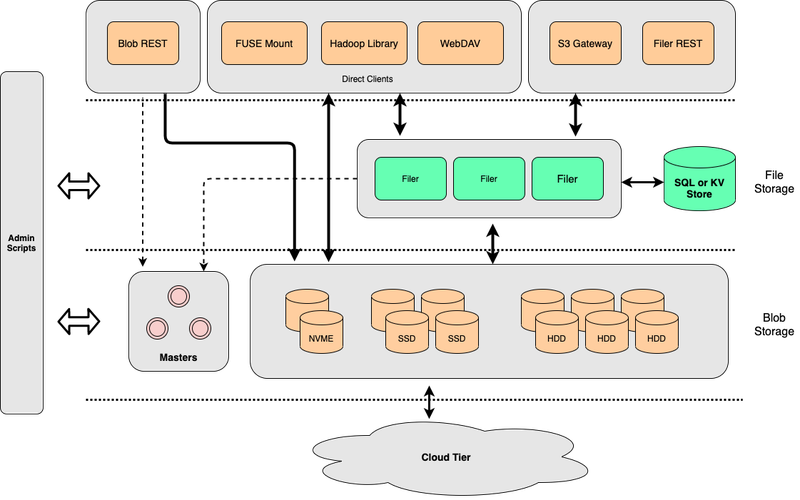
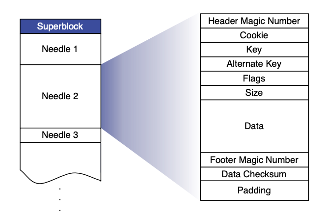

[SeaweedFS](https://github.com/seaweedfs/seaweedfs) 与 [JuiceFS](https://github.com/juicedata/juicefs) 皆是开源的高性能分布式文件存储系统，但二者存在诸多设计区别与功能差异，本章将会详述他们的区别和各自适用场景，帮助你的团队进行技术选型。

SeaweedFS 和 JuiceFS 都采用了对商用更友好的 Apache License 2.0，但 JuiceFS 分为[社区版](https://juicefs.com/docs/zh/community/introduction)和[企业版](https://juicefs.com/zh-cn/blog/solutions/juicefs-enterprise-edition-features-vs-community-edition)，企业版提供多种交付形式，例如私有部署和[云服务](https://juicefs.com/docs/zh/cloud)。JuiceFS 企业版使用自研的闭源元数据引擎，其客户端则与[社区版](https://github.com/juicedata/juicefs)大量共享代码。你可以通过下表速查两者的关键特性对比，然后在本文中选取感兴趣的话题详细阅读。

## JuiceFS 和 SeaweedFS 对比一览

| 对比项 | SeaweedFS | JuiceFS |
| :--- | :--- | :--- |
| 元数据引擎 | 支持多种数据库 | 社区版支持多种数据库、企业版使用自研高性能元数据引擎 |
| 元数据操作原子性 | 未保证 | 社区版通过数据库事务保证、企业版元数据引擎自身保证操作原子性 |
| 变更日志 | 支持 | 仅企业版支持 |
| 数据存储 | 自包含 | 依赖对象存储 |
| 纠删码 | 支持 | 依赖对象存储 |
| 数据合并 | 支持 | 依赖对象存储 |
| 文件拆分 | 8MB | 64MB 逻辑块 + 4MB 物理存储块 |
| 分层存储 | 支持 | 依赖对象存储 |
| 数据压缩 | 支持（基于扩展名） | 支持（全局设置） |
| 存储加密 | 支持 | 支持 |
| POSIX 兼容性 | 基本 | 完整 |
| S3 协议 | 基本 | 基本 |
| WebDAV 协议 | 支持 | 支持 |
| HDFS 兼容性 | 基本 | 完整 |
| CSI 驱动 | 支持 | 支持 |
| 客户端缓存 | 支持 | 支持 |
| 集群数据复制 | 支持单向、双向复制模式 | 仅企业版支持单向复制 |
| 云上数据缓存 | 支持（手动同步） | 仅企业版支持 |
| 回收站 | 不支持 | 支持 |
| 运维与监控 | 支持 | 支持 |
| 发布时间 | 2015.4 | 2021.1 |
| 主要维护者 | 个人（Chris Lu） | 公司（Juicedata Inc） |
| 语言 | Go | Go |
| 开源协议 | Apache License 2.0 | Apache License 2.0 |

## SeaweedFS 技术架构

系统由 3 部分组成：

- **Volume Server**，用于底层存储文件
- **Master Server**，用于管理集群
- **Filer**，一个向上提供更多特性的可选组件

Volume Server 与 Master Server 一并构成文件存储服务：

- Volume Server 专注于数据的写入与读取
- Master Server 负责管理集群与 Volumes

在读写数据时，SeaweedFS 的实现与 Haystack 相似，用户创建的文件系统（Volume）实际上是一个大磁盘文件，也就是下图的 Superblock。在此 Volume 中，用户写入的所有文件都会被合并到该大磁盘文件中，借用 Haystack 的术语，每一个文件都是“一根针”，needle。

SeaweedFS 中数据写入和读取流程：

1. 在开始写入数据之前，客户端向 Master Server 发起写入申请。
2. SeaweedFS 根据当前的数据量返回一个 File ID，这个 ID 由 \<volume id, file key, file cookie\> 三部分构成。在写入的过程中，一并被写入的还有基础的元数据信息（文件长度与 Chunk 等信息）。
3. 当写入完成之后，调用者需要在一个外部系统（例如 MySQL）中对该文件与返回的 File ID 进行关联保存。
4. 在读取数据时，由于 Volume 的索引信息已被加载入内存，可以通过 File ID 直接获取文件位置（偏移）的所有信息，因此可以高效地将文件的内容读取出来。

在上述的底层存储服务之上，SeaweedFS 提供了一个名为 Filer 的组件，他对接 Volume Server 与 Master Server，对外提供丰富的功能与特性，如 POSIX 支持、WebDAV、S3 API。与 JuiceFS 相同，Filer 也需要对接一个外部数据库以保存元数据信息。

## JuiceFS 技术架构

JuiceFS 采用元数据与数据分离存储的架构：

- 文件数据本身会被切分保存在对象存储（如 S3）当中
- 元数据被保存在元数据引擎中，元数据引擎是一个由用户自行选择数据库，如 Redis、MySQL。

客户端连接元数据引擎获取元数据服务，然后将实际数据写入对象存储，实现强一致性分布式文件系统。

JuiceFS 的架构在[「技术架构」](../architecture.md)有更详细的介绍。

## 架构对比

### 元数据

SeaweedFS 与 JuiceFS 都支持通过外部数据库以存储文件系统的元数据信息：

- SeaweedFS 支持多达 [24](https://github.com/seaweedfs/seaweedfs/wiki/Filer-Stores) 种数据库。
- JuiceFS 对数据库事务能力要求更高（下方会详细介绍），当前支持了 [3 类共 10 种事务型数据库](../../reference/how_to_set_up_metadata_engine.md)。

### 原子性操作

* JuiceFS 严格确保每一项操作的原子性，因此对于元数据引擎（例如 Redis、MySQL）的事务能力有着较强的要求，因此支持的数据库更少。
* SeaweedFS 则对操作的原子性保证较弱，目前而言 SeaweedFS 仅在执行 `rename` 操作时启用了部分数据库（SQL、ArangoDB 和 TiKV）的事务，因此对于数据库的事务能力要求较低。同时，由于 SeaweedFS 在 `rename` 操作中拷贝元数据时，未对原目录或文件进行加锁，高负载下可能造成数据丢失。

### 变更日志以及相关功能

SeaweedFS 会为所有的元数据操作生成变更日志（changelog），日志可以被传输、重放，保证数据安全的同时，还能用来实现文件系统数据复制、操作审计等功能。

SeaweedFS 支持在多个集群之间进行文件系统数据复制，存在两种异步数据复制模式：

- 「Active-Active」：此模式中，两个集群都能够参与文件写入并双向同步。如果集群节点数量超过 2，SeaweedFS 的一些操作（如重命名目录）会受到一些限制。
- 「Active-Passive」：此模式是主从关系，Passive 一方只读。

这两种模式都是通过传递 changelog 再应用的机制实现了不同集群数据间的一致性，对于每一条 changelog，其中会有一个签名信息以保证同一个修改不会被循环多次。

JuiceFS 社区版没有实现变更日志，但可以自行使用元数据引擎和对象存储自身的数据复制能力实现文件系统镜像功能，比方说 [MySQL](https://dev.mysql.com/doc/refman/8.0/en/replication.html) 或 [Redis](https://redis.io/docs/management/replication) 仅支持数据复制，配合上 [S3 的复制对象功能](https://docs.aws.amazon.com/zh_cn/AmazonS3/latest/userguide/replication.html)，就能脱离 JuiceFS 实现类似 SeaweedFS 的 Active-Passive 模式。

顺带一提，JuiceFS 企业版的元数据引擎也是基于变更日志实现，支持[数据复制](https://juicefs.com/docs/zh/cloud/guide/replication)、[镜像文件](https://juicefs.com/docs/zh/cloud/guide/mirror)系统，可以点击对应文档链接以了解更多。

## 存储对比

如前文所述，SeaweedFS 的数据存储由 Volume Server + Master Server 实现，支持小数据块的合并存储、纠删码等特性。而 JuiceFS 的数据存储则是依托于对象存储服务服务，相关的特性也都由对象存储提供。

### 文件拆分

SeaweedFS 与 JuiceFS 都会将文件拆分成若干个小块再持久化到底层的数据系统中：

- SeaweedFS 将文件拆分成 8MB 的块，对于超大文件（超过 8GB），它会将 Chunk 索引也保存到底层的数据系统中。
- JuiceFS 内部会使用 64MB 的逻辑数据块（Chunk），再拆成 4MB 的 Block 上传至对象存储，这点在[架构文档](../architecture.md#how-juicefs-store-files)中有更详细的介绍。

### 分层存储

对于新创建的 Volume，SeaweedFS 会把数据存储在本地，而对于较旧的 Volume，SeaweedFS 支持将他们上传至云端以达到[冷热数据的分离](https://github.com/seaweedfs/seaweedfs/wiki/Tiered-Storage)。JuiceFS 自身并没有实现分层存储的功能，而是直接使用对象存储提供的分层管理服务，比如 [S3 存储类](https://aws.amazon.com/cn/s3/storage-classes/glacier/?nc1=h_ls)。

### 数据压缩

JuiceFS 支持使用 LZ4 或者 Zstandard 来为所有写入的数据进行压缩，而 SeaweedFS 则是根据写入文件的扩展名、文件类型等信息来选择是否进行压缩。

### 加密

二者均支持加密，包括传输中加密及静态加密：

* SeaweedFS 支持传输中加密与静态加密。在开启了数据加密后，所有写入 Volume Server 的数据都会使用随机的密钥进行加密，而这些对应的随机密钥信息则由维护文件元数据的 Filer 进行管理，详见 [Wiki](https://github.com/seaweedfs/seaweedfs/wiki/Filer-Data-Encryption)。
* JuiceFS 的加密功能详见[文档](../../security/encryption.md)。

## 客户端协议对比

### POSIX

JuiceFS [完全兼容 POSIX](../../reference/posix_compatibility.md)，而 SeaweedFS 目前[实现了部分的 POSIX 兼容](https://github.com/seaweedfs/seaweedfs/wiki/FUSE-Mount)），功能还持续完善中。

### S3

JuiceFS 实现了 [S3 网关](https://juicefs.com/docs/zh/community/s3_gateway)，因此如果有需要，可以通过 S3 API 直接访问文件系统，也能使用 s3cmd、AWS CLI、MinIO Client（mc）等工具直接管理文件系统。

SeaweedFS 当前[支持部分 S3 API](https://github.com/seaweedfs/seaweedfs/wiki/Amazon-S3-API)，覆盖了常用的读写查删等请求，对一些特定的请求（如 Read）还做了功能上的扩展。

### HDFS

JuiceFS [完整兼容 HDFS API](../../deployment/hadoop_java_sdk.md)。包括 Hadoop 2.x 和 Hadoop 3.x，以及 Hadoop 生态系统中的各种组件。SeaweedFS 则是提供了对 HDFS API 的[基础兼容](https://github.com/seaweedfs/seaweedfs/wiki/Hadoop-Compatible-File-System)，一些更加高级的操作如如 truncate、concat、checksum 和扩展属性等则尚未支持。

### CSI 驱动

二者均支持 CSI 驱动，详见：

* [SeaweedFS CSI 驱动](https://github.com/seaweedfs/seaweedfs-csi-driver)
* [JuiceFS CSI 驱动](https://github.com/juicedata/juicefs-csi-driver)

### WebDAV

二者均支持 WebDAV 协议，详见：

* [SeaweedFS Wiki](https://github.com/seaweedfs/seaweedfs/wiki/WebDAV)
* [JuiceFS 文档](../../deployment/webdav.md)

## 其他高级功能

### 客户端缓存

SeaweedFS 客户端[具备简单客户端缓存能力](https://github.com/seaweedfs/seaweedfs/wiki/FUSE-Mount)，由于在写作期间未能找到具体文档，可以直接在其[源码](https://github.com/seaweedfs/seaweedfs/blob/master/weed/command/mount.go)中搜索 `cache` 相关字样。

JuiceFS 客户端支持[元数据以及数据缓存](../../guide/cache.md)，提供更丰富的定制空间，允许用户根据自己的应用场景进行调优。

### 对象存储网关

SeaweedFS 可以作为[对象存储的网关（Gateway）](https://github.com/seaweedfs/seaweedfs/wiki/Gateway-to-Remote-Object-Storage)来使用，可以将对象存储中指定的数据预热到本地，在本地发生的数据修改也会异步同步到对象存储中。

由于 JuiceFS 使用对象存储的方式是将文件进行切分存储，因架构所限，不支持直接作为对象存储的网关或者缓存层。但是在 JuiceFS 企业版，我们开发了单独的功能，为对象存储中已有的数据提供缓存服务，功能类似 SeaweedFS。

### 回收站

JuiceFS 支持并默认开启[回收站](../../security/trash.md)功能，删除的文件会保留指定的时间才删除，避免数据误删，保证数据安全。SeaweedFS 暂不支持此功能。

### 运维

二者均提供完善的运维和排查调优方案：

* JuiceFS 可以通过 [`juicefs stats`](../../administration/fault_diagnosis_and_analysis.md#stats)，[`juicefs profile`](../../administration/fault_diagnosis_and_analysis.md#profile) 来实时观测文件系统性能。也可以通过 [`metrics API`](../../administration/monitoring.md#collect-metrics) 将监控数据接入到 Prometheus，用 Grafana 进行可视化和监控告警。
* SeaweedFS 可以通过 [`weed shell`](https://github.com/seaweedfs/seaweedfs/wiki/weed-shell) 来交互式执行运维工作，例如查看当前集群状态、列举文件列表。SeaweedFS 同时支持 [push 和 pull 方式](https://github.com/seaweedfs/seaweedfs/wiki/System-Metrics) 对接 Prometheus。
