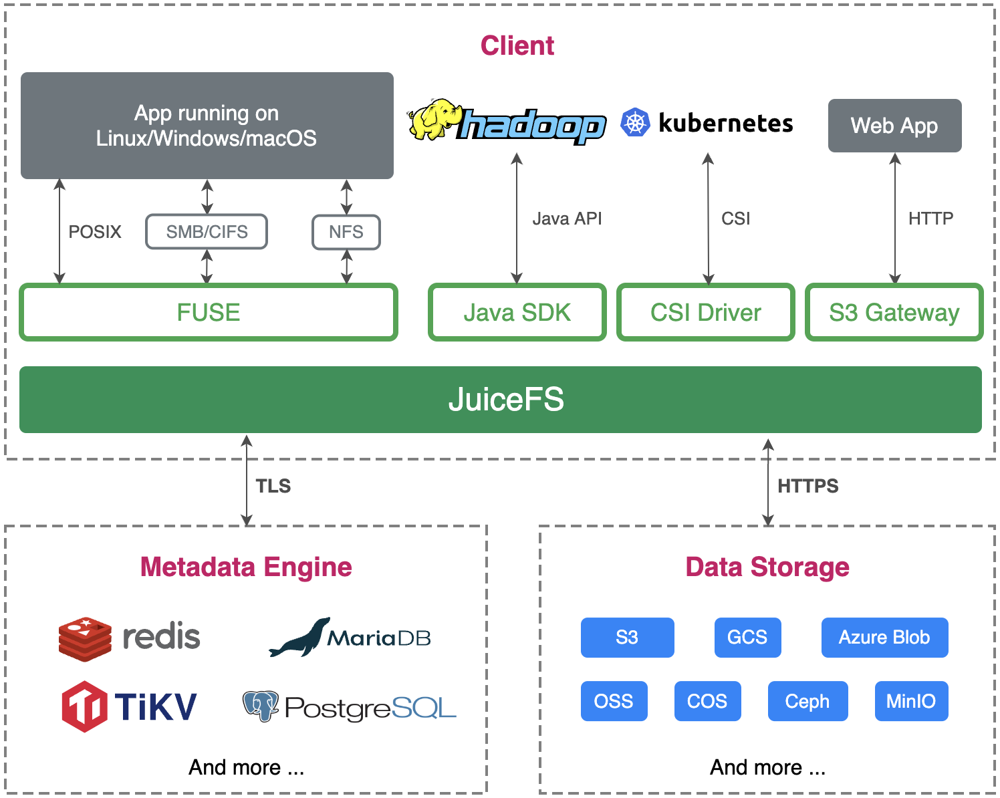

SeaweedFS 是一款高效的分布式文件存储系统，最早的设计原型参考了 Facebook 的 Haystack，具有快速读写小数据块的能力。本文将通过对比 SeaweedFS 与 JuiceFS 在设计与功能上的差异，以帮助读者进行更适合自己的选择。

# SeaweedFS 系统结构

SeaweedFS 由 3 部分组成，底层存储文件的 **Volume Server**，用于管理集群的 **Master Server**，以及一个向上提供更多特性的 **Filer** 可选组件。

## Volume Server 与 Master Server

在系统运作上，Volume Server 与 Master Server 一并服务于文件的存储。Volume Server 专注于数据的写入与读取，而 Master Server 则偏向是一个集群与 Volumes 的管理服务。

在读写数据时，SeaweedFS 的实现与 Haystack 相似，用户创建的一个 Volume 即是一个大磁盘文件（下图的 Superblock）。在此 Volume 中，用户写入的所有文件（下图的 Needle）都会被合并到该大磁盘文件中。

在开始写入数据之前，调用者需要向 SeaweedFS（Master Server）进行写入申请，随后 SeaweedFS 会根据当前的数据量返回一个 File ID（由 Volume ID 与 offset 组成），在写入的过程中，一并被写入的还有基础的元数据信息（文件长度与 Chunk 等信息）；当写入完成之后，调用者需要在一个外部系统（例如 MySQL）中对该文件与返回的 File ID 进行关联保存。在读取数据时，由于 File ID 已经包含了计算文件位置（偏移）的所有信息，因此可以高效地将文件的内容读取出来。

## Filer

在上述的底层存储单元之上，SeaweedFS 提供了一个名为 Filer 的组件。通过向下对接 Volume Server 与 Master Server，对外提供丰富的功能与特性（如 POSIX 支持、WebDAV、S3 接口等）。与 JuiceFS 相同，Filer 也需要对接一个外部数据库以保存元数据信息。

为了方便阐述，下文中所指的 SeaweedFS，皆包含了 Filer 组件。

# JuiceFS 系统结构

JuiceFS 采用「数据」与「元数据」分离存储的架构，文件数据本身会被切分保存在对象存储（如 Amazon S3）当中，而元数据则是会被保存在用户自行选择的数据库里（如 Redis、MySQL）。通过共享同一个份数据库与对象存储，JuiceFS 实现了一个强一致性保证的分布式文件系统，同时还具有「POSIX 完全兼容」、「高性能」等诸多特性。

# 元数据对比

SeaweedFS 与 JuiceFS 都支持通过外部数据库以存储文件系统的元数据信息。在数据库支持层面，SeaweedFS 支持多达 [24](https://github.com/seaweedfs/seaweedfs/wiki/Filer-Stores) 种数据库。 JuiceFS 对数据库事务能力要求高（见下文），当前支持了 3 类共 10 种事务型数据库。

## 原子性操作

为了保证所有元数据操作的原子性，JuiceFS 在实现层面需要使用有事务处理能力的数据库。而 SeaweedFS仅在执行 rename 操作时启用了部分数据库（SQL、ArangoDB 和 TiKV）的事务， 对于数据库的事务能力要求较低。同时，由于Seaweed FS 在 rename 操作中拷贝元数据时，未对原目录或文件进行加锁，可能会导致过程中更新的数据丢失。

## 变更日志（changelog）

SeaweedFS 会为所有的元数据操作生成变更日志，此日志可被进一步用于数据复制（见下文）、操作审计等功能，而 JuiceFS 则暂未实现此特性。

# 存储对比

如前文所述，SeaweedFS 的数据存储由 Volume Server + Master Server 实现，支持小数据块的「合并存储」、「纠删码」等特性。而 JuiceFS 的数据存储则是依托于对象存储服务服务，相关的特性也都由用户选择的对象存储提供。

## 文件拆分

在存储数据时，SeaweedFS 与 JuiceFS 都会将文件拆分成若干个小块再持久化到底层的数据系统中。SeaweedFS 将文件拆分成 8MB 的块，对于超大文件（超过 8GB），它会将 Chunk 索引也保存到底层的数据系统中。而 JuiceFS 则是先拆成 64MB 的 Chunk，再拆成 4MB 的 Object，通过内部一个 Slice 的概念对随机写、顺序读、重复写等性能进行了优化。（详情见[读取清求处理流程](https://juicefs.com/docs/zh/community/internals/io_processing)）

## 分层存储

对于新创建的 Volume，SeaweedFS 会把数据存储在本地，而对于较旧的 Volume，SeaweedFS 支持将他们上传至云端以达到[冷热数据的分离](https://github.com/seaweedfs/seaweedfs/wiki/Tiered-Storage)。在此方面，JuiceFS 则需要依赖外部的服务。

## 数据压缩

JuiceFS 支持使用 LZ4 或者 ZStandard 来为所有写入的数据进行压缩，而 SeaweedFS 则是根据写入文件的扩展名、文件类型等信息来选择是否进行压缩。

## 存储加密

JuiceFS 支持传输中加密（encryption in transit）及静态加密（encryption at rest），在用户开启了静态加密时，需要用户传递一个自行管理的密钥，所有写入的数据都会基于此密钥进行数据的加密。详情见 [《数据加密》](https://juicefs.com/docs/zh/community/security/encrypt)。

SeaweedFS 同样支持传输中加密与静态加密。在开启了数据加密后，所有写入 Volume Server 的数据都会使用随机的密钥进行加密，而这些对应的随机密钥信息则由维护「metadata」的「Filer」进行管理。

# 访问协议

## POSIX 兼容性

JuiceFS [完全兼容 POSIX](https://juicefs.com/docs/zh/community/posix_compatibility)， 而 SeaweedFS 目前只实现了部分的POSIX兼容( [「Issue 1558」](https://github.com/seaweedfs/seaweedfs/issues/1588) 与 [Wiki](https://github.com/seaweedfs/seaweedfs/wiki/FUSE-Mount)），功能还持续完善中。

## S3 协议

JuiceFS 通过 MinIO S3 网关实现了 [S3 网关](https://juicefs.com/docs/zh/community/s3_gateway)的功能。它为 JuiceFS 中的文件提供跟 S3 兼容的 RESTful API，在不方便挂载的情况下能够用 s3cmd、AWS CLI、MinIO Client（mc）等工具管理 JuiceFS 上存储的文件。

SeaweedFS 当前支持了约 20 个 S3 API，覆盖了常用的读写查删等请求，对一些特定的请求（如 Read）还做了功能上的扩展，详细见 [Amazon-S3-API](https://github.com/seaweedfs/seaweedfs/wiki/Amazon-S3-API)。

## WebDAV 协议

JuiceFS 与 SeaweedFS 皆支持 WebDAV 协议。

## HDFS 兼容性

JuiceFS [完整兼容 HDFS API](https://juicefs.com/docs/zh/community/hadoop_java_sdk)。不仅兼容 Hadoop 2.x 和 Hadoop 3.x，还兼容 Hadoop 生态系统中的各种组件。SeaweedFS 则是提供了对 HDFS API 的[基础兼容](https://github.com/seaweedfs/seaweedfs/wiki/Hadoop-Compatible-File-System)，对于部分操作（如 turncate、concat、checksum 和扩展属性等）则尚未支持。

## CSI 驱动

[JuiceFS](https://github.com/juicedata/juicefs-csi-driver) 与 [SeaweedFS](https://github.com/seaweedfs/seaweedfs-csi-driver) 皆提供了 「Kubernetes CSI Driver」 以帮助用户在 Kubernetes 生态中使用对应的文件系统。

# 扩展功能

## 客户端缓存

JuiceFS 有着多种客户端缓存策略，涵盖从元数据到数据缓存的各个部分，允许用户根据自己的应用场景进行调优 （[详情](https://juicefs.com/docs/zh/community/cache_management)），而 SeaweedFS 不具备客户端缓存能力。

## 集群数据复制

对于多个集群之间的数据复制，SeaweedFS 支持「Active-Active」与「Active-Passive」两种异步的复制模式，2 种模式都是通过传递 changelog 再应用的机制实现了不同集群数据间的一致性，对于每一条 changelog，其中会有一个签名信息以保证同一个修改不会被循环多次。在集群节点数量超过 2 个节点的 Active-Active 模式下，SeaweedFS 的一些操作（如重命名目录）会受到一些限制。

JuiceFS 尚未原生支持集群之间的数据同步功能，需要依赖元数据引擎和对象存储自身的数据复制能力。

## 云上数据缓存

SeaweedFS 可以作为云上对象存储的缓存来使用，支持通过命令手动预热数据。对于缓存数据的修改，会异步同步到对象存储中。JuiceFS 需要将文件分块存储到对象存储中，不支持为对象存储中已有的数据提供缓存加速。

## 回收站

JuiceFS 默认开启 [回收站](https://juicefs.com/docs/zh/community/security/trash/) 功能，会自动将用户删除的文件移动到 JuiceFS 根目录下的 .trash 目录内，保留指定时间后才将数据真正清理。 SeaweedFS 暂不支持此功能。

## 运维工具

JuiceFS 提供了 juciefs stats 以及 juicefs profile 两种子命令，允许用户实时查看当前或回放某一时间段的性能指标。同时，JuiceFS 还对外开发 [metrics](https://juicefs.com/docs/zh/community/administration/monitoring) 接口，用户能够方便地将监控数据接入到 Prometheus 与 Grafana 中。

SeaweedFS 则同时实现了 [Push 与 Pull](https://github.com/seaweedfs/seaweedfs/wiki/System-Metrics) 2种方式对接 Prometheus 与Grafana ，同时提供了 [weed shell](https://github.com/seaweedfs/seaweedfs/wiki/weed-shell) 的交互式工具方便使用者进行一系列运维工作（如查看当前集群状态、列举文件列表等）。

# 其它

在发布时间上，SeaweedFS 于 2015 年 4 月发布，目前累计 stars 为 16.4K，而 JuiceFS 于 2021 年 1 月发布，截止目前累计 7.3K stars。
在项目上，JuiceFS 与 SeaweedFS 皆采用了对商用更友好的 Apache License 2.0，SeaweedFS 主要由 Chris Lu 个人进行维护，而 JuiceFS 则主要由 Juicedata 公司进行维护。
JuiceFS 与 SeaweedFS 皆采用 Go 语言进行编写。

|                  | SeaweedFS          | JuiceFS               |
| :--------------- | :----------------- | :-------------------- |
| 元数据           | 多引擎             | 多引擎                |
| 元数据操作原子性 | 未保证             | 通过数据库事务保证    |
| 变更日志         | 有                 | 无                    |
| 数据存储         | 包含               | 外部服务              |
| 纠删码           | 支持               | 依赖外部服务          |
| 数据合并         | 支持               | 依赖外部服务          |
| 文件拆分         | 8MB                | 64MB + 4MB            |
| 分层存储         | 支持               | 依赖外部服务          |
| 数据压缩         | 支持（基于扩展名） | 支持（全局设置）      |
| 存储加密         | 支持               | 支持                  |
| POSIX 兼容性     | 基本               | 完整                  |
| S3 协议          | 基本               | 基本                  |
| WebDAV 协议      | 支持               | 支持                  |
| HDFS 兼容性      | 基本               | 完整                  |
| CSI 驱动         | 支持               | 支持                  |
| 客户端缓存       | 不支持             | 支持                  |
| 集群数据复制     | 双向异步、多模式   | 不支持                |
| 云上数据缓存     | 支持（手动同步）   | 不支持                |
| 回收站           | 不支持             | 支持                  |
| 运维工具         | 提供               | 提供                  |
| 发布时间         | 2015.4             | 2021.1                |
| 主要维护者       | 个人（Chris Lu）   | 公司（Juicedata Inc） |
| 语言             | Go                 | Go                    |
| 开源协议         | Apache License 2.0 | Apache License 2.0    |

