# JuiceFS 对比 ZeroFS {#juicefs-vs-zerofs}

[ZeroFS](https://github.com/Barre/ZeroFS) 是一个开源的日志结构文件系统，能够将兼容 S3 的存储桶转换为 POSIX 文件系统，通过
NFS 和 9P 协议对外提供服务，也可以作为基于 NBD 的裸块设备使用。它将文件数据和元数据都保存在对象存储本身，并依赖本地磁盘/内存缓存来提升性能。ZeroFS
采用 AGPLv3 与商业许可的双重授权模式。

ZeroFS 和 [JuiceFS](https://github.com/juicedata/juicefs) 都能在不将文件一对一映射为对象的前提下，把对象存储转变为 POSIX
文件系统，但两者在元数据架构、并发模型、加密默认策略和许可协议方面存在显著差异。

## 产品定位 {#product-positioning}

**ZeroFS** 是一个默认加密、自托管的文件系统，用于在兼容 S3 的存储桶之上提供 POSIX 语义（或者一个 ZFS 存储池、一个块设备）。单个
ZeroFS 核心服务同时处理元数据、数据以及所有访问协议，因此不需要额外运行一个单独的元数据数据库。它面向的是希望以合理运维成本自托管、基于对象存储的文件访问能力的团队，而不是需要横向扩展海量吞吐量的团队。关于其单
Leader 设计和强制加密如何影响这一权衡，详见下文的[系统架构](#architecture)部分。

**JuiceFS** 是一款云原生分布式文件系统，专为跨多云环境下高要求的 AI/ML
训练、高性能计算和大数据分析场景设计。通过采用[数据与元数据分离](../architecture.md)的架构，并配备了可选配的、可独立扩展的元数据引擎，JuiceFS
能够支持海量客户端的并发访问，满足大规模、高性能、兼容 POSIX 的工作负载需求。

## 系统架构 {#architecture}

**ZeroFS** 将文件拆分为 32 KiB 的 Extent，先进行压缩（默认使用 Zstd，或者 LZ4），再用 XChaCha20-Poly1305
加密（没有非加密模式），随后打包成不可变的 256 MiB Segment，作为独立对象上传。ZeroFS 将文件系统元数据存储在一个基于对象存储的
LSM 树中，文件内容则单独存储在同一对象存储中的不可变 Segment 对象里，因此不依赖任何外部数据库。由于文件被打包进不透明的
Segment，而不是与对象一一映射，因此无法通过 S3 API 单独访问 ZeroFS 中的文件，这一点与 JuiceFS 的做法类似。

关键架构特点：

- 无需单独的元数据数据库：元数据（inode、目录项、Extent 指针、Manifest 等）存储在基于对象存储的 LSM 树中，文件内容则单独存储在不可变的
  Segment 对象里，两者都由 ZeroFS 服务端统一管理。使用 ZeroFS 时，这个服务端（以及用于高可用的 Standby
  节点、用于读扩展的只读副本）就是你需要部署和运维的主要服务。
- 只有一个服务端进程（Leader）能够向底层对象存储写入数据。它接受来自多个并发客户端的连接，并在内部仲裁它们的写入和 POSIX
  锁，但所有变更都要经过这一个进程。详见下文[并发与写入扩展性](#concurrency-and-write-scalability)部分。
- 每个数据块都强制进行加密和压缩，无法关闭。
- 双层本地缓存：用于对象字节的加密原始分块（Raw-Parts）缓存、用于元数据的明文解码块（Decoded-Block）缓存，以及为每个 inode 最近写入
  Extent 提供的内存尾部缓存（Tail Cache）能够减少与对象存储之间的往返次数。
- 在高可用方面，ZeroFS 支持 Leader/Standby 复制架构，同一时刻只有一个活跃写入节点，并通过写节点隔离（Writer Fencing）
  机制防止脑裂。只读副本的行为、故障转移编排以及数据滞后程度，取决于所配置的复制实现和版本。

**JuiceFS** 采用元数据与数据分离的架构。文件在上传到对象存储之前会被拆分为 Chunk（默认最大 64 MiB，再进一步拆分为 4 MiB 的
Block），对应的元数据则存储在独立的、可插拔的数据库引擎中。

关键架构特点：

- JuiceFS 支持可插拔的元数据引擎（Redis、TiKV、MySQL、PostgreSQL、SQLite、etcd、FoundationDB 等），每种引擎都有各自的运维方式和高可用特性。
- JuiceFS
  通过数据分块的方式存储文件，从而能够高效地处理部分更新、追加写入以及高吞吐量操作。更多细节请参阅[技术架构](../../introduction/architecture.md)。
- 不依赖任何私有的中间存储格式。JuiceFS 提供灵活的缓存机制，以降低延迟、提升性能。
- 支持多云和混合云部署，兼容[所有主流对象存储后端](../../reference/how_to_set_up_object_storage.md)。

### 数据路径 {#data-path}

**ZeroFS** 会将所有文件数据通过其服务端节点进行中转。无论是 NFS、9P 协议客户端，还是原生 Linux 内核客户端，都不会直接与对象存储通信，只有
ZeroFS 服务端持有存储凭证并发起 GET/PUT 请求。因此读写请求在通往（或来自）存储桶的路上，都要经过这一个进程代理。

**JuiceFS** 客户端则会直接向对象存储发起 GET/PUT 请求。元数据操作通过元数据引擎处理，但文件数据始终在挂载客户端与对象存储之间直接传输，不经过任何中转。

这一差异在云上部署中值得关注。由于 ZeroFS 客户端永远不会直接访问对象存储，文件数据实际上要在网络上传输两次：一次在对象存储与
ZeroFS 服务端之间，另一次在服务端与客户端之间。当服务端、客户端和对象存储不在同一网络区域时，这多出来的一跳会带来额外的数据传输费用，并占用服务端自身的带宽，这些成本还是在对象存储直接向客户端收费之外额外产生的。而
JuiceFS 客户端直接与对象存储通信，因此除了元数据引擎产生的流量外，不存在类似的中转跳数，也无需为此预留额外的数据传输成本。

### 并发与写入扩展性 {#concurrency-and-write-scalability}

**ZeroFS** 确实允许多个客户端并发写入：其 Kubernetes CSI 驱动提供了真正的 ReadWriteMany 卷，任意数量节点上的任意数量 Pod
都可以通过 9P 挂载，它们的 POSIX 字节范围锁由 Leader 统一仲裁。但限制存在于服务端层面，而不是客户端层面：这些客户端的每一次写入都要先经过唯一的
Leader 进程，才能到达对象存储，而这个进程无法横向扩展；HA 节点对的作用是提供故障转移，而不是写入方向的水平扩展。如果 Leader
成为瓶颈，解决办法是升级为更强的单机，而不是增加更多 Leader；Standby 节点作为热备份保持同步，只读副本则以有限的数据滞后（写入方的刷新间隔，默认
30 秒，再加上最多 10 秒的副本轮询窗口）提供读取服务，而不是增加写入能力。

**JuiceFS** 避免了由单一文件系统服务端中转数据的方式。客户端直接执行文件 I/O，并同时与元数据引擎和对象存储通信。各元数据引擎自身也具备扩展能力：Redis
Cluster/Sentinel、基于 Raft 复制的 TiKV 集群，以及 JuiceFS 企业版自研的分布式元数据引擎（可横向扩展，并以至少 3 副本的方式进行
Raft 复制）。这种设计使元数据吞吐量和并发写入客户端的数量都能够随负载增长。

### 持久性与一致性 {#durability-and-consistency}

**ZeroFS** 会将写入先缓冲在内存中：一个尚未封存的数据 Segment（达到 256 MiB 后被封存并上传），加上用于元数据的 LSM
memtable。只有在特定触发条件出现时，ZeroFS 才会保证数据已持久化到对象存储：显式调用 `fsync`、NFS 的 `COMMIT`、NBD 的
`FLUSH`/`FUA`、`sync_writes = true` 的批量写入、周期性刷新定时器（`flush_interval_secs`，默认 30
秒）、垃圾回收启动，或是一次优雅关闭。值得注意的是，普通的 `close()` 并不在这份触发列表中，因此关闭文件描述符本身并不会强制触发刷新。如果一个应用在写入并关闭文件后没有调用
`fsync()`，一旦 Leader 在下一次周期性刷新之前崩溃，就可能丢失最多一个刷新间隔内的写入内容，即便它的 `write()`/`close()`
调用当时已经成功返回。针对应用确实调用了 `fsync()` 的情况，ZeroFS
提供了一层保护机制：如果服务端在刷新已确认的写入之前重启，"verified fsync" 机制会返回 `ESTALE`
，而不是错误地报告写入成功。一旦数据完成刷新，恢复过程是强一致的：崩溃后系统会恢复到崩溃前某个可见变更的原子前缀状态，绝不会出现部分写入或写入撕裂。

**JuiceFS** 同样会缓冲写入（存放在客户端的读写缓冲区中，默认 300 MiB），但它将持久性边界直接绑定在 `close()` 上：`close()`、
`fsync()`、`fdatasync()`（以及写满一个 4 MiB 的 Block）都会触发一次刷新，客户端只有在对应数据确实已经上传到对象存储之后，才会向元数据引擎提交这次写入。这正是其默认的
close-to-open 一致性保证的基础：一次成功的
`close()` 就意味着这次写入既已持久化到对象存储，也对之后打开该文件的任何其他客户端可见，应用完全无需自行调用
`fsync()`。更多细节请参阅[缓存](../../guide/cache.md#consistency)
和 [POSIX 兼容性](../../reference/posix_compatibility.md)。JuiceFS 也提供了一个可选启用的 `--writeback`
模式，其风险特征与 ZeroFS 的默认行为类似：写入会立即提交到元数据，再从本地磁盘异步上传。不过官方文档对此有明确提示（「如果写缓存数据在上传完成前丢失，文件数据将永久丢失」），并且该模式默认关闭。

### 缓存 {#caching}

**ZeroFS** 实现了按磁盘和内存预算划分的双层本地缓存（对应配置项 `disk_size_gb` / `memory_size_gb`）。Raw-Parts 缓存以 128
KiB 为粒度，存储从对象存储原样获取的字节（仍处于压缩加密状态）；另一个独立的 Decoded-Block 缓存则保存解码后的明文元数据块；内存中的
Tail Cache 保留每个 inode 最近写入的 Extent。一个自适应预读层最多可为每个文件跟踪 4 个并发顺序读取流，并随着顺序访问的持续而将预取窗口逐步翻倍（最大
8 MiB）。

**JuiceFS** 在本地 SSD 或内存中实现客户端缓存。它预设了默认的磁盘缓存上限（100 GiB），用户可以根据需要自由调整。当缓存用量达到上限时，JuiceFS
会采用类似 LRU 的算法自动清理，确保后续操作始终有可用的缓存空间。更多细节请参阅[缓存](../../guide/cache.md)。

### 安全性 {#security}

**ZeroFS** 强制启用加密：每个数据块在离开客户端之前都会先压缩、再用 XChaCha20-Poly1305 加密，没有非加密模式可选。密钥通过用户提供的密码（借助
Argon2id）派生，用于包裹一个数据加密密钥；一旦密码丢失，数据将永久无法恢复。对安全敏感型部署而言，这是一个很强的默认策略，但它不可关闭，并且会在每一条
I/O 路径上都增加强制的加解密开销。

**JuiceFS** 将加密作为一项可选、可配置的功能提供，而不是强制默认开启，因此用户可以根据自己的工作负载，在安全开销与原始性能之间自行权衡取舍。

### 多云支持 {#multi-cloud-support}

**ZeroFS** 可以连接 AWS S3 及兼容 S3 的存储端点（例如 MinIO 和 Cloudflare R2）、Google Cloud Storage 以及 Azure Blob
Storage。 **JuiceFS** 则在更广泛的存储服务商范围内提供一致的文件系统接口——包括 HDFS 和本地磁盘——并兼容 AWS、Azure、GCP
或私有云上的任意主流对象存储后端。更多细节请见下表。

## 功能对比 {#feature-comparison}

| 特性           | ZeroFS                                                   | JuiceFS 社区版                                  | JuiceFS 企业版                               |
|----------------|----------------------------------------------------------|-------------------------------------------------|----------------------------------------------|
| 客户端         | NFS、9P、NBD（块设备）                                   | POSIX（FUSE）、Java SDK、Python SDK、S3 网关    | POSIX（FUSE）、Java SDK、Python SDK、S3 网关 |
| 元数据存储     | 内嵌 LSM 树，持久化在同一对象存储中（无需外部数据库）    | 外部数据库（Redis、TiKV、MySQL、PostgreSQL 等） | 自研高性能分布式元数据引擎（可横向扩展）     |
| 元数据冗余保护 | Leader/Standby 节点对，支持自动故障转移                  | 取决于所使用的数据库                            | 至少 3 副本（基于 Raft 共识算法）            |
| 并发写入       | 支持多客户端并发，但所有写入都经由同一个 Leader 进程     | 多客户端并发，均直接写入存储                    | 多客户端并发，均直接写入存储                 |
| 数据存储       | AWS S3、兼容 S3 的存储、Google Cloud Storage、Azure Blob | 任意主流对象存储                                | 任意主流对象存储                             |
| 数据冗余保护   | 由对象存储提供                                           | 由对象存储提供                                  | 由对象存储提供                               |
| 数据缓存       | 本地磁盘 + 内存（双层缓存）                              | 本地缓存                                        | 分布式缓存                                   |
| 存储加密       | ✓ 强制启用，无法关闭（XChaCha20-Poly1305）              | ✓ 支持（可选）                                 | ✓ 支持（可选）                              |
| 数据压缩       | ✓ 强制启用（Zstd 或 LZ4）                               | ✓ 支持                                         | ✓ 支持                                      |
| 配额管理       | ◐ 可配置文件系统容量上限                                 | ✓ 支持                                         | ✓ 支持                                      |
| POSIX 兼容性   | ✓ 完全兼容                                              | ✓ 完全兼容                                     | ✓ 完全兼容                                  |
| POSIX ACL      | 官方文档未公开说明                                       | ✓ 支持                                         | ✓ 支持                                      |
| Kubernetes CSI | ✓ 支持                                                  | ✓ 支持                                         | ✓ 支持                                      |
| 跨区数据复制   | ◐ 依赖外部服务                                           | ◐ 依赖外部服务                                  | ✓ 支持                                      |
| 多云镜像       | ✕ 不支持                                                | ✕ 不支持                                       | ✓ 支持                                      |
| 定价           | AGPLv3，或商业许可                                       | 开源免费（Apache License 2.0）                  | 商业许可，按使用量计费                       |

## 许可协议影响 {#licensing-implications}

**ZeroFS** 采用 GNU AGPLv3 与商业许可的双重授权模式。当经过修改的软件被分发，或者以网络交互的形式对外提供服务时，AGPLv3
可能会要求提供源代码及相应的配套源码，具体义务取决于许可证的准确条款。对于托管、嵌入或分发类的产品形态，建议企业寻求法律意见。

**JuiceFS 社区版**采用 Apache License 2.0 发布，这是一种宽松式许可协议，无论是内部使用、分发还是托管服务，都不会带来
Copyleft 或源代码公开方面的义务。JuiceFS 企业版则通过独立的商业许可提供，适合需要分布式元数据引擎、分布式缓存和多云镜像等能力的团队。

## 总结 {#summary}

**ZeroFS** 是一个安全优先的文件系统，它把元数据存储整合进自己的服务端进程，而不需要额外的数据库，默认对每个数据块进行加密和压缩，并且可以通过
NFS、9P 或原生 Linux 内核客户端挂载，也可以作为 NBD
块设备使用。它依然是一个需要你部署和运维的服务，只是你不需要再额外运维一个单独的元数据数据库。客户端可以并发连接和写入，但所有写入都要先经过唯一的
Leader 进程，才能到达对象存储，这条写入路径无法横向扩展。它的高可用设计（一个 Leader/Standby
节点对，加上数量不限的只读副本）是为故障转移和读扩展而生，而不是为了提升写入吞吐量。这使得 ZeroFS 非常适合自托管部署场景，例如
CI 构建缓存、内核编译、家庭实验室以及中小规模服务，尤其是在强制加密和只需运维单一服务比扩展写入路径本身更重要的场景下。

**JuiceFS** 则是为大规模、高并发、多写入者的工作负载而构建的。通过将元数据与数据解耦，并支持可插拔、可独立扩展的元数据引擎（Redis、TiKV、MySQL、PostgreSQL、SQLite
等，或 JuiceFS 企业版自研的分布式元数据引擎），JuiceFS 允许任意数量的客户端在最广泛的对象存储后端和多云环境下，以强一致性并发读写同一个文件系统。它通过
FUSE 提供标准的 POSIX 接口，为 Hadoop 生态提供 Java API，还提供 S3 网关和 Kubernetes CSI 驱动。JuiceFS 社区版采用宽松的
Apache License 2.0 发布。JuiceFS 被广泛应用于大数据分析、AI/ML 训练、Agentic AI 工具、多云与混合云部署、容器共享存储以及高性能计算等场景。
