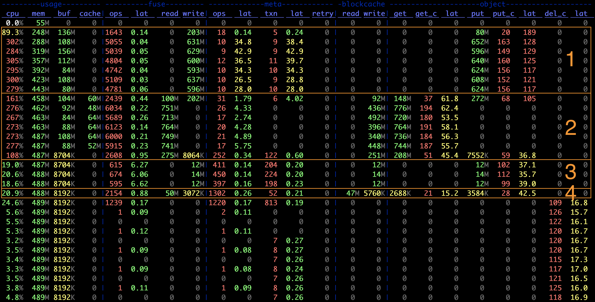
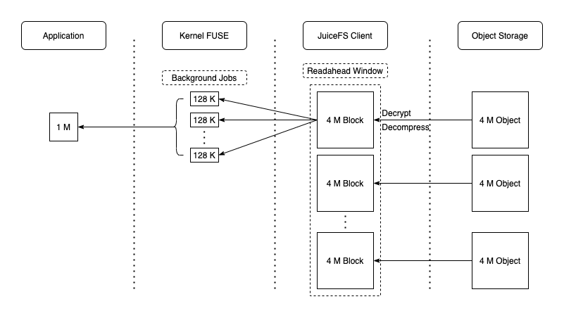

# 读写请求处理流程介绍

## 写入流程

JuiceFS 对大文件会做多级拆分（参见 [JuiceFS 如何存储文件](../reference/how_juicefs_store_files.md)），以提高读写效率。在处理写请求时，JuiceFS 先将数据写入 Client 的内存缓冲区，并在其中按 Chunk/Slice 的形式进行管理。Chunk 是根据文件内 offset 按 64 MiB 大小拆分的连续逻辑单元，不同 Chunk 之间完全隔离。每个 Chunk 内会根据应用写请求的实际情况进一步拆分成 Slices；当新的写请求与已有的 Slice 连续或有重叠时，会直接在该 Slice 上进行更新，否则就创建新的 Slice。Slice 是启动数据持久化的逻辑单元，其在 flush 时会先将数据按照默认 4 MiB 大小拆分成一个或多个连续的 Blocks，并上传到对象存储，每个 Block 对应一个 Object；然后再更新一次元数据，写入新的 Slice 信息。显然，在应用顺序写情况下，只需要**一个**不停增长的 Slice，最后仅 flush 一次即可；此时能最大化发挥出对象存储的写入性能。以一次简单的 [JuiceFS 基准测试](../benchmark/performance_evaluation_guide.md)为例，其第一阶段是使用 1 MiB IO 顺序写 1 GiB 文件，数据在各个组件中的形式如下图所示：

> **注意**：图中的压缩和加密默认未开启。欲启用相关功能需要在 format 文件系统的时候添加 `--compress value` 或 `--encrypt-rsa-key value` 选项。

这里再放一张测试过程中用 `stats` 命令记录的指标图，可以更直观地看到相关信息：

上图中第 1 阶段：

- 对象存储写入的平均 IO 大小为 `object.put / object.put_c = 4 MiB`，等于 Block 的默认大小
- 元数据事务数与对象存储写入数比例大概为 `meta.txn : object.put_c ~= 1 : 16`，对应 Slice flush 需要的 1 次元数据修改和 16 次对象存储上传，同时也说明了每次 flush 写入的数据量为 4 MiB * 16 = 64 MiB，即 Chunk 的默认大小
- FUSE 层的平均请求大小为约 `fuse.write / fuse.ops ~= 128 KiB`，与其默认的请求大小限制一致

相较于顺序写来说，大文件内随机写的情况要复杂许多；每个 Chunk 内可能存在**多个不连续**的 Slice，使得一方面数据对象难以达到 4 MiB 大小，另一方面元数据需要多次更新。同时，当一个 Chunk 内已写入的 Slices 过多时，会触发 Compaction 来尝试合并与清理这些 Slices，这又会进一步增大系统的负担。因此，JuiceFS 在此类场景下会比顺序写有较明显的性能下降。

小文件的写入通常是在文件关闭时被上传到对象存储，对应 IO 大小一般就是文件大小。从上面指标图的第 3 阶段（创建 128 KiB 小文件）中也可以看到：

- 对象存储 PUT 的大小就是 128 KiB
- 元数据事务数大致是 PUT 计数的两倍，对应每个文件的一次 Create 和一次 Write

值得一提的是，对于这种不足一个 Block 的对象，JuiceFS 在上传的同时还会尝试写入到本地 Cache（由 `--cache-dir` 指定，可以是内存或硬盘），以期能提升后续可能的读请求速度。从指标图中也可以看到，创建小文件时 blockcache 下有同等的写入带宽，而在读取时（第 4 阶段）大部分均在 Cache 命中，这使得小文件的读取速度看起来特别快。

由于写请求写入 Client 内存缓冲区即可返回，因此通常来说 JuiceFS 的 Write 时延非常低（几十微秒级别），真正上传到对象存储的动作由内部自动触发（单个 Slice 过大，Slice 数量过多，缓冲时间过长等）或应用主动触发（关闭文件、调用 `fsync` 等）。缓冲区中的数据只有在被持久化后才能释放，因此当写入并发比较大或者对象存储性能不足时，有可能占满缓冲区而导致写阻塞。具体而言，缓冲区的大小由挂载参数 `--buffer-size` 指定，默认为 300 MiB；其实时值可以在指标图的 usage.buf 一列中看到。当使用量超过阈值时，JuiceFS Client 会主动为 Write 添加约 10ms 等待时间以减缓写入速度；若已用量超过阈值两倍，则会导致新的写入暂停直至缓冲区得到释放。因此，在观察到 Write 时延上升以及 Buffer 长时间超过阈值时，通常需要尝试设置更大的 `--buffer-size`。另外，通过增大 `--max-uploads` 参数（上传到对象存储的最大并发数，默认为 20）也有可能提升写入到对象存储的带宽，从而加快缓冲区的释放。

### 回写（Writeback）模式

当对数据的一致性和可靠性要求并不高时，还可以在挂载时添加 `--writeback` 以进一步提升系统性能。回写模式开启后，Slice flush 仅需写到本地 Staging 目录（与 Cache 共享）即可返回，数据由后台线程异步上传到对象存储。请注意，JuiceFS 的回写模式与通常理解的先写内存不同，是需要将数据写入本地 Cache 目录的（具体的行为根据 Cache 目录所在硬件和本地文件系统而定）。换个角度理解，此时本地目录就是对象存储的缓存层。

回写模式开启后，还会默认跳过对上传对象的大小检查，激进地尽量将所有数据都保留在 Cache 目录。这在一些会产生大量中间文件的场景（如软件编译等）特别有用。此外，JuiceFS v0.17 版本还新增了 `--upload-delay` 参数，用来延缓数据上传到对象存储的时间，以更激进地方式将其缓存在本地。如果在等待的时间内数据被应用删除，则无需再上传到对象存储，既提升了性能也节省了成本。同时相较于本地硬盘而言，JuiceFS 提供了后端保障，在 Cache 目录容量不足时依然会自动将数据上传，确保在应用侧不会因此而感知到错误。这个功能在应对 Spark shuffle 等有临时存储需求的场景时非常有效。

## 读取流程

JuiceFS 在处理读请求时，一般会按照 4 MiB Block 对齐的方式去对象存储读取，实现一定的预读功能。同时，读取到的数据会写入本地 Cache 目录，以备后用（如指标图中的第 2 阶段，blockcache 有很高的写入带宽）。显然，在顺序读时，这些提前获取的数据都会被后续的请求访问到，Cache 命中率非常高，因此也能充分发挥出对象存储的读取性能。此时数据在各个组件中的流动如下图所示：

> **注意**：读取的对象到达 JuiceFS Client 后会先解密再解压缩，与写入时相反。当然，如果未启用相关功能则对应流程会直接跳过。

做大文件内随机小 IO 读取时，JuiceFS 的这种策略则效率不高，反而会因为读放大和本地 Cache 的频繁写入与驱逐使得系统资源的实际利用率降低。不幸的是，此类场景下一般的缓存策略很难有足够高的收益。此时可考虑的一个方向是尽可能提升缓存的整体容量，以期达到能几乎完全缓存所需数据的效果；另一个方向则可以直接将缓存关闭（设置 `--cache-size 0`），并尽可能提高对象存储的读取性能。

小文件的读取则比较简单，通常就是在一次请求里读取完整个文件。由于小文件写入时会直接被缓存起来，因此类似 JuiceFS bench 这种写入后不久就读取的访问模式基本都会在本地 Cache 目录命中，性能非常可观。
