# KubeSphere 平台一键部署 JuiceFS

[KubeSphere](https://kubesphere.com.cn/) 是在 Kubernetes 之上构建的以应用为中心的多租户容器平台，提供全栈的 IT 自动化运维的能力，简化企业的 DevOps 工作流。

KubeSphere 提供了运维友好的向导式操作界面，即便是 Kubernetes 经验并不丰富的用户，也能相对轻松的上手开始管理和使用。它提供了基于 Helm 的应用市场，可以在图形化界面下非常轻松地安装各种 Kubernetes 应用。

本文将介绍如何在 KubeSphere 中一键部署 JuiceFS CSI Driver，为集群上的各种应用提供数据持久化。

## 前提条件

1. 安装 KubeSphere

安装 KubeSphere 有两种方法。一是在 Linux 上直接安装，可以参考文档：[在 Linux 安装 KubeSphere](https://kubesphere.com.cn/docs/quick-start/all-in-one-on-linux/) ；
二是在已有 Kubernetes 中安装，可以参考文档：[在 Kubernetes 安装 KubeSphere](https://kubesphere.com.cn/docs/quick-start/minimal-kubesphere-on-k8s/) 。

2. 在 KubeSphere 中启用应用商店

在 KubeSphere 中启用应用商店可以参考文档：[KubeSphere 应用商店](https://kubesphere.com.cn/docs/pluggable-components/app-store/) 。

## 安装 JuiceFS CSI Driver

### 配置应用模板/应用仓库

安装 JuiceFS CSI Driver 首先需要创建应用模板，这里有两种方法。

#### 方法一：应用仓库

在企业空间中点击进去应用管理，选择「应用仓库」，点击创建按钮添加 JuiceFS CSI 仓库，填写：

- 仓库名称：juicefs-csi-driver
- Index URL：https://juicedata.github.io/juicefs-csi-driver/

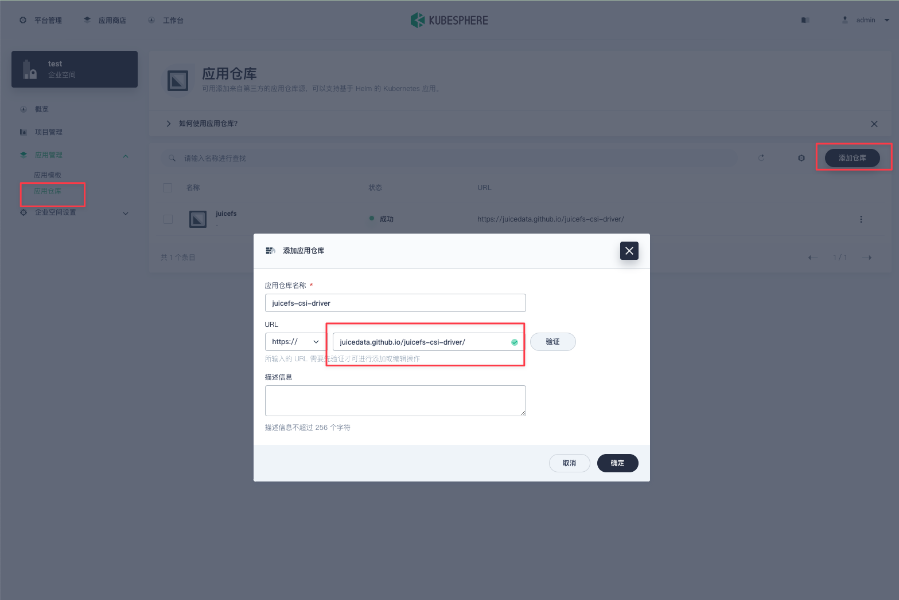

#### 方法二：应用模板

先在 JuiceFS CSI Driver 仓库下载 chart 压缩包：https://github.com/juicedata/juicefs-csi-driver/releases 。

在「企业空间」中点击进入「应用管理」，选择「应用模板」，点击「创建」，上传 chart 压缩包：

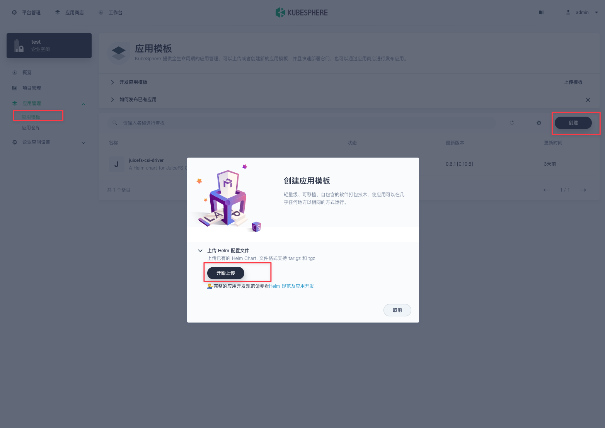

### 安装

在「企业空间」中选择您所需部署的「项目」（KubeSphere 中的项目即为 K8s 中的 namespace），选择「应用负载」，点击「部署新应用」按钮，选择「来自应用商店」或「来自应用模板」，取决于上一步中配置的方法。比如选择「来自应用模板」：

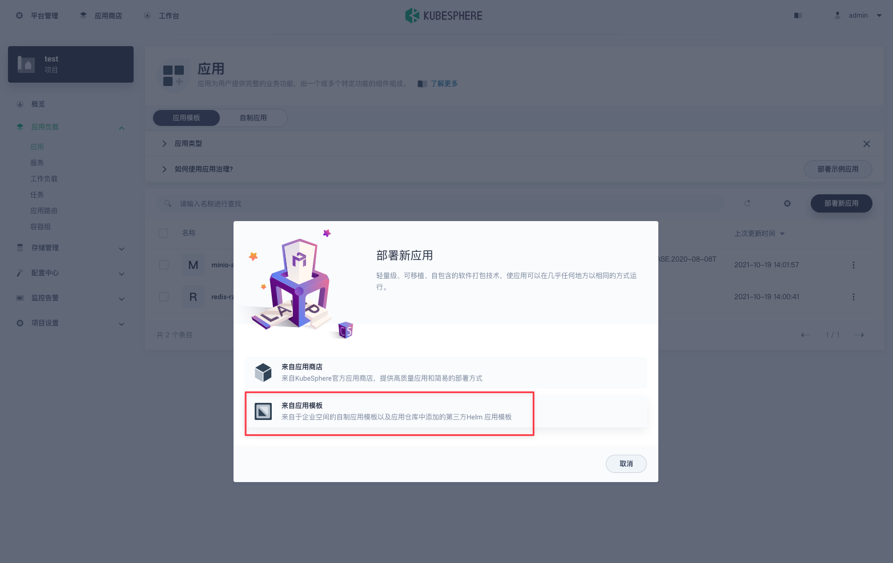

进入配置修改页面，修改以下两个地方：
- namespace：改成对应的项目名
- storageClass.backend：
  `backend` 部分用来定义文件系统后端的数据库和对象存储，可以查阅 [「JuiceFS 快速上手指南」](quick_start_guide.md) 了解相关内容。例如：

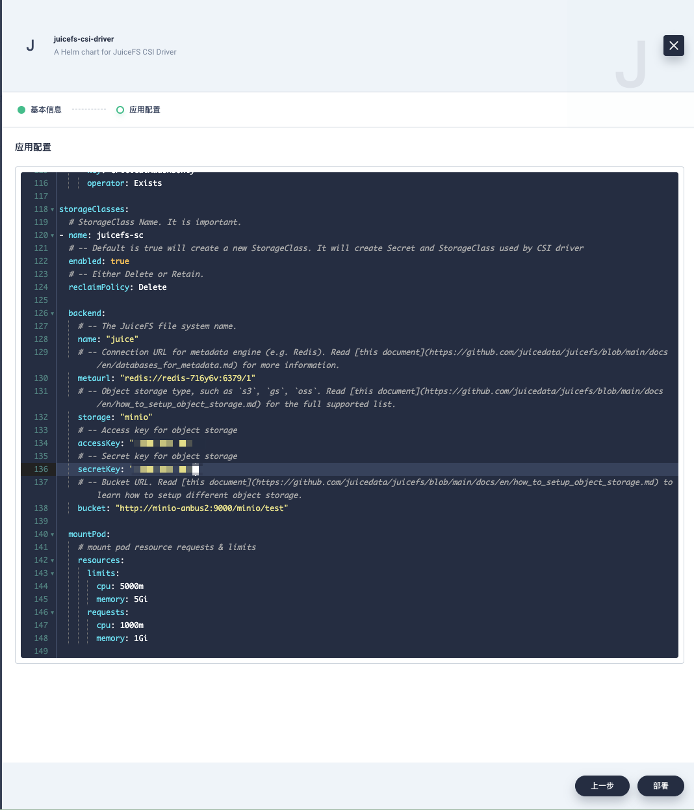

配置修改完毕后，点击安装即可。

## 使用

### 部署应用

按照上述方法安装好的 JuiceFS CSI Driver 已经创建好一个 `StorageClass`，名为上述 `backend` 的 `name`，比如上述创建的 `StorageClass` 为 `juicefs-sc`，可以直接使用。

然后需要创建一个 PVC，指定使用 `juicefs-sc` 这个 `StorageClass`。在「项目」中，选择「存储管理」，再选择「存储卷」，点击「创建」按钮创建 PVC，其中「存储类型」选择 `juicefs-sc`，如下：

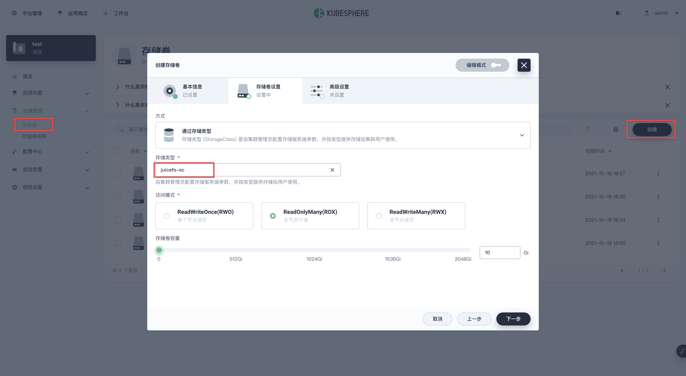

PVC 创建好之后，再在「项目」的「应用负载」中，选择「工作负载」，点击「创建」按钮部署工作负载，其中「存储卷来源」选择「已有存储卷」，再选择上一步创建的 PVC，如下：

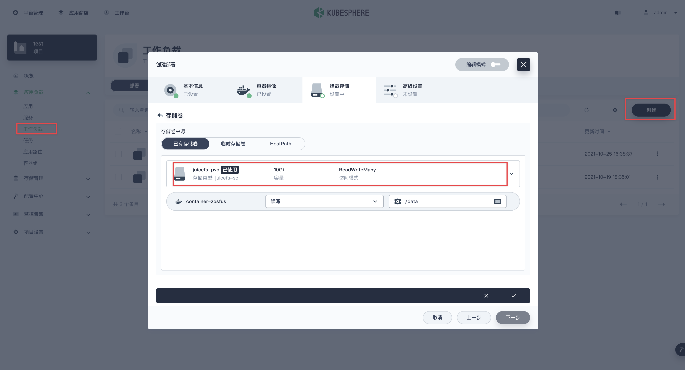

部署完成后可以看到运行中的容器组：

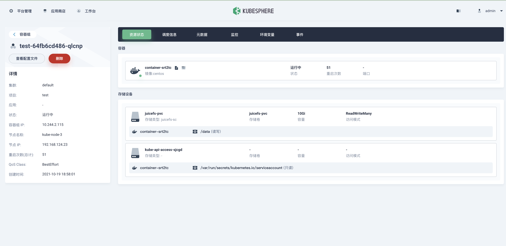

### 新建 StorageClass

若安装 JuiceFS CSI Driver 的时候没有创建 `StorageClass`，或者需要另外新建，可以遵循以下步骤：

准备好元数据服务和对象存储服务后，新建一个 `Secret`。在「平台管理」页面选择「配置中心」，选择「密钥」，点击「创建」按钮新建：

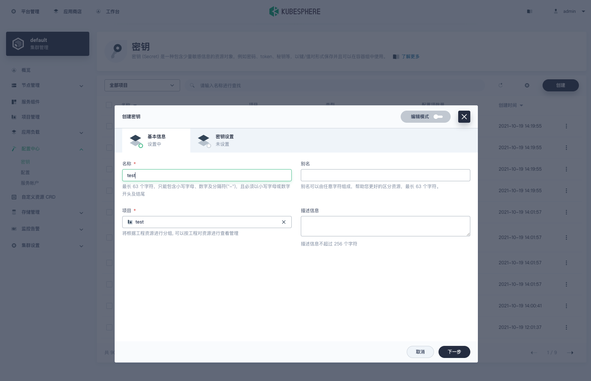

「密钥设置」中填入准备好的元数据服务和对象存储信息，如下：

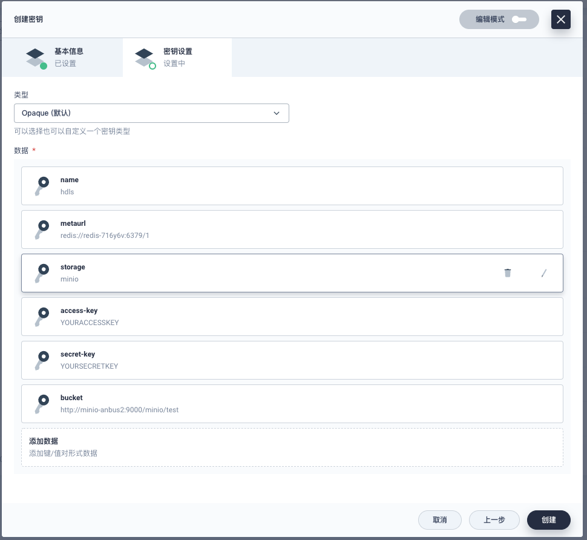

`Secret` 新建好之后，创建 `StorageClass`，在「平台管理」页面选择「存储管理」，选择「存储类型」，点击「创建」按钮新建，其中「存储系统」选择「自定义」：

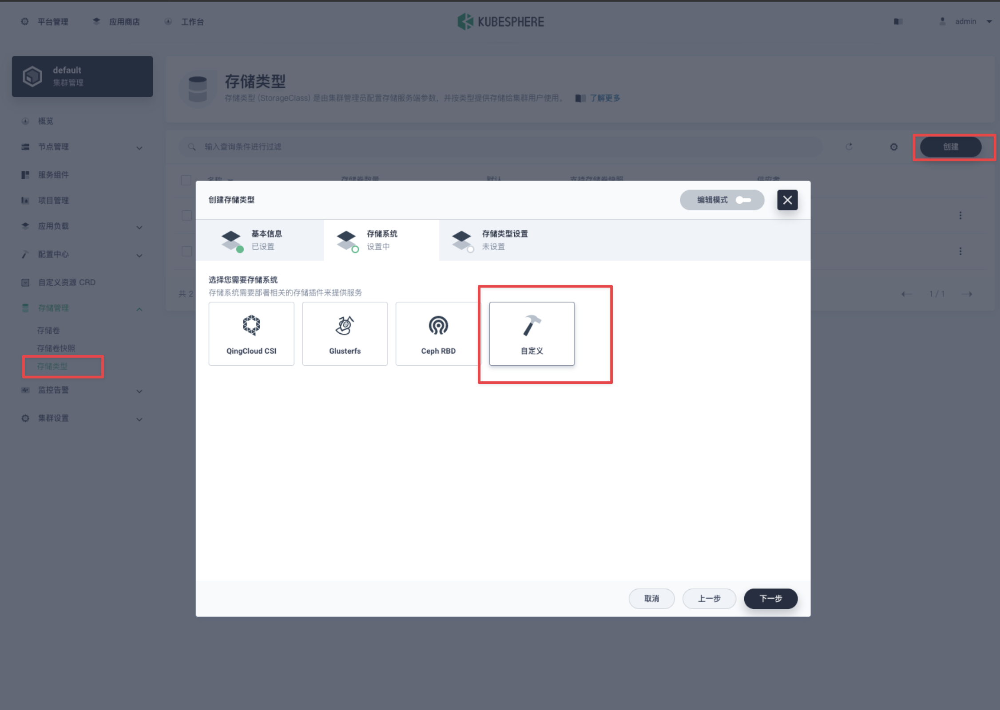

设置页面信息如下，其中「存储系统」填写 `csi.juicefs.com`，另外再设置 4 个参数：

- `csi.storage.k8s.io/provisioner-secret-name`: 刚刚创建好的 secret name
- `csi.storage.k8s.io/provisioner-secret-namespace`: secret 对应的项目名
- `csi.storage.k8s.io/node-publish-secret-name`: 刚刚创建好的 secret name
- `csi.storage.k8s.io/node-publish-secret-namespace`: secret 对应的项目名

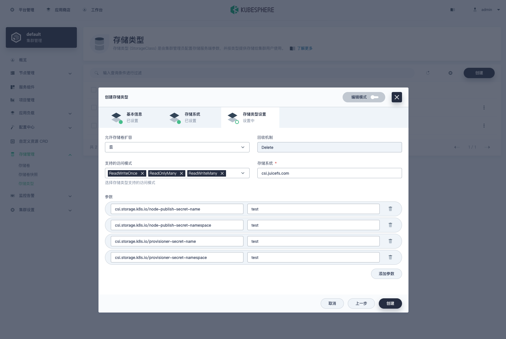

点击「创建」按钮之后，`StorageClass` 就创建好了。
