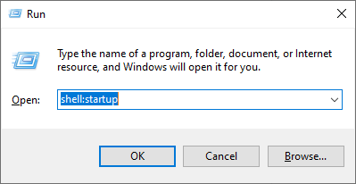

# Windows 系统使用 JuiceFS

## 1. 安装依赖工具

JuiceFS 支持在 Windows 环境中创建和挂载文件系统。但你需要先安装  [WinFsp](http://www.secfs.net/winfsp/) 才能在 Windows 系统中挂载 JuiceFS 文件系统。

> **[WinFsp](https://github.com/billziss-gh/winfsp)** 是一个开源的 Windows 文件系统代理，它提供了一个 FUSE 仿真层，使得 JuiceFS 客户端可以将文件系统挂载到 Windows 系统中使用。

## 2. Windows 上安装 JuiceFS

你可以在 [这里下载](https://github.com/juicedata/juicefs/releases/latest) 最新的预编译的二进制程序，以 Windows 10 系统为例，下载文件名包含 `windows-amd64` 的压缩包，解压后得到 `juicefs.exe` 即是 JuiceFS 的客户端程序。

为了便于使用，可以在 `C：\` 盘根目录创建一个名为 `juicefs` 的文件夹，把 `juicefs.exe` 解压到该文件夹中。然后将 `C:\juicefs` 文件夹路径添加到系统的环境变量，重启系统让设置生效以后，可直接使用使用系统自带的 `命令提示符` 或 `PowerShell` 等程序执行 `juicefs` 命令。


## 3. 挂载 JuiceFS 文件系统

这里假设你已经准备好了对象存储、Redis 数据库，并且已经创建好了 JuiceFS 文件系统。如果你还没有准备好这些必须的资源，请参考 [快速上手指南](quick_start_guide.md)。

这里，我们假设在当前局域网中 IP 地址为 `192.168.1.8` 的 Linux 主机上部署了 MinIO 对象存储和 Redis 数据库，然后执行了以下命令，创建了名为 `music` 的 JuiceFS 文件系统。

```shell
$ juicefs format --storage minio --bucket http://192.168.1.8:9000/music --access-key minioadmin --secret-key minioadmin redis://192.168.1.8:6379/1 music
```

> **注意**：Windows 系统上的 JuiceFS 客户端是命令行程序，你需要在 `命令提示符`、`PowerShell` 或 `Windows 终端` 中使用。

执行以下命令，将 `music` 文件系统挂载到 Z 盘。

```power
> juicefs.exe mount redis://192.168.1.8:6379/1 Z:
```


如上图，JuiceFS 客户端会把文件系统以网络驱动器的形式挂载为指定的系统盘符，你可以根据实际需要改用其他的盘符，但注意不要使用已经被占用的盘符。

## 4. 开机自动挂载 JuiceFS

> **提示**：此处提供的方法仅在 Windows 10 上得到验证，欢迎验证并反馈其他 Windows 版本。

### 1. 创建脚本

创建一个 VBS 脚本，例如：`juicefs-music.vbs`。根据实际情况修改以下内容：

```vbscript
set ws=WScript.CreateObject("WScript.Shell")
ws.Run "C:\juicefs\juicefs.exe mount redis://192.168.1.8:6379/1 Z:",0
```

> **注意**：脚本中的内容因人而异，请根据实际情况修改其中的命令及参数！

### 2. 设置开机启动

使用键盘组合键 <kbd>Windows + R</kbd> 唤出运行窗口



输入 `shell:startup` 打开 Windows 启动文件夹，把编辑好的 vbs 脚本拖入该文件夹即可。


### 3. 取消开机启动

如果需要取消开机启动，请参照[第 2 步](#2-设置开机启动) 设置开机启动)打开 Windows 启动文件夹，删除相应的 VBS 脚本即可。

## 5. 卸载文件系统

## 你可能需要

- [Linux 系统使用 JuiceFS](juicefs_on_linux.md)
- [macOS 系统使用 JuiceFS](juicefs_on_macos.md)
