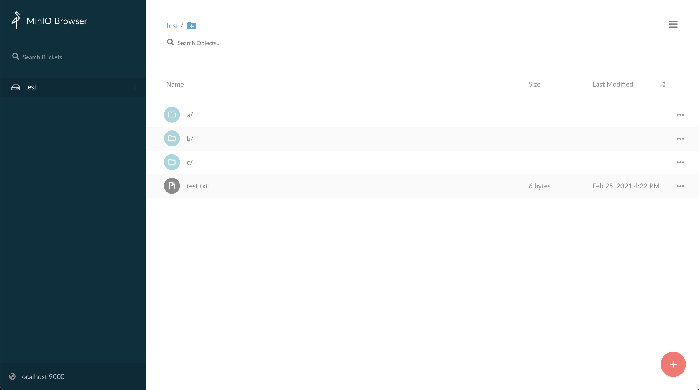

# S3 网关

JuiceFS S3 网关是一个提供 S3 兼容接口的服务。这意味着您可以通过现有工具与 JuiceFS 进行交互，例如 AWS CLI、s3cmd、MinIO 客户端 (`mc`)。JuiceFS S3 网关基于 [MinIO S3 网关](https://docs.min.io/docs/minio-gateway-for-s3.html)。

## 先决条件

在运行网关之前，您需要先参考 [快速上手指南](quick_start_guide.md) 创建一个文件系统。

JuiceFS S3 网关是 v0.11.0 中引入的功能，请确保您拥有最新版本的 JuiceFS。

## 快速开始

使用 `juicefs gateway` 命令运行网关，该命令的 [大多数选项](command_reference.md#juicefs-gateway) 与 `juicefs mount` 相同，除了以下选项：

```
--access-log value  JuiceFS 访问日志的路径
--no-banner         禁用 MinIO 启动信息（默认：false）
```

`--access-log` 选项控制 JuiceFS 的 [访问日志](fault_diagnosis_and_analysis.md#访问日志) 的存储位置。默认情况下，不会存储访问日志。`--no-banner` 选项控制是否禁用 MinIO 的日志。

MinIO S3 网关需要在启动前配置两个环境变量：`MINIO_ROOT_USER` 和 `MINIO_ROOT_PASSWORD`。您可以将它们设置为任何值，但必须满足长度要求。`MINIO_ROOT_USER` 长度至少应为 3 个字符，而 `MINIO_ROOT_PASSWORD` 长度至少应为 8 个字符。

以下命令展示了如何运行网关，Redis 地址是 `localhost:6379`，网关监听在 `localhost:9000`。

```bash
$ export MINIO_ROOT_USER=admin
$ export MINIO_ROOT_PASSWORD=12345678
$ juicefs gateway redis://localhost:6379 localhost:9000
```

如果网关运行成功，您可以在浏览器中访问 [http://localhost:9000](http://localhost:9000)：



## 使用 AWS CLI

从 [https://aws.amazon.com/cli](https://aws.amazon.com/cli) 安装 AWS CLI，然后进行配置：

```bash
$ aws configure
AWS Access Key ID [None]: admin
AWS Secret Access Key [None]: 12345678
Default region name [None]:
Default output format [None]:
```

`Access Key ID` 与 `MINIO_ROOT_USER` 相同，`Secret Access Key` 与 `MINIO_ROOT_PASSWORD` 相同。区域名称和输出格式可以为空。

之后，您可以使用 `aws s3` 命令访问网关，例如：

```bash
# List buckets
$ aws --endpoint-url http://localhost:9000 s3 ls

# List objects in bucket
$ aws --endpoint-url http://localhost:9000 s3 ls s3://<bucket>
```

## 使用 MinIO 客户端

从 [https://docs.min.io/docs/minio-client-complete-guide.html](https://docs.min.io/docs/minio-client-complete-guide.html) 安装 MinIO 客户端，然后添加一个名为 `juicefs` 的新主机：

```bash
$ mc alias set juicefs http://localhost:9000 admin 12345678 --api S3v4
```

之后，您可以使用 `mc` 命令访问网关，例如：

```bash
# List buckets
$ mc ls juicefs

# List objects in bucket
$ mc ls juicefs/<bucket>
```
