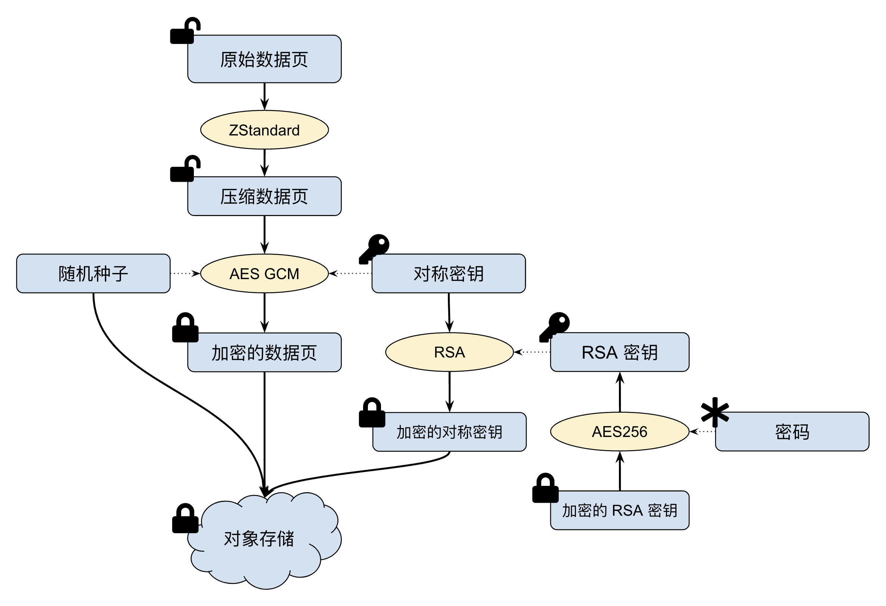

# 数据加密

在数据安全方面，JuiceFS 提供两个方面的数据加密保护：

1. 传输加密
2. 静态数据加密

## 传输加密 {#in-transit}

JuiceFS 的架构决定了它的运行通常涉及与数据库和对象存储之间的网络连接，只要这些服务支持加密连接，JuiceFS 就可以通过其提供的加密通道进行访问。

### 通过 HTTPS 与对象存储连接

公有云对象存储一般会同时支持 HTTP 和 HTTPS，在创建文件系统时如果没有指定协议头，JuiceFS 会默认使用 HTTPS 协议头。例如：

```shell {2}
juicefs format --storage s3 \
  --bucket myjfs.s3.ap-southeast-1.amazonaws.com \
  ...
```

以上命令，客户端会默认将 bucket 识别为 `https://myjfs.s3.ap-southeast-1.amazonaws.com`。

对于服务器和对象存储运行在相同 VPC 网络的情况，如果不需要加密连接，可以明确指定要使用的协议头，例如：`--bucket http://myjfs.s3.ap-southeast-1.amazonaws.com`。

### 通过 TLS/SSL 加密连接到数据库

对于所有[支持的元数据引擎](../reference/how_to_set_up_metadata_engine.md)，只要数据库本身支持并配置了 TLS/SSL 等加密链接，JuiceFS 即可通过其加密通道进行连接。例如，配置了 TLS 加密的 Redis 数据库可以使用 `rediss://` 协议头进行链接：

```shell {3}
juicefs format --storage s3 \
  --bucket myjfs.s3.ap-southeast-1.amazonaws.com \
  "rediss://myredis.ap-southeast-1.amazonaws.com:6379/1" myjfs
```

## 静态数据加密 {#at-rest}

JuiceFS 提供静态数据加密支持，即先加密，再上传。所有存入 JuiceFS 的文件都会在本地完成加密后再上传到对象存储，这可以在对象存储本身被破坏时有效地防止数据泄露。

JuiceFS 的静态数据加密采用了行业标准的 AES-GCM 和 RSA 加密算法，只需在创建文件系统时提供一个 RSA 私钥即可为文件系统启用数据加密功能，通过 `JFS_RSA_PASSPHRASE` 环境变量提供私钥密码。在使用上，挂载点对应用程序完全透明，即加密和解密过程对文件系统的访问不会产生影响。

:::caution 注意
客户端缓存的数据是**未加密**的！不过，只有 root 用户或文件所有者有权访问这些数据。如果需要对缓存进行加密，可以把缓存目录放在加密的文件系统或加密的块存储中。
:::

### 加密原理

JuiceFS 采用对称加密与非对称加密相结合的静态加密方案，需要用户预先为文件系统创建一个全局 RSA 私钥 `M`。在对象存储中保存的每个对象都将有自己的随机对称密钥 `S`。数据用对称密钥 `S` 进行 AES-GCM 加密，`S` 用全局 RSA 私钥 `M` 进行加密，RSA 私钥使用用户指定的口令进行加密。

符号说明：

- `M` 代表用户自行创建的 RSA 私钥
- `S` 代表 JuiceFS 客户端为每个文件对象生成的 256 位对称密钥
- `N` 代表 JuiceFS 客户端为每个文件对象生成的随机种子
- `K` 代表 `M` 加密 `S` 得到的密文



#### 数据加密过程

- 在写入对象存储之前，数据块会使用 LZ4 或 Zstandard 进行压缩。
- 为每个数据块生成一个随机的 256 位对称密钥 `S` 和一个随机种子 `N`。
- 基于 AES-GCM 使用 `S` 和 `N` 对每个数据块进行加密得到 `encrypted_data`。
- 为了避免对称密钥 `S` 在网络上明文传输，使用 RSA 私钥 `M` 对对称密钥 `S` 进行加密得到密文 `K` 。
- 将加密后的数据 `encrypted_data`、密文 `K` 和随机种子 `N` 组合成对象，然后写入对象存储。

#### 数据解密过程

- 读取整个加密对象（它可能比 4MB 大一点）。
- 解析对象数据得到密文 `K`、随机种子 `N` 和被加密的数据 `encrypted_data`。
- 用 RSA 私钥解密 `K`，得到对称密钥 `S`。
- 基于 AES-GCM 使用 `S` 和 `N` 解密数据 `encrypted_data` 得到数据块明文。
- 对数据块解压缩。

### 启用静态加密

:::note 注意
静态数据加密功能必须在创建文件系统时启用，已创建的文件系统无法再启用数据加密。
:::

启用静态加密功能的步骤为：

1. 创建 RSA 私钥
2. 使用 RSA 私钥创建加密的文件系统
3. 挂载文件系统

#### 第一步 创建 RSA 私钥

RSA 私钥是静态数据加密的关键，一般使用 OpenSSL 手动生成。以下命令将使用 aes256 算法在当前目录生成长度为 2048 位，文件名为 `my-priv-key.pem` 的 RSA 私钥：

```shell
openssl genrsa -out my-priv-key.pem -aes256 2048
```

由于使用了 `aes256` 加密算法，命令行会要求必须为该私钥提供一个至少 4 位的 `Passphrase`，可以简单地把它理解为一个用于加密 RSA 私钥文件本身的密码，它也是 RSA 私钥文件的最后一道安全保障。

:::caution 特别注意
RSA 私钥的安全极其重要，一旦泄露可能导致数据安全风险。若私钥丢失，**所有的加密数据**都将丢失且无法恢复。
:::

#### 第二步 创建加密的文件系统

创建加密的文件系统需要使用 `--encrypt-rsa-key` 选项指定 RSA 私钥，提供的私钥内容将写入元数据引擎。由于 aes256 算法加密的 RSA 私钥强制要求 Passphrase，因此在创建和挂载文件系统之前都需要用环境变量 `JFS_RSA_PASSPHRASE` 来指定私钥的 Passphrase。

1. 用环境变量设置 Passphrase

   ```shell
   export JFS_RSA_PASSPHRASE=the-passwd-for-rsa
   ```

2. 创建文件系统

   ```shell {2}
   juicefs format --storage s3 \
     --encrypt-rsa-key my-priv-key.pem \
     ...
   ```

#### 第三步 挂载文件系统

挂载加密的文件系统无需指定额外的选项，但在挂载之前需要通先过环境变量设置私钥的 Passphrase。

1. 用环境变量设置 Passphrase

   ```shell
   export JFS_RSA_PASSPHRASE=the-passwd-for-rsa
   ```

2. 挂载文件系统

   ```shell
   juicefs mount redis://127.0.0.1:6379/1 /mnt/myjfs
   ```

### 性能提示

TLS、HTTPS 和 AES-256 在现代 CPU 中的实现非常高效，因此启用加密功能对文件系统的性能影响并不大。

需要注意的是，RSA 算法相对较慢，特别是解密过程。建议文件加密中使用 2048 位 RSA 密钥，4096 位密钥可能会对读取性能产生重大影响。
