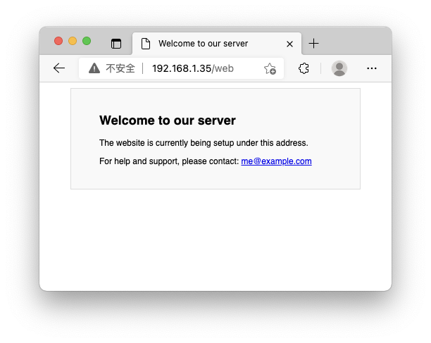

# 在 K3s 上使用 JuiceFS

[K3s](https://k3s.io/) 是一个经过功能优化的 Kubernetes 发行版，它与 Kubernetes 完全兼容，即几乎所有在 Kubernetes 的操作都可以在 K3s 上执行。K3s 将整个容器编排系统打包进了一个容量不足 100MB 的二进制程序，减少了部署 Kubernetes 生产集群的环境依赖，大大降低了安装难度。相比之下，K3s 对操作系统的性能要求更低，树莓派等 ARM 设备都可以用来组建集群。

在本文中，我们会建立一个包含两个节点的 K3s 集群，为集群安装并配置使用 [JuiceFS CSI Driver](https://github.com/juicedata/juicefs-csi-driver)，最后会创建一个 Nginx 容器进行验证。

## 部署 K3s 集群

K3s 对硬件的**最低要求**很低：

- **内存**：512MB+（建议 1GB+）
- **CPU**：1 核

在部署生产集群时，通常可以将树莓派 4B（4 核 CPU，8G 内存）作为一个节点的硬件配置起点，详情查看[硬件需求](https://rancher.com/docs/k3s/latest/en/installation/installation-requirements/#hardware)。

### K3s server 节点

运行 server 节点的服务器 IP 地址为：`192.168.1.35`

使用 K3s 官方提供的脚本，即可将常规的 Linux 发行版自动部署成为 server 节点。

```shell
curl -sfL https://get.k3s.io | sh -
```

部署成功后，K3s 服务会自动启动，kubectl 等工具也会一并安装。

执行命令查看节点状态：

```shell
sudo kubectl get nodes
```
```output
NAME     STATUS   ROLES                  AGE   VERSION
k3s-s1   Ready    control-plane,master   28h   v1.21.4+k3s1
```

获取 `node-token`：

```shell
sudo -u root cat /var/lib/rancher/k3s/server/node-token
```

### K3s worker 节点

运行 worker 节点的服务器 IP 地址为：`192.168.1.36`

执行以下命令，将其中 `K3S_URL` 的值改成 server 节点的 IP 或域名，默认端口 `6443`。将 `K3S_TOKEN` 的值替换成从 server 节点获取的 `node-token`。

```shell
$ curl -sfL https://get.k3s.io | K3S_URL=http://192.168.1.35:6443 K3S_TOKEN=K1041f7c4fabcdefghijklmnopqrste2ec338b7300674f::server:3d0ab12800000000000000006328bbd80 sh -
```

部署成功以后，回到 server 节点查看节点状态：

```shell
sudo kubectl get nodes
```
```output
NAME     STATUS   ROLES                  AGE   VERSION
k3s-s1   Ready    control-plane,master   28h   v1.21.4+k3s1
k3s-n1   Ready    <none>                 28h   v1.21.4+k3s1
```

## 安装 CSI Driver

与在 [Kubernetes 上安装 JuiceFS CSI Driver](../deployment/how_to_use_on_kubernetes.md) 的方法一致，你可以通过 Helm 安装，也可以通过 kubectl 安装。

这里我们用 kubectl 安装，执行以下命令安装 JuiceFS CSI Driver：

```shell
kubectl apply -f https://raw.githubusercontent.com/juicedata/juicefs-csi-driver/master/deploy/k8s.yaml
```

### 创建存储类

复制并修改以下代码创建一个配置文件，例如：`juicefs-sc.yaml`

```yaml
apiVersion: v1
kind: Secret
metadata:
  name: juicefs-sc-secret
  namespace: kube-system
type: Opaque
stringData:
  name: "test"
  metaurl: "redis://juicefs.afyq4z.0001.use1.cache.amazonaws.com/3"
  storage: "s3"
  bucket: "https://juicefs-test.s3.us-east-1.amazonaws.com"
  access-key: "<your-access-key-id>"
  secret-key: "<your-access-key-secret>"
---
apiVersion: storage.k8s.io/v1
kind: StorageClass
metadata:
  name: juicefs-sc
provisioner: csi.juicefs.com
reclaimPolicy: Retain
volumeBindingMode: Immediate
parameters:
  csi.storage.k8s.io/node-publish-secret-name: juicefs-sc-secret
  csi.storage.k8s.io/node-publish-secret-namespace: kube-system
  csi.storage.k8s.io/provisioner-secret-name: juicefs-sc-secret
  csi.storage.k8s.io/provisioner-secret-namespace: kube-system
```

配置文件中 `stringData` 部分用来设置 JuiceFS 文件系统相关的信息，系统会根据你指定的信息创建文件系统。当需要在存储类中使用已经预先创建好的文件系统时，则只需要填写 `name` 和 `metaurl` 两项即可，其他项可以删除或将值留空。

执行命令，部署存储类：

```shell
kubectl apply -f juicefs-sc.yaml
```

查看存储类状态：

```shell
sudo kubectl get sc
```
```output
NAME                   PROVISIONER             RECLAIMPOLICY   VOLUMEBINDINGMODE      ALLOWVOLUMEEXPANSION   AGE
local-path (default)   rancher.io/local-path   Delete          WaitForFirstConsumer   false                  28h
juicefs-sc             csi.juicefs.com         Retain          Immediate              false                  28h
```

> **注意**：一个存储类与一个 JuiceFS 文件系统相关联，你可以根据需要创建任意数量的存储类。但需要注意修改配置文件中的存储类名称，避免同名冲突。

## 使用 JuiceFS 持久化 Nginx 数据

接下来部署一个 Nginx Pod，使用 JuiceFS 存储类声明的持久化存储。

### Deployment

创建一个配置文件，例如：`depolyment.yaml`

```yaml
apiVersion: v1
kind: PersistentVolumeClaim
metadata:
  name: web-pvc
spec:
  accessModes:
    - ReadWriteMany
  resources:
    requests:
      storage: 10Pi
  storageClassName: juicefs-sc
---
apiVersion: apps/v1
kind: Deployment
metadata:
  name: nginx-run
  labels:
    app: nginx
spec:
  replicas: 2
  selector:
    matchLabels:
      app: nginx
  template:
    metadata:
      labels:
        app: nginx
    spec:
      containers:
        - name: nginx
          image: linuxserver/nginx
          ports:
            - containerPort: 80
          volumeMounts:
            - mountPath: /config
              name: web-data
      volumes:
        - name: web-data
          persistentVolumeClaim:
            claimName: web-pvc
```

执行部署：

```
sudo kubectl apply -f depolyment.yaml
```

### Service

创建一个配置文件，例如：`service.yaml`

```yaml
apiVersion: v1
kind: Service
metadata:
  name: nginx-run-service
spec:
  selector:
    app: nginx
  ports:
    - name: http
      port: 80
```

执行部署：

```shell
sudo kubectl apply -f service.yaml
```

### Ingress

K3s 默认预置了 traefik-ingress，通过以下配置为 Nginx 创建一个 ingress。例如：`ingress.yaml`

```yaml
apiVersion: networking.k8s.io/v1
kind: Ingress
metadata:
  name: nginx-run-ingress
  annotations:
    traefik.ingress.kubernetes.io/router.entrypoints: web
spec:
  rules:
    - http:
        paths:
          - pathType: Prefix
            path: "/web"
            backend:
              service:
                name: nginx-run-service
                port:
                  number: 80
```

执行部署：

```shell
sudo kubectl apply -f ingress.yaml
```

### 访问

部署完成以后，使用相同局域网的主机访问任何一个集群节点，即可看到 Nginx 的欢迎页面。



接下来查看一下容器是否成功挂载了 JuiceFS，执行命令查看 Pod 状态：

```shell
sudo kubectl get pods
```
```output
NAME                         READY   STATUS    RESTARTS   AGE
nginx-run-7d6fb7d6df-qhr2m   1/1     Running   0          28h
nginx-run-7d6fb7d6df-5hpv7   1/1     Running   0          24h
```

执行命令，查看任何一个 Pod 的文件系统挂载情况：

```shell
$ sudo kubectl exec nginx-run-7d6fb7d6df-qhr2m -- df -Th
Filesystem     Type          Size  Used Avail Use% Mounted on
overlay        overlay        20G  3.2G   17G  17% /
tmpfs          tmpfs          64M     0   64M   0% /dev
tmpfs          tmpfs         2.0G     0  2.0G   0% /sys/fs/cgroup
JuiceFS:jfs    fuse.juicefs  1.0P  174M  1.0P   1% /config
/dev/sda1      ext4           20G  3.2G   17G  17% /etc/hosts
shm            tmpfs          64M     0   64M   0% /dev/shm
tmpfs          tmpfs         2.0G   12K  2.0G   1% /run/secrets/kubernetes.io/serviceaccount
tmpfs          tmpfs         2.0G     0  2.0G   0% /proc/acpi
tmpfs          tmpfs         2.0G     0  2.0G   0% /proc/scsi
tmpfs          tmpfs         2.0G     0  2.0G   0% /sys/firmware
```

可以看到，名为 `jfs` 的文件系统已经挂载到了容器的 `/config` 目录，已使用空间为 174M。

这就表明集群中的 Pod 已经成功配置并使用 JuiceFS 持久化数据了。
