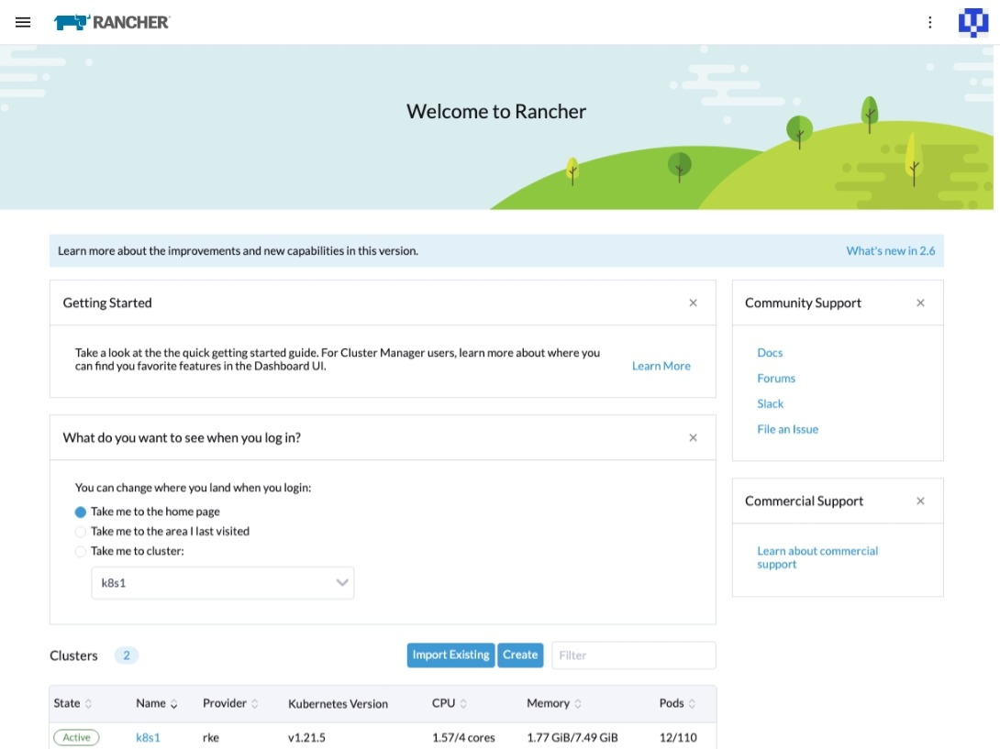
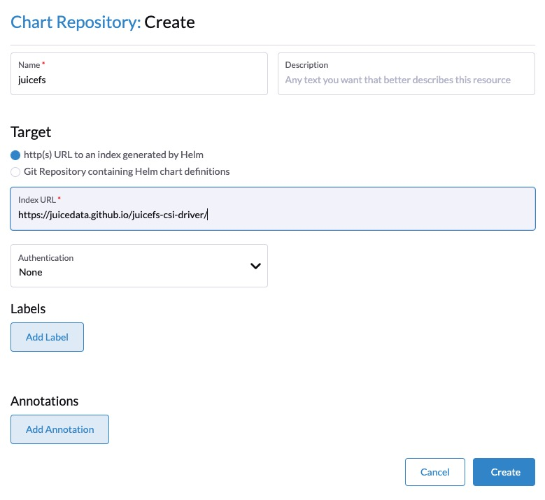
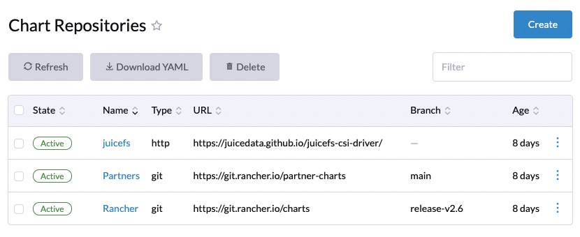
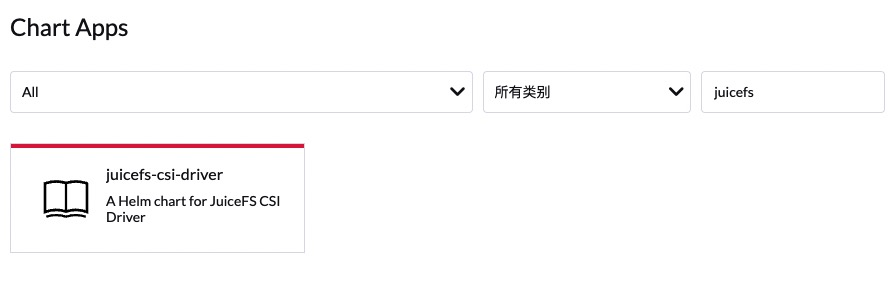
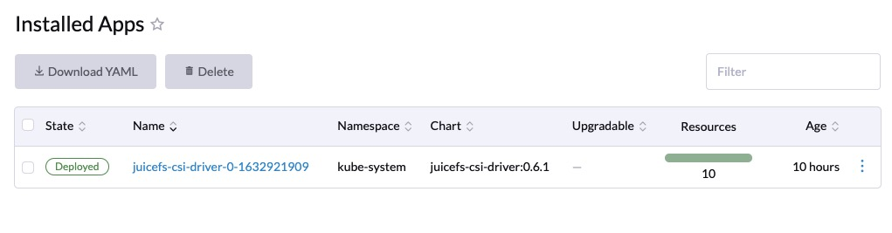

简单来说，[Rancher](https://rancher.com) 是一个企业级的 Kubernetes 集群管理工具，使用它可以非常轻松的在各种云计算平台上快速的完成 Kubernetes 集群的部署。

Rancher 提供了基于浏览器的管理界面，即便是 Kubernetes 经验并不丰富的用户，也能相对轻松的上手开始管理和使用。它默认预置了基于 Helm 的应用市场，可以在图形化界面下非常轻松的安装各种 Kubernetes 应用。

本文将介绍如何在 Linux 系统上部署 Rancher，并在上面创建 Kubernetes 集群，然后通过其内置的应用市场，一键部署 JuiceFS CSI Driver，为集群上的各种应用提供数据持久化。

## 安装 Rancher

几乎所有主流的现代 Linux 发行版都可以安装 Rancher，它既可以直接安装在操作系统上，也可以安装在 Docker、Kubernetes、K3s 或 RKE 上，不论在哪种环境上安装都是“Product-Ready”的。

这里我们选择将 Rancher 安装在 Docker 上，配置上需要满足以下要求：

- **操作系统**：x86-64 架构的 Linux 系统
- **内存**：4GB 以上
- **Docker**：19.03+

执行以下命令安装 Rancher：

```shell
sudo docker run --privileged -d --restart=unless-stopped -p 80:80 -p 443:443 rancher/rancher
```

容器创建完成以后，通过浏览器访问主机的 IP 地址就能打开 Rancher 的管理界面。



## 创建 Kubernetes 集群

Rancher 安装成功以后，可以看到它已经在当前容器中部署了一个 K3s 集群，Rancher 相关资源都运行在这个内部的 K3s 集群中，无需理会这个集群。

接下来开始创建 Kubernetes 集群，在欢迎页面的 Cluster 部分点击 `Create` 创建集群。Rancher 支持在各大主流云计算平台创建 Kubernetes 集群，这里我们要在 Rancher 的宿主机上直接选择集群，因此选择 `Custom`。然后根据向导填写集群名称，选择 Kubernetes 版本即可。


在 `Cluster Options` 页面中，选择要创建的节点角色，然后复制生成命令，在目标主机上执行即可。


集群创建完成后，Rancher 的集群列表中会有状态显示。


## 一键安装 JuiceFS CSI Driver

在集群列表中点击进入创建的 Kubernetes 集群，左侧导航菜单点击展开 `应用市场` → `Chart 仓库`，点击 `创建` 按钮添加 JuiceFS CSI 仓库，填写：

- **仓库名称**：`juicefs`
- **Index URL**：`https://juicedata.github.io/charts/`



创建以后，在仓库列表中可以看到刚刚添加的 JuiceFS CSI 仓库。



紧接着通过左侧菜单点击打开 `应用市场` → `Charts`，搜索栏中输入 `juicefs`，然后点击打开检索出的 `juicefs-csi-driver`。



在应用详情页面点击“安装”按钮，默认会安装最新版本，也可以点选切换到历史版本进行安装。


安装向导共有两步：

### 第一步：设置应用的 `Namespace`

JuiceFS CSI Driver 默认为 `kube-system`，这一步无需设置。

### 第二步：调整配置参数

这个页面提供了 YAML 编辑器，你可以根据需要调整 JuiceFS 相关的信息，通常只需要修改 `storageClasses` 部分，其中 `backend` 部分用来定义文件系统后端的数据库和对象存储。如果你使用的是已经预先创建的文件系统，那么只需填写 `metaurl` 和 `name` 两项即可，例如：

```yaml
...
storageClasses:
  - backend:
      accessKey: ''
      bucket: ''
      metaurl: 'redis://:mypasswd@efgh123.redis.rds.aliyuncs.com/1'
      name: myjfs
      secretKey: ''
      storage: ''
    enabled: true
    name: juicefs-sc
    reclaimPolicy: Retain
...
```

> **提示**：如果你有多个 JuiceFS 文件系统，分别需要关联到 Kubernetes 集群不同的 storageClass，可以在 `storageClasses` 数组后面再加 storageClass 配置项，注意修改存储类的名称，避免冲突。

点击「安装」，等待应用安装完成。



## 使用 JuiceFS 持久化数据

部署应用时，在存储配置中指定 `juicefs-sc` 即可。


