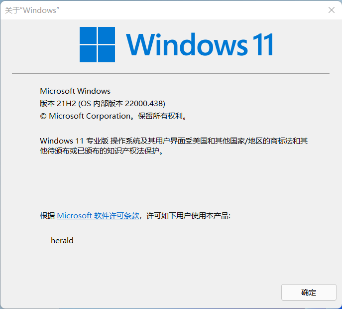
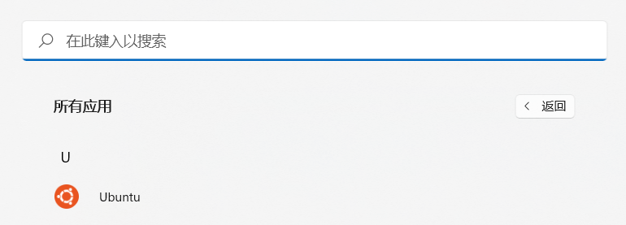
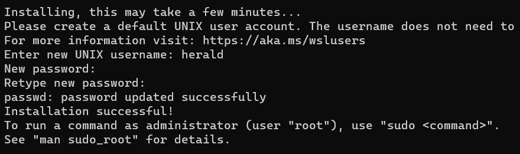
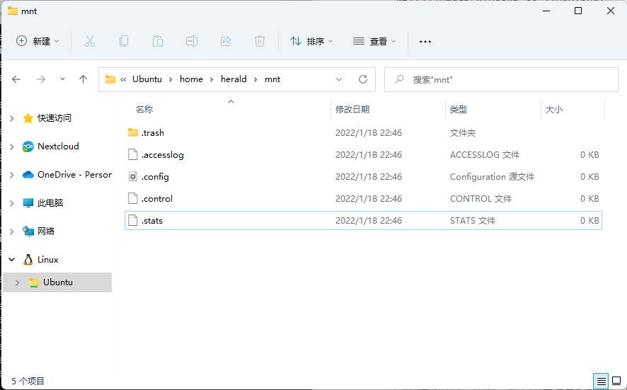
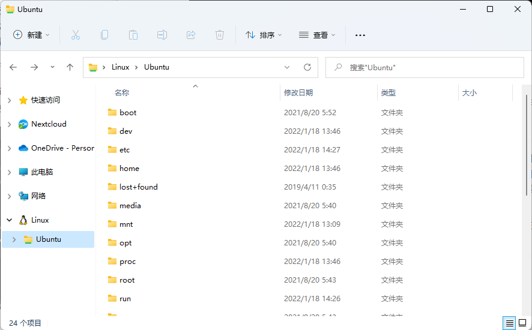
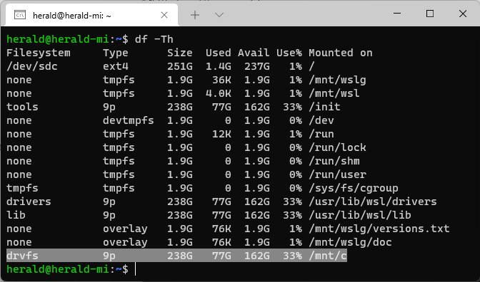
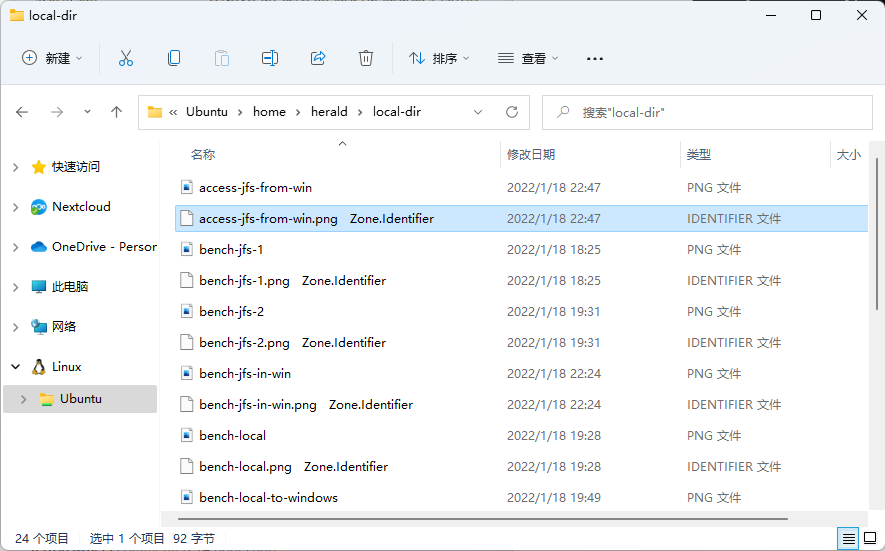

WSL 全称 Windows Subsystem for Linux，即适用于 Linux 的 Windows 子系统。它可以让你在 Windows 系统环境下运行大多数 GNU/Linux 原生命令、工具和程序，且不必像用虚拟机或双系统那样产生额外的硬件开销。

## 安装 WSL

使用 WSL 要求必须是 Windows 10 2004 以上或 Windows 11。

查看当前系统的版本，可以通过组合键 <kbd>Win</kbd> + <kbd>R</kbd> 唤出运行程序，输入并运行 `winver`。



确认 Windows 版本以后，以管理员身份打开 PowerShell 或 Windows 命令提示符，运行安装命令：

```powershell
wsl --install
```

该命令会下载最新的 Linux 内核，安装并将 WSL 2 作为默认版本，并安装 Linux 发行版（默认为 Ubuntu）。

也可以直接指定要安装的发行版：

```powershell
wsl --install -d ubuntu
```

:::tip 提示
`wsl --list --online`  命令可以查看所有可选的发行版。
:::

## 设置 Linux 用户和密码

WSL 安装完成以后，即可在开始菜单找到新安装的 Linux 发行版。



点击 Ubuntu 子系统的快捷方式，WSL 会打开 Linux 子系统的终端。初次运行会要求设置管理 Linux 子系统的用户和密码，根据提示设置即可。



这里设置的用户名和密码有以下几点需要注意：

- 此用户专用于该 Linux 子系统的管理，与 Windows 系统中的用户无关；
- 此用户将作为 Linux 子系统的默认用户，并在启动时自动登录；
- 此用户将被视为 Linux 子系统的管理员，允许执行 `sudo` 命令；
- WSL 中允许同时运行多个 Linux 子系统，且每个子系统都需要设置一个管理用户。

## 在 WSL 中使用 JuiceFS

在 WSL 中使用 JuiceFS，即是在 Linux 系统中使用 JuiceFS，这里以社区版为例进行介绍。

### 安装客户端

执行命令，在 Linux 子系统中安装 JuiceFS 客户端：

   ```shell
   curl -sSL https://d.juicefs.com/install | sh -
   ```

### 创建文件系统

JuiceFS 是数据与元数据分离的分布式文件系统，通常用对象存储作为数据存储，用 Redis、PostgreSQL 或 MySQL 作为元数据存储。这里假设已经准备了如下材料：

#### 对象存储

查看「[JuiceFS 支持的数据存储](../reference/how_to_set_up_object_storage.md)」

- **Bucket Endpoint**：`https://myjfs.oss-cn-shanghai.aliyuncs.com`
- **Access Key ID**：`ABCDEFGHIJKLMNopqXYZ`
- **Access Key Secret**：`ZYXwvutsrqpoNMLkJiHgfeDCBA`

#### 数据库

查看「[JuiceFS 支持的元数据引擎](../reference/how_to_set_up_metadata_engine.md)」

- **数据库地址**：`myjfs-sh-abc.redis.rds.aliyuncs.com:6379`
- **数据库密码**：`mypassword`

将私密信息写入环境变量：

```shell
export ACCESS_KEY=ABCDEFGHIJKLMNopqXYZ
export SECRET_KEY=ZYXwvutsrqpoNMLkJiHgfeDCBA
export REDIS_PASSWORD=mypassword
```

创建名为 `myjfs` 的文件系统：

```shell
juicefs format \
    --storage oss \
    --bucket https://myjfs.oss-cn-shanghai.aliyuncs.com \
    redis://myjfs-sh-abc.redis.rds.aliyuncs.com:6379/1 \
    myjfs
```

### 挂载和使用

把数据库密码写入环境变量：

```shell
export REDIS_PASSWORD=mypassword
```

:::note 注意
对象存储的 API 密钥信息仅在创建文件系统时需要设置，一旦文件系统创建成功，相应的密钥信息会被写入数据库，JuiceFS 客户端会在挂载文件系统时自动从数据库中读取，无需重复设置。
:::

挂载文件系统到用户家目录下的 `mnt`：

```shell
sudo juicefs mount -d redis://myjfs-sh-abc.redis.rds.aliyuncs.com:6379/1 $HOME/mnt
```

如果需要从 Windows 系统访问 Linux 子系统中挂载的 JuiceFS 文件系统，在资源管理器左侧列表中找到 Linux 子系统，然后找到并打开挂载点路径即可。



有关 JuiceFS 使用方面的更多内容请查阅官方文档。

## WSL 文件存储性能问题

WSL 打通了 Windows 与 Linux 子系统，允许二者相互访问彼此系统中存储的文件。



但需要注意，从 Windows 访问 Linux 子系统或从 Linux 子系统访问 Windows 势必会因系统之间的转换而产生一定的性能开销。因此，推荐的做法是根据程序所在的系统来决定文件存储的位置，对于 Linux 子系统中的程序，它要处理的文件也应该存储在 Linux 子系统中性能才更理想。

在 Linux 子系统中，WSL 将 Windows 的各个盘符挂载到了 `/mnt`，比如 C: 盘在 Linux 子系统中的挂载点是 `/mnt/c`。



为了保证性能最优，在 WSL 中使用 JuiceFS 时，不论存储还是缓存路径都应设置在 Linux 子系统中。换言之，应该避免把存储或缓存设置在 `/mnt/c` 类似的 Windows 分区挂载点上。

通过使用 JuiceFS 自带的 `bench` 基准测试工具，结果显示，将文件系统挂载到 Windows（如 `/mnt/c`）的性能要比挂载到 Linux 子系统内部（如 `$HOME/mnt`）低 30% 左右。

## 已知问题

当通过 Windows 资源管理器拷贝文件到 Linux 子系统时，WSL 会自动为每个文件附加一个带有 `Zone.Identifier` 标识的同名文件。这是 NTFS 文件系统的一种安全防护机制，意在对外部文件的来源进行跟踪，但对于 WSL 来说，这个功能应该属于 bug 且已经有人在 GitHub 上向微软开发团队反馈 [#7456](https://github.com/microsoft/WSL/issues/7456)。

受此问题影响，通过 Windows 资源管理器向 Linux 子系统中挂载的 JuiceFS 文件系统存入文件时也会出现同样的问题。但在 Linux 子系统内部读写 JuiceFS 文件系统不受该 bug 的干扰。


